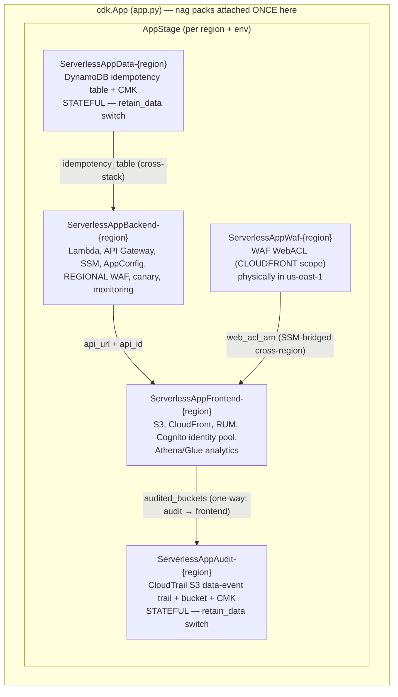
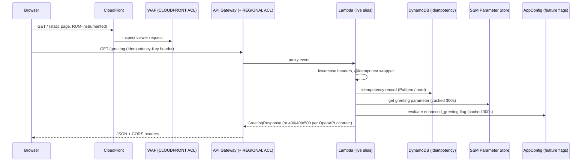
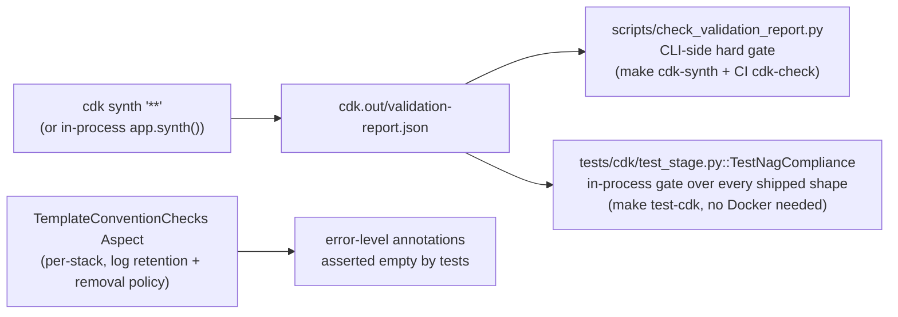
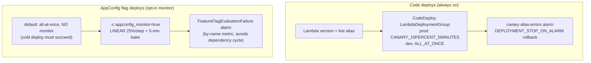

# System Architecture

How the five CDK stacks compose into one deployable unit, how requests flow at runtime, and the design principles that hold the template together.

## Deployment topology

All five stacks live inside `AppStage` (a `cdk.Stage`), instantiated once per region + environment pair by `app.py`. The Stage makes "these stacks deploy together" structural, scopes the cloud assembly under `cdk.out/assembly-{stage}/`, and paves the way for CDK Pipelines.

Key topology rules (violating these breaks deploys or creates dependency cycles):

- **Stack names are pinned.** The default `prod` environment keeps legacy names (`ServerlessAppBackend-us-east-1` etc.). CloudFormation matches stacks by name; renaming orphans live deployments. Non-prod environments insert an env segment (`ServerlessAppBackend-{env}-{region}`).
- **WAF is always us-east-1** (CloudFront-scoped WebACLs must live there). When the target region differs, `cross_region_references=True` on the frontend stack bridges the ACL ARN through SSM automatically.
- **Audit → frontend is one-way.** The trail and its bucket are inseparable (the bucket policy references the trail ARN), so they live together in `AuditStack`; the buckets the trail merely *audits* stay in the frontend stack and are passed in. Moving either piece reintroduces a cycle.
- **The Stage computes WAF log S3 locations as strings** (account pseudo-parameter only) and passes them to the frontend's Glue tables, deliberately avoiding a cross-region cross-stack reference.

## Runtime request flow

The handler is layered: `lambda/app.py` (HTTP boundary, Powertools wiring, error translation) → `lambda/service.py` (business logic, no AWS client state) → `lambda/models.py` (Pydantic contracts). The `EnvVars` model validates the environment at import time so misconfiguration fails the cold start, not the Nth request.

## Compliance gating architecture

cdk-nag v3 rule packs are **policy-validation plugins** evaluated over the synthesized assembly — not per-stack Aspects. The CLI exit code is *not* the gate for Python apps (CDK sets `process.exitCode` in jsii's throwaway Node kernel, so `cdk synth` exits 0 with findings).

- Packs attach **once at the App root** (`attach_nag_packs` in `nag_utils.py`); `apply_compliance_aspects` runs per stack and carries only the project's own Aspect plus cdk-nag's `WriteNagSuppressionsToCloudFormationAspect` (which must be per-stack because Aspects do not cross `cdk.Stage` boundaries).
- Findings are resolved by fixing the resource or acknowledging via `acknowledge_rules(construct, [{"id", "reason", "applies_to"}])` — the v2-shaped adapter onto v3's acknowledge API. Granular rules (IAM4/IAM5) need exact `Rule[Finding]` ids in `applies_to`; acknowledgments cover the whole construct subtree.
- A missing `validation-report.json` **fails** the gate (packs not attached = broken gate, not a pass), and `test_nag_gate_can_fail` is the canary proving the gate is not vacuous.

## Encryption posture

Every data-bearing resource that supports a per-resource customer-managed key is CMK-encrypted, and keys are scoped per stack (never shared across stack boundaries) so each carries a least-privilege key policy:

| Stack | CMK scope |
|---|---|
| DataStack | DynamoDB table (key lives with the data it protects — retention is meaningless otherwise) |
| AuditStack | CloudTrail log files (per-object SSE-KMS into an SSE-S3 bucket) + trail log group |
| WafStack | S3 auto-delete provider log group |
| Backend | Lambda env vars, log groups, SNS alarm topic, AppConfig hosted config, SQS DLQs |
| Frontend | Asset bucket, RUM/provider log groups |

Service-principal grants on CMKs are confused-deputy-guarded with `aws:SourceAccount` + `aws:SourceArn` (see `grant_logs_service_to_key` / `grant_cloudtrail_service_to_key` in `nag_utils.py`). Exception: `grant_cloudwatch_alarms_to_key` deliberately omits `aws:SourceArn` (CloudWatch is not documented to set it on via-SNS KMS calls). Account/region-wide encryption settings (X-Ray, Glue Data Catalog) are deliberately out of scope — they would mutate state shared with other apps in the account.

## Log routing: operational vs audit

- **Operational logs** → CloudWatch (Lambda, API Gateway access + execution) at 90-day retention; CDK-provider singletons at 7 days.
- **Audit/analytics logs** → S3 via the shared `create_sse_s3_log_bucket` helper: CloudFront access logs (7-day lifecycle), CloudTrail logs (90-day), and **two** WAF log buckets (90-day) — one in WafStack (us-east-1, CloudFront ACL) and one in the backend stack (target region, REGIONAL ACL), because the WAF→S3 destination must be in the ACL's region.
- WAF log buckets pre-declare the exact `delivery.logs.amazonaws.com` grant, and each `CfnLoggingConfiguration` is ordered after `bucket.policy` — otherwise WAF auto-attaches its own bucket policy and the deploy fails with "The bucket policy already exists".
- Athena + Glue partition-projected tables (CloudFront access logs, both WAF logs) plus named queries make the S3 sinks queryable.

## Deployment safety machinery

`appconfig_monitor` **must never be set on a cold/first deploy**: AppConfig rolls back on `INSUFFICIENT_DATA`, which a fresh alarm always is, so the stack can never reach `CREATE_COMPLETE`. `make deploy-appconfig-monitor` guards this by refusing unless the backend stack is already in an updatable `*_COMPLETE` state. Deployment-control alarms carry no SNS action (the deployment services poll alarm state); operational alarms (MonitoringFacade) route to SNS in prod only.

## Design principles

1. **Fail loud at synth, not at deploy**: strict boolean context-flag parsing (`parse_context_flag`), env-name validation, convention Aspects, snapshot tests.
2. **The expensive-to-retrofit decision ships now**: stack topology (stateful separation) is baked in; production posture is one flag (`retain_data=true`).
3. **Everything pinned, everything gated**: one `uv.lock` for two conflicting resolutions, npm-pinned CDK CLI, SHA-pinned GitHub Actions, drift gates on every committed generated artifact.
4. **Destroy-friendly by default**: `RemovalPolicy.DESTROY`, auto-delete objects, cleanup custom resources for out-of-CFN resources (RUM log group, Application Insights dashboard), `make destroy-clean` sweeps async-log stragglers.
5. **Observability as a first-class contract**: tenant_id dimensioning from day one (metadata, not dimension — the EMF dimension set is pinned by a unit test), correlation ids, saved Logs Insights queries, RUM with X-Ray correlation.
