# Codebase Information

Basic facts about the `lambda-powertools-reference` repository, gathered during codebase analysis.

## Identity

- **Name**: `serverless-app` (PyPI project name in `pyproject.toml`); repository `lambda-powertools-reference`
- **Purpose**: Production-grade reference architecture for serverless AWS applications built on Lambda + AWS Lambda Powertools, deployed with AWS CDK (Python). Designed to be forked via GitHub's "Use this template".
- **License**: Apache-2.0
- **Primary language**: Python (requires >= 3.13)
- **Secondary tooling languages**: Node.js (pinned AWS CDK CLI + markdownlint via `package.json`), Bash (automation scripts), YAML (CI), HTML/JavaScript (static frontend page with CloudWatch RUM snippet)

## Technology stack

| Layer | Technology |
|---|---|
| Infrastructure as code | AWS CDK v2 (Python, `aws-cdk-lib`), five stacks composed in a `cdk.Stage` |
| Compliance gating | cdk-nag v3 (policy-validation plugins): AwsSolutions, Serverless, NIST 800-53 R5, HIPAA Security, PCI DSS 3.2.1 + a bespoke `TemplateConventionChecks` Aspect |
| Lambda runtime | AWS Lambda Powertools for Python (Logger, Tracer, Metrics, Event Handler, Idempotency, Parameters, Feature Flags), Pydantic v2 models |
| API | Amazon API Gateway REST API fronting a single Lambda (`GET /greeting`), OpenAPI 3 spec committed and CI-gated |
| Data | DynamoDB (Powertools idempotency table, TTL, PITR, CMK-encrypted) |
| Configuration | SSM Parameter Store (greeting), AWS AppConfig (feature flags, optional gradual rollout + alarm rollback) |
| Edge / security | CloudFront + WAF (CloudFront-scoped WebACL in us-east-1 and a REGIONAL WebACL on API Gateway), custom ResponseHeadersPolicy (HSTS + CSP) |
| Audit | CloudTrail object-level S3 data-event trail with dedicated CMK and S3 log bucket |
| Analytics | Athena + Glue partition-projected tables over CloudFront access logs and WAF logs (S3 log sinks), named triage queries |
| Observability | CloudWatch dashboards (cdk-monitoring-constructs `MonitoringFacade`), EMF metrics, X-Ray, CloudWatch RUM, Application Insights, Logs Insights saved queries |
| Deployment safety | CodeDeploy Lambda canary (alias + alarm-driven rollback), optional AppConfig deployment monitor |
| Package management | uv (single `uv.lock`, PEP 735 dependency groups, conflict-split venvs), npm (`package.json` pins) |
| Testing | pytest (+xdist, cov, mock, timeout, randomly, html), CDK assertions, snapshot tests, live integration tests |
| Lint / static analysis | ruff (format + lint), mypy (strict, pydantic plugin), pylint (design/complexity), bandit, xenon, pip-audit, pre-commit, markdownlint |
| Docs | Zensical static site + mkdocstrings; Scalar-rendered OpenAPI page; git-cliff changelog |
| CI/CD | GitHub Actions (CI, CodeQL, Scorecard, dependency audit, Dependabot auto-merge, PR-title gate, docs publish, release) |

## Directory layout

```mermaid
graph TB
    ROOT["Repository root"]
    ROOT --> APP["app.py — CDK entry point (App → AppStage)"]
    ROOT --> INFRA["infrastructure/ — CDK stacks, constructs, nag helpers"]
    ROOT --> LAMBDA["lambda/ — Lambda handler, service, models, requirements.txt"]
    ROOT --> TESTS["tests/ — unit, cdk, integration suites"]
    ROOT --> SCRIPTS["scripts/ — CI gates and generators"]
    ROOT --> FRONTEND["frontend/ — static index.html + favicon (RUM-instrumented)"]
    ROOT --> DOCS["docs/ — Zensical pages, committed openapi.json, architecture diagram"]
    ROOT --> GH[".github/ — workflows, dependabot"]
    ROOT --> MK["Makefile — canonical developer entry points"]
    ROOT --> PY["pyproject.toml — dependency groups + all Python tool config"]
    ROOT --> NPM["package.json — pinned CDK CLI + markdownlint"]
    ROOT --> CDKJSON["cdk.json — app command, feature flags, production switches"]

    INFRA --> STAGE["app_stage.py — AppStage, env naming, context-flag parsing"]
    INFRA --> DATA["data_stack.py — DynamoDB + CMK (stateful)"]
    INFRA --> WAF["waf_stack.py — CloudFront-scoped WebACL (us-east-1)"]
    INFRA --> BSTACK["backend_stack.py — thin stack wrapping BackendApp"]
    INFRA --> BAPP["backend_app.py — Lambda, API GW, AppConfig, canary, monitoring"]
    INFRA --> FSTACK["frontend_stack.py — S3, CloudFront, RUM, Athena/Glue"]
    INFRA --> ASTACK["audit_stack.py — CloudTrail trail + bucket + CMK (stateful)"]
    INFRA --> NAG["nag_utils.py — nag packs, suppressions, shared helpers"]
    INFRA --> VAL["validation_aspects.py — TemplateConventionChecks Aspect"]
    INFRA --> FLAGS["feature_flags.json — AppConfig flag definitions"]

    LAMBDA --> LAPP["app.py — handler layer (resolver, idempotency, wiring)"]
    LAMBDA --> LSVC["service.py — business logic (build_greeting)"]
    LAMBDA --> LMOD["models.py — Pydantic contracts + EnvVars"]

    TESTS --> TU["unit/ — handler tests (100% coverage gate)"]
    TESTS --> TC["cdk/ — stack assertions, nag gate, snapshots"]
    TESTS --> TI["integration/ — live API + frontend tests"]
```

## Languages: supported and unsupported

- **Analyzed fully**: Python (all of `infrastructure/`, `lambda/`, `scripts/`, `tests/`), Makefile, YAML workflows, JSON/TOML configuration.
- **Present but shallow**: the static `frontend/index.html` (inline JavaScript for the RUM web client and API call) — small, self-contained, no build step.
- **Not present**: no TypeScript/JavaScript application code, no container images, no Terraform/CloudFormation authored by hand (templates are synthesized by CDK).

## Key entry points

| Entry point | Role |
|---|---|
| `app.py` (repo root) | CDK app: parses context (`region`, `env`, `retain_data`, `appconfig_monitor`), attaches nag packs, instantiates `AppStage` |
| `lambda/app.py` | Lambda handler: Powertools resolver, idempotency wrapper, error translation |
| `Makefile` | Canonical developer interface (`make help` lists everything; `make pr` mirrors CI) |
| `scripts/check_validation_report.py` | The hard cdk-nag gate over `cdk.out/validation-report.json` |
| `scripts/generate_openapi.py` | Generates the committed `docs/openapi.json` from the resolver |
| `scripts/cdk_pr_diff.py` | Renders the PR-comment CloudFormation diff in CI |
| `scripts/deps_merge.sh` | Dependabot PR maintainer loop (rebase + `make lock` + auto-merge) |

## Architectural patterns observed

- **"Model with constructs, deploy with stacks"**: `BackendStack` is a thin shell around the `BackendApp` construct.
- **Stateful/stateless stack separation**: `DataStack` and `AuditStack` hold stateful resources behind the `retain_data` switch; compute stacks are freely destroyable.
- **One-way cross-stack dependencies**: data → backend (table handed in), WAF → frontend (ACL ARN, SSM-bridged cross-region), audit → frontend (audited buckets). No cycles by design.
- **Fail-loud-at-synth**: strict context-flag parsing, env-name validation, bespoke Aspects turning convention violations into synth errors.
- **Defense-in-depth supply chain**: everything pinned (uv.lock, package.json, action SHAs), local + Dependabot cooldowns, drift gates between generated artifacts and their sources.
- **Committed generated artifacts with drift gates**: `docs/openapi.json`, `lambda/requirements.txt`, CDK snapshots — CI fails if they drift from their source of truth.
