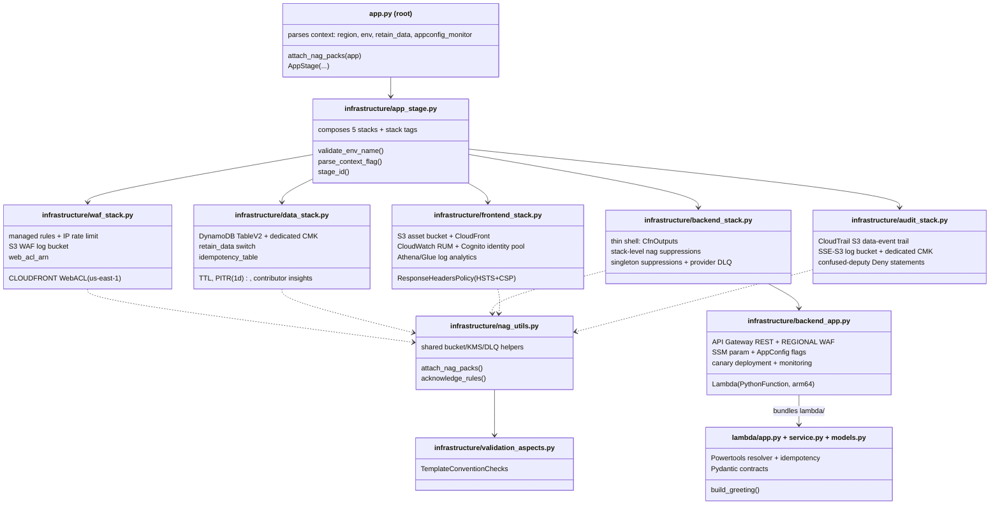

# Components

Major components, their responsibilities, and how they relate. File references are repo-relative.

## Component map

## Infrastructure components

### `app.py` (root) — CDK entry point

Reads CDK context (`region`, `env`, `retain_data`, `appconfig_monitor`), attaches the five cdk-nag packs once at the App root, and instantiates one `AppStage`. Context flags are parsed strictly — junk values fail synth rather than silently coercing to `False`.

### `infrastructure/app_stage.py` — AppStage

Groups the five stacks as one deploy unit. Owns environment naming (prod keeps legacy names byte-for-byte; other envs get namespaced, collision-free names, max 39 chars validated at synth), stack tags (`service` / `environment` / `owner`), and the string-computed WAF log S3 locations handed to the frontend's Glue tables.

### `infrastructure/waf_stack.py` — WafStack

CloudFront-scoped WebACL, always us-east-1. Four AWS managed rule groups (shared with the REGIONAL ACL via `build_managed_threat_rules`) plus a 200-requests-per-5-minutes IP rate limit. WAF logs to S3 via `create_waf_logs_bucket` (bucket-policy ordering is load-bearing — see architecture.md). Exposes `web_acl_arn`.

### `infrastructure/data_stack.py` — DataStack (stateful)

DynamoDB idempotency table (`TableV2`, on-demand, TTL on `expiration`, PITR with 1-day window, throttled-keys contributor insights) encrypted by its own CMK. `retain_data=True` flips table + CMK to `RETAIN`, enables deletion protection and stack termination protection. Carries the `DynamoDBInBackupPlan` acknowledgments (it owns the table).

### `infrastructure/backend_stack.py` — BackendStack

Thin wrapper per "model with constructs, deploy with stacks": applies compliance aspects, composes `BackendApp`, wires CfnOutputs (API URL, function ARN, dashboard URL, alarm topic name...), applies CDK-singleton suppressions, and attaches the AwsCustomResource provider's async failure DLQ. Stack-level nag acknowledgments live here with per-rule rationales.

### `infrastructure/backend_app.py` — BackendApp construct

The domain-level application, largest infrastructure module. Contains:

- **Lambda**: `PythonFunction` (arm64, Python 3.14 bundling image), bundled from `lambda/` with `requirements.txt`, CMK-encrypted env vars, reserved concurrency, explicit log group, `recursive_loop=Terminate`.
- **API Gateway**: REST API with Prod stage throttling, access + execution logging, request tracing; integrates with the `live` alias (not `$LATEST`).
- **Configuration**: SSM greeting parameter; AppConfig application/environment/hosted configuration (from `infrastructure/feature_flags.json`) with all-at-once default deployment.
- **`_attach_canary_deployment`**: publishes a version, shifts the `live` alias via CodeDeploy (`CANARY_10PERCENT_5MINUTES` in prod, `ALL_AT_ONCE` in dev) with alarm-driven rollback.
- **`_attach_appconfig_rollback_monitor`** (only when `appconfig_monitor=True`): gradual flag rollout + environment monitor on a **by-name** `FeatureFlagEvaluationFailure` metric (using `function.metric_errors()` would create a dependency cycle that only `Template.from_stack` catches).
- **`_attach_regional_waf`**: REGIONAL WebACL + its own S3 log bucket, associated with the Prod stage.
- **`_build_monitoring`**: cdk-monitoring-constructs `MonitoringFacade` dashboard, latency/error alarms; SNS topic only in prod (`_build_alarm_topic`).
- **`_create_insights_queries`**: saved Logs Insights queries; Application Insights resource group + dashboard-cleanup custom resource.

### `infrastructure/frontend_stack.py` — FrontendStack

S3 asset bucket (CMK) + access-log bucket (SSE-S3) + CloudFront distribution with the WAF ACL, custom `ResponseHeadersPolicy` (HSTS, CSP pinned to the exact execute-api host), `BucketDeployment` of `frontend/`, CloudWatch RUM app monitor (pinned name, Cognito identity pool, X-Ray client correlation) with a log-group cleanup custom resource, and the Athena/Glue analytics layer (`_create_athena_glue_resources`: partition-projected tables for CloudFront access logs + both WAF log locations, named triage queries, CMK-encrypted Athena workgroup).

### `infrastructure/audit_stack.py` — AuditStack (stateful)

CloudTrail trail scoped to object-level S3 data events on the frontend buckets (`include_management_events=False` — the CDK default would bill a second copy of every management event). Pinned trail name enables the confused-deputy Deny statements (two separate ones so IAM ORs the condition keys) and the CMK's scoped CloudTrail grant. Same `retain_data` semantics as DataStack.

### `infrastructure/nag_utils.py` — shared helpers

The compliance and shared-pattern toolbox: `attach_nag_packs`, `apply_compliance_aspects`, `acknowledge_rules` (v2-shaped suppression data → v3 acknowledge API, with a metadata fallback for finding ids CDK's API rejects), confused-deputy KMS grant helpers, `build_managed_threat_rules` (the shared WAF rule list), `attach_async_failure_destination` (SQS DLQ for async-invoked provider Lambdas), `suppress_cdk_singletons` + `CDK_LAMBDA_SUPPRESSIONS`, `create_auto_delete_objects_log_group`, `create_sse_s3_log_bucket`, `waf_logs_bucket_name` / `create_waf_logs_bucket`. Also exports the CDK singleton construct ids (`AWS_CUSTOM_RESOURCE_PROVIDER_ID`, `BUCKET_DEPLOYMENT_PROVIDER_ID`).

### `infrastructure/validation_aspects.py` — TemplateConventionChecks

Per-stack Aspect enforcing two project conventions no rule pack covers: every log group declares explicit retention, and every stateful L1 (`CfnBucket`, `CfnTable`, `CfnGlobalTable`, `CfnKey`) declares an explicit removal policy. Violations are error-level annotations that fail synth.

## Lambda components

| Module | Responsibility |
|---|---|
| `lambda/app.py` | Handler layer: Powertools resolver (CORS, validation), shared botocore retry config (`adaptive`, `total_max_attempts=3`, tight timeouts — budget math documented inline), idempotency layer keyed on the `Idempotency-Key` header (lowercased before JMESPath), tenant-id resolution for observability, translation of idempotency errors to 400/409 with hand-built CORS headers |
| `lambda/service.py` | `build_greeting`: SSM read (300s cache) → `enhanced_greeting` flag evaluation (graceful fallback + `FeatureFlagEvaluationFailure` EMF metric — the only signal a broken flag config is live) → message composition. Domain error `GreetingUnavailableError` keeps the layer HTTP-free |
| `lambda/models.py` | Pydantic contracts: `EnvVars` (import-time env validation), `GreetingResponse`, and the 400/409/500 response models that exist to document the OpenAPI contract |
| `lambda/requirements.txt` | Exported from `uv.lock`'s lambda group (`make lock`); bundled into the deployed function; CI gates drift |

## Test components

| Suite | Venv | Scope |
|---|---|---|
| `tests/unit/` | `.venv-lambda` | Handler behavior with mocked AWS (autouse fixture patches `ssm_provider.get` + `feature_flags.evaluate`); 100% branch-coverage gate on `lambda/`; EMF dimension-set contract test; feature-flag schema test |
| `tests/cdk/` | `.venv` | Stack assertions (`test_stacks.py`), Stage contracts + the in-process nag gate over every shipped shape (`test_stage.py`), Aspect unit tests (`test_validation_aspects.py`), template snapshots (`test_snapshots.py` + `snapshots/*.json`) |
| `tests/integration/` | `.venv-lambda` | Live tests against a deployed stack (API Gateway behavior, frontend delivery); excluded from CI (no credentials) |
| `tests/conftest.py` | shared | Loads `lambda/app.py` by absolute file path (the root CDK `app.py` would shadow it) and appends `lambda/` to `sys.path` for its flat sibling imports |

## Automation components

| Component | Role |
|---|---|
| `Makefile` | Canonical interface; `make help` self-documents. Notable: two-venv selector via `UV_PROJECT_ENVIRONMENT`, `'**'` glob on every CDK command, guarded `deploy-appconfig-monitor`, `destroy-clean` log-group snapshot/sweep machinery |
| `.github/workflows/ci.yml` | Three-job core (quality / test / cdk-check) + PR-only `cdk-diff` sticky comment; ARM runners for native Lambda bundling |
| Other workflows | `codeql.yml` (Python analysis with security-extended queries; push/PR/weekly), `scorecard.yml` (OpenSSF Scorecard → code scanning; weekly + push), `dependency-audit.yml` (weekly pip-audit over each of the five dependency groups exported separately, plus `npm audit` on the pinned node tooling — independent lanes so one ecosystem's failure can't hide the other's), `dependabot-auto-merge.yml` (auto-approves + squash-auto-merges **patch/minor** bumps across all three ecosystems — GitHub Actions, uv/pip, npm; majors stay manual), `pr-title.yml` (Conventional Commit regex gate on PR titles), `docs.yml` (Zensical build + coverage badge → GitHub Pages, on push to main), `release.yml` (publishes the GitHub Release from the annotated `v*` tag; no-op if already published) |
| `.pre-commit-config.yaml` | ruff format → ruff lint → mypy (serial; excludes `lambda/`+`scripts/` — checked in `.venv-lambda` instead) → bandit → pylint → hygiene hooks → xenon complexity → pip-audit. Tools run from the venv (`language: system`) so versions come from `pyproject.toml` |
| `frontend/index.html` | Static page: RUM web client snippet (config injected at deploy) + a fetch against `GET /greeting` |
