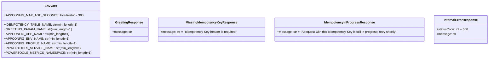
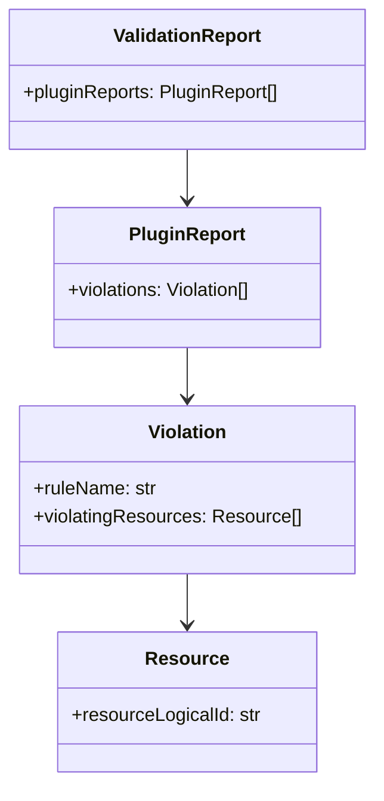

# Data Models

Data structures and contracts across the runtime, infrastructure, and analytics layers.

## Pydantic models (`lambda/models.py`)



Design notes:

- `EnvVars` is validated **once at module import** (`EnvVars.model_validate(dict(os.environ))`) so a bad deployment fails the cold start with a field-by-field report, not the Nth request deep inside boto3. It also asserts the Powertools-read variables (service name, metrics namespace) whose absence would otherwise fail at metrics-flush time after the business logic ran.
- The 400/409 models exist purely to document the OpenAPI contract — those responses are hand-built in `lambda_handler` outside the resolver, and the model shapes must match the hand-built bodies.
- These models do triple duty: runtime validation (resolver `enable_validation=True`), the committed OpenAPI spec, and the import-time config check.

## DynamoDB idempotency table (`infrastructure/data_stack.py`)

| Attribute | Value |
|---|---|
| Partition key | `id` (String) — Powertools idempotency record key |
| TTL attribute | `expiration` — records expire after `expires_after_seconds=3600` (set in `lambda/app.py`) |
| Billing | On-demand |
| Encryption | Customer-managed key (the DataStack CMK) |
| PITR | Enabled, 1-day recovery window (records TTL out after an hour) |
| Contributor insights | `THROTTLED_KEYS` mode only |
| Table name | CDK-generated (never pinned — avoids collisions and replacement blocks) |

The idempotency key is the client-supplied `Idempotency-Key` header, extracted via JMESPath `headers."idempotency-key"` after the handler lowercases all header keys (HTTP headers are case-insensitive; JMESPath is exact-match).

## Feature flag schema (`infrastructure/feature_flags.json`)

AWS AppConfig feature-flag document consumed by Powertools `FeatureFlags`:

```json
{
  "enhanced_greeting": {
    "default": false
  }
}
```

Evaluated per request with context `{source_ip, user_agent}` so AppConfig rules can match on them. The schema shape is pinned by `tests/unit/test_feature_flags_schema.py`.

## Telemetry contracts

| Signal | Contract |
|---|---|
| `GreetingRequests` (EMF, namespace `ServerlessApp`) | Counted per request *before* the SSM fetch; dashboard widget addresses it by `{service}` dimension only |
| `FeatureFlagEvaluationFailure` (EMF) | Emitted on the flag-evaluation fallback path — the **only** signal a broken flag config is live (the request still returns 200). The AppConfig rollback alarm watches it **by name** |
| EMF dimension set | `{service}` only; `tenant_id` rides as **metadata**, not a dimension — CloudWatch matches custom metrics on the exact dimension set, so adding a dimension silently blinds every existing consumer. Pinned by a unit test in `tests/unit/test_handler.py` |
| Log correlation | `correlation_id` from the API Gateway request id (`correlation_paths.API_GATEWAY_REST`); `tenant_id` appended per request with `clear_state=True` to avoid cross-request leakage on warm containers |
| X-Ray | `tenant_id` annotation; response payload capture disabled (`capture_response=False`) |

## OpenAPI spec (`docs/openapi.json`)

Committed, generated artifact — OpenAPI 3 from the Powertools resolver plus a post-processed `x-amazon-apigateway-integration` block per operation (with literal `{region}`/`{lambdaArn}` placeholders; documentation-only). Regenerate with `make openapi` after touching routes, models, or `responses=` metadata; CI gates both byte-drift and breaking changes.

## cdk-nag suppression data shape (`infrastructure/nag_utils.py`)

Project-wide suppression entries keep the v2-era shape and are adapted onto v3's acknowledge API:

```python
{"id": "AwsSolutions-IAM5", "reason": "...", "applies_to": ["Action::s3:GetObject*", ...]}
```

- Granular rules (IAM4/IAM5) match only exact `Rule[Finding]` ids — every wildcard needs its precise `applies_to` finding (the gate's failure output prints them).
- Finding ids with more than one `::` are routed through the `aws:cdk:acknowledged-rules` metadata fallback (CDK's acknowledge API rejects them).

## Validation report (`cdk.out/validation-report.json`)

The cdk-nag v3 output parsed by both gates (`scripts/check_validation_report.py` and `tests/cdk/test_stage.py`):



A missing report fails the gate (packs not attached = broken gate, not a pass).

## WAF log schema (Athena/Glue, `infrastructure/frontend_stack.py`)

`_WAF_LOG_COLUMNS` encodes AWS's documented WAF S3 log schema as `(name, hive_type)` pairs — nested `struct<>`/`array<>` Hive types for rule match details, HTTP request, CAPTCHA/challenge responses, JA3/JA4 fingerprints. Two partition-projected Glue tables (`waf_cloudfront_logs`, `waf_regional_logs`) share it. The partition-projection contract: named queries must filter `log_time` in the exact `yyyy/MM/dd` format the projection declares — any other date format silently disables partition pruning.

## Committed generated artifacts (drift-gated)

| Artifact | Source of truth | Regenerate | CI gate |
|---|---|---|---|
| `docs/openapi.json` | `lambda/app.py` routes + models | `make openapi` | byte-compare + oasdiff |
| `lambda/requirements.txt` | `uv.lock` lambda group | `make lock` | `uv export` + diff |
| `tests/cdk/snapshots/*.json` | synthesized templates | snapshot test's update mode | assertion suite |
| `CHANGELOG.md` | Conventional Commits | `git cliff -o CHANGELOG.md` | not gated (release-time) |
