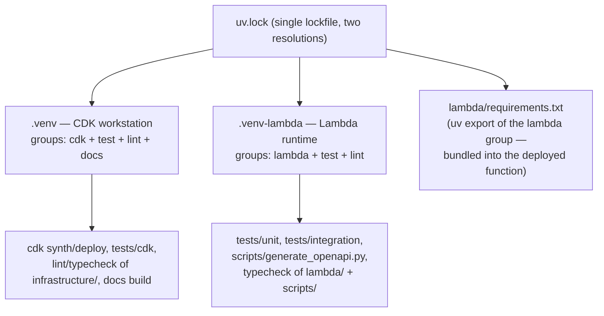
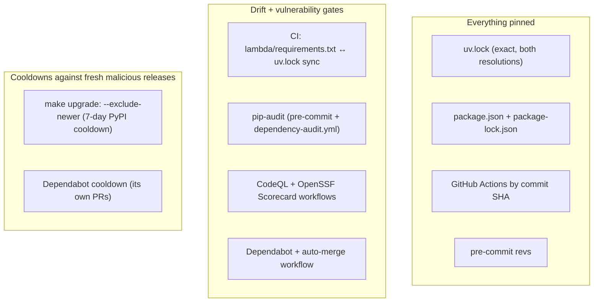

# Dependencies

External dependencies, how they're partitioned, and the supply-chain posture around them.

## The two-venv model (the central constraint)

CDK and Powertools require incompatible `attrs` versions (CDK pulls `attrs<26` via jsii; Powertools pulls `attrs>=26`). `[tool.uv.conflicts]` in `pyproject.toml` declares the `lambda` and `cdk` dependency groups mutually exclusive, so **one `uv.lock` holds both resolutions**, installed into separate venvs:

- Never install Powertools into `.venv` or CDK into `.venv-lambda`.
- One deliberate exception: plain `pydantic` is pinned in the `lint` group so the `pydantic.mypy` plugin loads in **both** venvs (it has no `attrs` dependency).
- The venv selector is `UV_PROJECT_ENVIRONMENT` (used by the Makefile); installs use `uv sync --locked` so a stale lock fails loudly.

## Dependency groups (PEP 735, `pyproject.toml`)

| Group | Contents | Where it lands |
|---|---|---|
| `lambda` | `aws-lambda-powertools[all]`, `aws-xray-sdk`, `boto3` | `.venv-lambda` + the deployed bundle (via `lambda/requirements.txt`) |
| `cdk` | `aws-cdk-lib`, `constructs`, `aws-cdk-aws-lambda-python-alpha`, `cdk-monitoring-constructs`, `cdk-nag` | `.venv` |
| `test` | pytest + plugins (env, cov, xdist, mock, html, timeout, randomly), `requests` | both venvs |
| `lint` | ruff, mypy, pylint, bandit, xenon, radon, pip-audit, pre-commit, boto3-stubs, pydantic | both venvs |
| `docs` | zensical, mkdocstrings(-python) | `.venv` only |

All versions are exact-pinned (`==`).

## Key runtime/infrastructure dependencies and their roles

| Dependency | Role |
|---|---|
| `aws-lambda-powertools[all]` | Logger, Tracer, Metrics (EMF), APIGatewayRestResolver + validation, Idempotency, SSMProvider, FeatureFlags/AppConfigStore, event data classes |
| `aws-cdk-lib` / `constructs` | All infrastructure; feature flags curated in `cdk.json` (safe / template-changing / IAM groups, with two documented skips) |
| `aws-cdk-aws-lambda-python-alpha` | `PythonFunction` — bundles `lambda/` with `requirements.txt` in a container (arm64, needs Docker locally / ARM runners in CI) |
| `cdk-nag` | The five policy-validation rule packs (v3 plugin engine) |
| `cdk-monitoring-constructs` | `MonitoringFacade` dashboard + latency/error alarms |
| `boto3` / `botocore` | AWS SDK; the handler pins an explicit retry `Config` (adaptive mode, `total_max_attempts=3`, 0.5s/1s timeouts) shared by every client |

## Node-side tooling (`package.json`)

`aws-cdk` (the CLI) and `markdownlint-cli` are pinned as devDependencies, installed by `npm ci`, and invoked via `npx` — never globally installed. This makes the CLI a locked, Dependabot-tracked supply-chain input like every Python dependency.

## Pre-commit tooling strategy

Every linter with a `pyproject.toml` pin runs as a `language: system` hook so its version comes from the project venv — Dependabot's pre-commit ecosystem bumps `rev:` fields but never `additional_dependencies`, so tools pinned in both places would drift silently. Only the zero-config hygiene hooks (`pre-commit-hooks`) use a remote `rev:`. mypy runs `require_serial: true` (its SQLite cache lock-contends across parallel workers on 2-CPU CI runners) and excludes `lambda/`+`scripts/` (checked properly in `.venv-lambda` via `make typecheck` instead — Powertools isn't importable in `.venv`).

## Supply-chain hygiene

- pip-audit's `--ignore-vuln` list lives **only** in `.pre-commit-config.yaml` (mirrored in `dependency-audit.yml`); `make security` routes through the hook so the suppression list never forks. Current ignores are dated with re-check notes.
- The cooldown applies to `make upgrade` only, not `make lock` — `lock` reproduces already-made decisions; `upgrade` is where new versions enter.
- `npm update` and `pre-commit autoupdate` (both run by `make upgrade`) do **not** honor the PyPI cooldown; review their diffs by release date.

## Version-sensitive facts (verify when bumping)

- **cdk-nag 3.x** switched from Aspects to policy-validation plugins — the entire gating architecture (`attach_nag_packs`, report parsing, `check_validation_report.py`) is built around v3 behavior, including the fact that Python-app synth does not fail natively on findings (verified against aws-cdk-lib 2.261.0 + cdk-nag 3.0.1; drop the script if CDK ever fails jsii-app synth natively).
- **`acknowledge_rules`' metadata fallback** for finding ids containing multiple `::` exists for a CDK acknowledge-API limitation — drop when fixed upstream.
- **Zensical is pre-1.0** — docs-group versions are pinned exactly and can break on minor bumps.
- The Lambda bundling image tracks the runtime (`Runtime.PYTHON_3_14`, arm64); CI's `cdk-check`/`cdk-diff` jobs run on ARM runners specifically so bundling runs natively.
