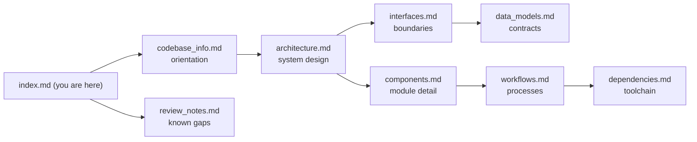

# Knowledge Base Index — lambda-powertools-reference

**Audience: AI assistants.** This directory is a generated knowledge base describing the `lambda-powertools-reference` repository — a five-stack AWS CDK (Python) reference architecture for Lambda + Powertools serverless applications. Load this index into context first; it carries enough metadata to decide which detail file (if any) you need to read next.

## How to use this knowledge base

1. **Start here.** This index summarizes every document and maps question types to files.
2. **Read detail files lazily.** Each file below is self-contained; read only the one(s) matching the question.
3. **Precedence.** The repository's own `CLAUDE.md` (project instructions) and `README.md` are authoritative over this summary. `AGENTS.md` (repo root) is the condensed agent-facing companion to this knowledge base. If this summary disagrees with the code, the code wins — these files describe the repo as analyzed on 2026-07-06.
4. **Verify before acting.** File paths and behaviors cited here were verified at generation time; re-verify anything load-bearing (especially version-sensitive facts in `dependencies.md`) before making changes.

## Documents

| File | Read it when you need… |
|---|---|
| [codebase_info.md](codebase_info.md) | The basics: identity, tech stack table, directory layout diagram, entry points, languages, observed patterns. Best first read for orientation. |
| [architecture.md](architecture.md) | The five-stack topology and its rules (naming, one-way dependencies, cross-region WAF), runtime request flow, the cdk-nag v3 gating architecture, encryption posture, log routing, deployment-safety machinery, and design principles. |
| [components.md](components.md) | Per-module responsibilities: every `infrastructure/` module (including `BackendApp`'s private methods), the three Lambda layers, test suites, and automation (Makefile, workflows, pre-commit). |
| [interfaces.md](interfaces.md) | Boundaries: the `GET /greeting` HTTP contract (+ sequence diagram), cross-stack CDK interfaces, CDK context keys, Lambda env vars, Make targets, CI gates, and AWS service integration gotchas. |
| [data_models.md](data_models.md) | Contracts: Pydantic models, the DynamoDB idempotency table schema, feature-flag JSON, telemetry contracts (EMF dimension set!), OpenAPI artifact, nag suppression shape, validation-report format, WAF Glue schema, drift-gated committed artifacts. |
| [workflows.md](workflows.md) | Processes: local dev loop, CI pipeline, cold-deploy → monitor-enable sequence, ephemeral envs, `destroy-clean` teardown, releases, dependency updates, and the add-a-resource / change-the-API checklists. |
| [dependencies.md](dependencies.md) | The two-venv `attrs` conflict model, dependency groups, npm-pinned CDK CLI, pre-commit strategy, supply-chain hygiene (pins, cooldowns, audit gates), version-sensitive facts. |
| [review_notes.md](review_notes.md) | Known gaps and caveats of this documentation set itself (consistency/completeness review). |

## Question → file routing

| Question type | Consult |
|---|---|
| "Where is X defined / which module owns Y?" | components.md, then codebase_info.md's layout diagram |
| "Why is synth/deploy failing on a nag finding?" | architecture.md (gating), data_models.md (suppression shape), workflows.md (add-a-resource) |
| "How do I run tests / why is coverage failing?" | workflows.md (dev loop), components.md (test suites), dependencies.md (which venv) |
| "How do stacks reference each other / can I move resource X between stacks?" | architecture.md (topology rules — several moves are known to create cycles) |
| "What's the API contract / how do I add a route?" | interfaces.md, data_models.md, workflows.md (API change) |
| "How do I deploy / tear down / enable the AppConfig monitor?" | workflows.md (deployment), interfaces.md (context keys) |
| "Why two venvs / can I install package X?" | dependencies.md |
| "What's pinned where / how do updates land?" | dependencies.md, workflows.md (dependency updates) |
| "What's deliberately out of scope / not production-ready?" | architecture.md (principles), repo `TODO.md` (production readiness checklist — authoritative) |

## Relationships between documents

## Example queries this knowledge base can answer

- *"Why does `cdk synth` exit 0 even though there are cdk-nag findings?"* → architecture.md, Compliance gating (the exit code lands in jsii's throwaway Node kernel; the report check is the gate).
- *"I added a log group and `make test-cdk` now fails with an annotation error."* → components.md, `validation_aspects.py` (explicit retention is enforced).
- *"Can I set `appconfig_monitor=true` in cdk.json before the first deploy?"* → workflows.md, First (cold) deploy (no — it bricks stack creation).
- *"Why is `tenant_id` metrics metadata instead of a dimension?"* → data_models.md, Telemetry contracts.
- *"Which venv runs `scripts/generate_openapi.py`?"* → dependencies.md (`.venv-lambda` — it imports Powertools).
