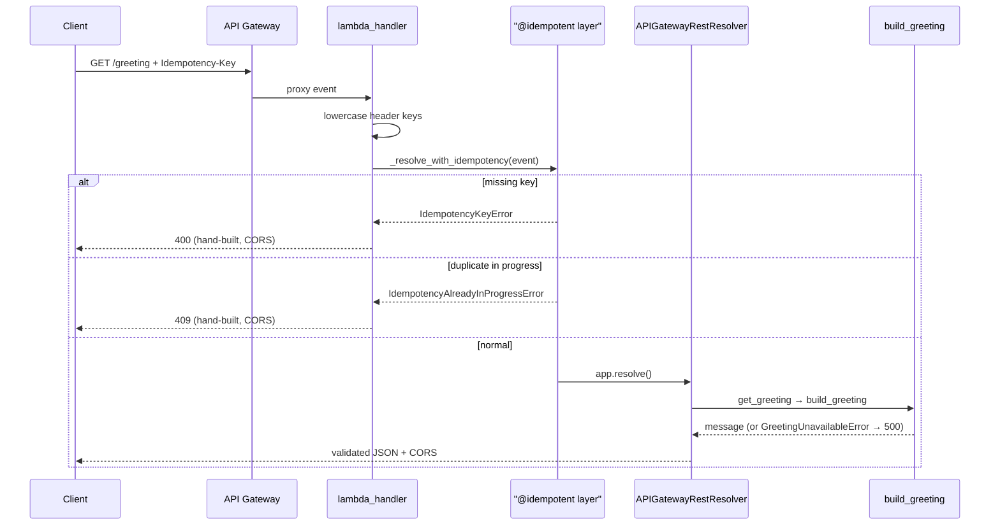

# Interfaces and Integration Points

Every boundary where components talk to each other or to the outside world.

## HTTP API

One route, defined in `lambda/app.py` and documented by the **committed** `docs/openapi.json` (regenerated by `make openapi`; CI fails on drift and on breaking changes via oasdiff).

| Aspect | Value |
|---|---|
| Route | `GET /greeting` (API Gateway REST, Prod stage, proxied to the Lambda `live` alias) |
| Required header | `Idempotency-Key` — missing → 400; duplicate while original in-flight → 409 |
| Responses | 200 `GreetingResponse`, 400 `MissingIdempotencyKeyResponse`, 409 `IdempotencyInProgressResponse`, 500 `InternalErrorResponse` |
| CORS | `allow_origin="*"`, `Idempotency-Key` in allowed headers; the hand-built 400/409 responses carry their own CORS header (built outside the resolver) |
| Validation | Powertools `enable_validation=True` — Pydantic on request/response; same models drive the OpenAPI schema |
| Spec exposure | Build-time only (`scripts/generate_openapi.py`); deliberately **not** served at runtime (`enable_swagger` is not called) |

Caching caveat: `@idempotent` wraps the whole resolver, so non-2xx resolver *returns* (404/422/500) are cached under the client's key for 1 hour; only raised exceptions are not cached. Documented in `_resolve_with_idempotency`'s docstring with the fork path (`@idempotent_function` on the service layer).

## Cross-stack interfaces (CDK)

| Producer | Consumer | Interface |
|---|---|---|
| DataStack | BackendStack | `idempotency_table` (ITableV2) → Lambda env var `IDEMPOTENCY_TABLE_NAME` + scoped read/write grant. The single data↔compute relationship |
| WafStack | FrontendStack | `web_acl_arn` — SSM-bridged automatically when regions differ (`cross_region_references=True`) |
| BackendStack | FrontendStack | `api_url` + `api_id` (the id lets the CSP pin the exact execute-api host) |
| FrontendStack | AuditStack | `audited_buckets` (asset + access-log buckets) — one-way, audit → frontend |
| AppStage | FrontendStack | WAF log S3 locations as computed strings (account pseudo-param only; avoids cross-region references) |

## Configuration interfaces

### CDK context keys (set via `-c key=value`, `cdk.json`, or `ENVIRONMENT` env var)

| Key | Default | Effect |
|---|---|---|
| `region` | `us-east-1` | Target region for data/backend/frontend/audit (WAF pinned to us-east-1) |
| `env` | `prod` (or `ENVIRONMENT` var) | Deployment environment; non-prod namespaces stack names and disables alarm paging |
| `retain_data` | `false` | `true` flips data + audit stacks to RETAIN + deletion/termination protection. Safe from the first deploy; sticky home is `cdk.json` |
| `appconfig_monitor` | `false` | `true` enables gradual AppConfig rollout + alarm rollback monitor. **Never on a cold deploy** |

Boolean context values are strictly parsed (`parse_context_flag`) — anything but `true`/`false` fails synth.

### Lambda environment variables (validated by `EnvVars` at import)

`IDEMPOTENCY_TABLE_NAME`, `GREETING_PARAM_NAME`, `APPCONFIG_APP_NAME`, `APPCONFIG_ENV_NAME`, `APPCONFIG_PROFILE_NAME`, `POWERTOOLS_SERVICE_NAME`, `POWERTOOLS_METRICS_NAMESPACE`, optional `APPCONFIG_MAX_AGE_SECONDS` (default 300).

### Feature flags

`infrastructure/feature_flags.json` → AppConfig hosted configuration → evaluated per request as `enhanced_greeting` with `{source_ip, user_agent}` context. Schema pinned by `tests/unit/test_feature_flags_schema.py`.

## Developer interface (Makefile)

`make help` is self-documenting. The load-bearing targets:

| Target | Purpose |
|---|---|
| `make install` / `make doctor` | Provision both venvs + npm tooling + pre-commit; verify the setup |
| `make pr` | Every CI gate locally, in CI's order (lock check, lint, typecheck, docs lint, unit tests, CDK tests, synth + nag gate, OpenAPI drift) |
| `make test` / `test-cdk` / `test-integration` | Unit (`.venv-lambda`, 100% gate) / CDK assertions (`.venv`) / live integration |
| `make cdk-synth` | `cdk synth '**'` + `scripts/check_validation_report.py` (the real nag gate) |
| `make deploy [ENV=name]` / `deploy-appconfig-monitor` / `destroy-clean [ENV=name]` | Deploy, guarded second-deploy monitor enablement, teardown with async-log sweeps |
| `make openapi` / `compare-openapi` | Regenerate / drift-check the committed spec |
| `make lock` / `upgrade` / `deps-merge` | Lockfile regeneration (incl. `lambda/requirements.txt` export), cooldown-gated upgrades, Dependabot PR processing |
| `make coverage` / `coverage-badge` | Combined cross-venv coverage report / shields endpoint JSON |

All CDK commands use the `'**'` glob — bare `cdk synth`/`deploy`/`diff` sees only the empty Stage manifest.

## CI interfaces (GitHub Actions)

| Job / workflow | Gate |
|---|---|
| `quality` | requirements.txt↔uv.lock sync, pre-commit hooks, markdownlint |
| `test` | unit tests (100% coverage), OpenAPI drift, oasdiff breaking-change gate (PRs) |
| `cdk-check` | `cdk synth '**'` (real asset bundling, ARM runner), validation-report check, CDK assertion suite |
| `cdk-diff` (PRs) | Synthesizes base + PR, posts a sticky CloudFormation-diff comment (`scripts/cdk_pr_diff.py`), credential-free |
| `pr-title.yml` | Conventional Commit grammar on PR titles (squash-merge subjects feed git-cliff) |
| `release.yml` | Publishes the GitHub Release when a `vX.Y.Z` tag is pushed |
| `docs.yml` | Builds Zensical site + coverage badge JSON to GitHub Pages |

## AWS service integration points

| Integration | Where | Notes |
|---|---|---|
| WAF → S3 logging | `create_waf_logs_bucket` + both `CfnLoggingConfiguration`s | Pre-declared delivery grant + explicit ordering after `bucket.policy` (deploy fails otherwise) |
| CloudTrail → S3/CloudWatch | AuditStack | Pinned trail name; confused-deputy Denies on the bucket policy |
| CloudFront → access-log bucket | FrontendStack | Async delivery — the reason `destroy-clean` exists |
| RUM → Cognito identity pool | FrontendStack | Unauthenticated identities; RUM config served as `/config.json` next to the static page |
| CodeDeploy → Lambda alias | `_attach_canary_deployment` | API integrates with the `live` alias, never `$LATEST` |
| AppConfig ↔ CloudWatch alarm | `_attach_appconfig_rollback_monitor` | By-name metric to avoid a dependency cycle only `Template.from_stack` catches |
| Custom-resource cleanups | `RumLogGroupCleanup`, `AppInsightsDashboardCleanup` | Pattern for out-of-CFN resources: `on_delete` SDK call, ARN-scoped IAM, `ignore_error_codes_matching="ResourceNotFoundException"` |
