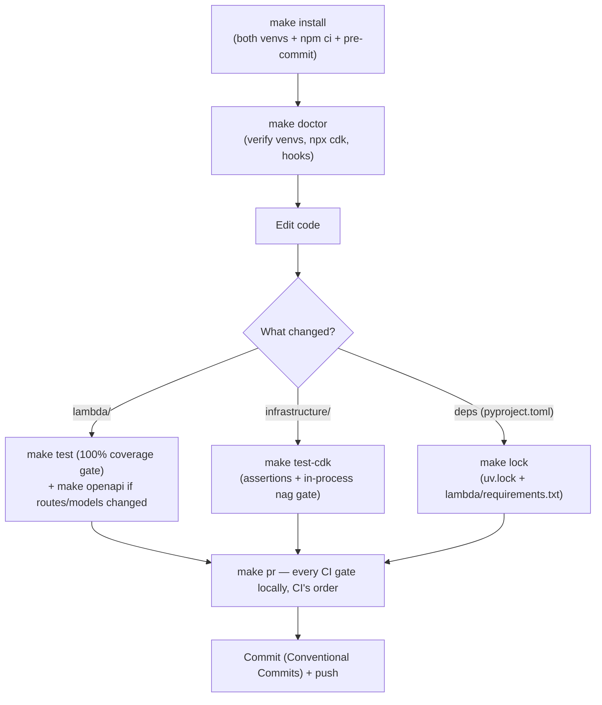
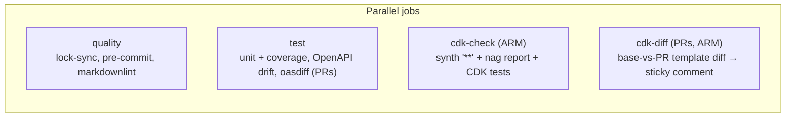
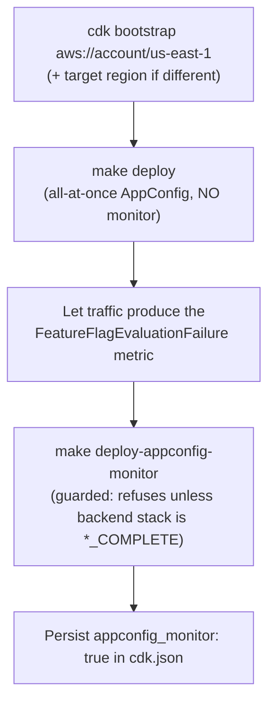
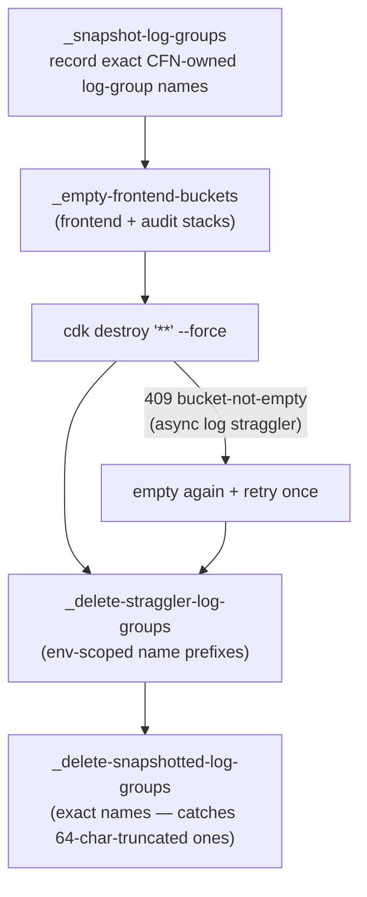

# Key Workflows

The processes a contributor (human or agent) actually runs, in the order they run them.

## Local development loop

Rules that keep the loop working:

- **Never mix the venvs**: `.venv` (CDK) and `.venv-lambda` (Powertools) hold incompatible `attrs` resolutions. The Makefile routes each target to the right venv via `UV_PROJECT_ENVIRONMENT`; follow it rather than running pytest/mypy directly. Recovery: `make clean-venvs && make install`.
- **Don't run `pytest tests/cdk` bare** — the project-wide `addopts` hardcodes a 100% `lambda/` coverage gate that only the unit suite satisfies; the make targets pass `--override-ini="addopts="`.
- **`make cdk-synth` needs Docker** (PythonFunction bundling). `make test-cdk` covers the nag gate without Docker (bundling skipped in-process); run the full synth before pushing IAM-touching code.
- Commit messages follow the Conventional Commit grammar (`feat:` `fix:` `docs:` `chore:` `ci:` `test:` `refactor:` `build:`) — enforced on PR titles by `.github/workflows/pr-title.yml` and consumed by git-cliff. **No `Co-Authored-By:` trailers** (project preference).

## CI pipeline (per push / PR)

`make pr` mirrors quality + test + cdk-check locally. The cdk-diff job is hermetic (no AWS credentials — diffs two locally synthesized assemblies).

## Deployment workflows

### First (cold) deploy

`appconfig_monitor` on a cold deploy bricks the stack: the monitor's fresh alarm starts `INSUFFICIENT_DATA`, AppConfig treats that as a rollback signal, and the create aborts. `retain_data=true` is safe from the first deploy and belongs in `cdk.json` for production forks.

### Ephemeral environments

`make deploy ENV=alice-feature-x` deploys a fully namespaced copy of all five stacks (validated env name, alarms page nobody). `make destroy-clean ENV=alice-feature-x` tears down only that environment — sweeps are env-prefixed by construction.

### Teardown (`make destroy-clean`)

Why: CloudFront/S3/CloudTrail log delivery is asynchronous (late files fail `DeleteBucket`), and Lambda log delivery re-creates deleted log groups. The snapshot pass exists because CloudFormation truncates Lambda physical names at 64 chars mid-word, which no prefix can match.

## Release workflow

1. `git cliff --bumped-version` decides the next version from Conventional Commits.
2. Bump `pyproject.toml`, run `make lock`.
3. `git cliff -o CHANGELOG.md` (Dependabot bumps and merge commits are filtered by `cliff.toml`).
4. One `chore:` commit; annotated `vX.Y.Z` tag whose body is the release notes.
5. Push the tag → `.github/workflows/release.yml` publishes the GitHub Release automatically.

## Dependency update workflow

- **Dependabot** bumps `pyproject.toml` + `uv.lock` (uv ecosystem), `package.json` (npm), workflow SHAs, and pre-commit `rev:`s — but never the exported `lambda/requirements.txt`, so CI's drift gate fails until `make lock` runs on the branch.
- **`make deps-merge`** (wraps `scripts/deps_merge.sh`) automates the loop per PR: rebase onto main → `make lock` → `ruff format` → commit → force-push → arm squash auto-merge. Sequential by design (each `make lock` regenerates `uv.lock`). Never force-merges through failing checks.
- **`make upgrade`** is the local path: `uv lock --upgrade` gated by a 7-day PyPI cooldown (`COOLDOWN_DAYS`) against fresh malicious releases, plus `pre-commit autoupdate` and `npm update` (which do **not** honor the cooldown — review their diffs).

## Adding a resource (infrastructure change)

1. Add the construct in the owning module (usually `BackendApp` or `FrontendStack`); follow the local pattern (explicit log group with retention, CMK where supported, removal policy on stateful resources — the `TemplateConventionChecks` Aspect fails synth otherwise).
2. Run `make test-cdk` — expect nag findings; fix the resource or add `acknowledge_rules` with a real rationale (granular IAM rules need exact `applies_to` finding ids, printed by the gate's failure output).
3. Update the snapshot tests if templates changed; run `make cdk-synth` (Docker) before pushing IAM-touching changes.
4. If the service creates out-of-CFN supporting resources, mirror the cleanup custom-resource pattern (`RumLogGroupCleanup` / `AppInsightsDashboardCleanup`).

## API change workflow

1. Edit routes/models in `lambda/app.py` / `lambda/models.py` (+ `service.py` logic).
2. `make test` (100% coverage gate — new branches need tests).
3. `make openapi` and **commit `docs/openapi.json`** — CI rejects drift; oasdiff rejects breaking changes on PRs.
4. If response shapes built outside the resolver change (the 400/409), keep the hand-built dicts and their documenting models in sync.
