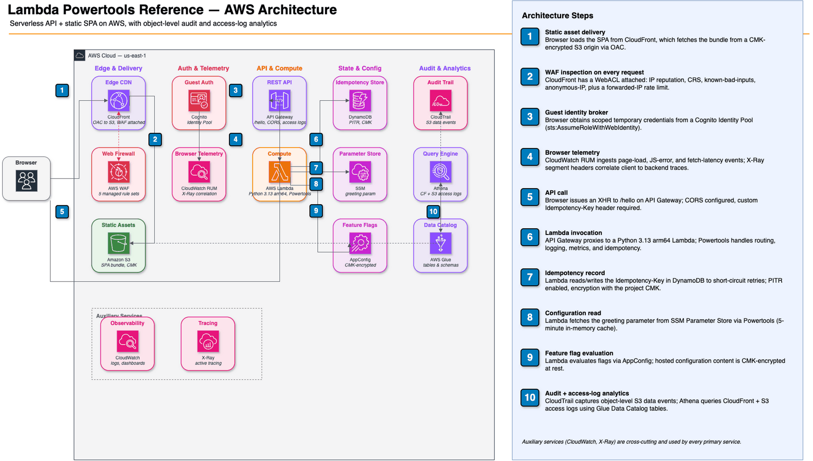
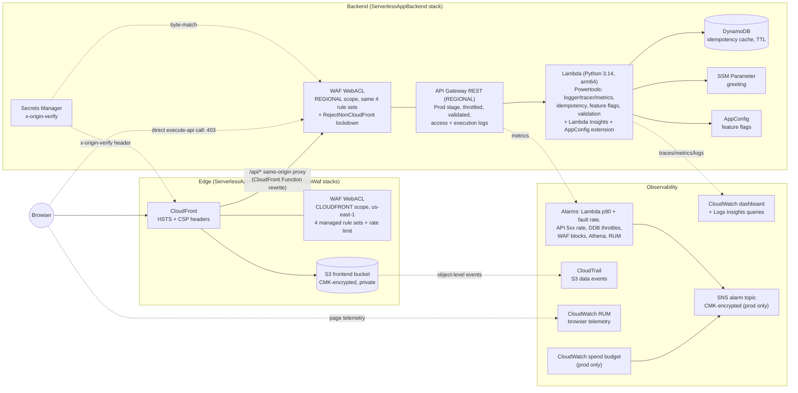

# Lambda Powertools Reference

[](https://github.com/timpugh/lambda-powertools-reference/actions/workflows/ci.yml)
[](https://securityscorecards.dev/viewer/?uri=github.com/timpugh/lambda-powertools-reference)
[](https://github.com/timpugh/lambda-powertools-reference/actions/workflows/codeql.yml)
[](https://timpugh.github.io/lambda-powertools-reference/)
[](https://www.python.org/downloads/)
[](https://timpugh.github.io/lambda-powertools-reference/)
[](LICENSE)

**Docs:** https://timpugh.github.io/lambda-powertools-reference/

This project contains source code and supporting files for a serverless application that you can deploy with the AWS CDK. It includes the following files and folders.

- `app.py` - CDK entry point; instantiates the data, WAF, backend, frontend, and audit stacks and calls `app.synth()`
- `lambda/` - Code for the application's Lambda function
- `infrastructure/data_stack.py` - The stateful data stack — DynamoDB idempotency table + its dedicated CMK, with the `retain_data` retention switch
- `infrastructure/backend_stack.py` - The backend CDK stack — a thin wrapper that composes `BackendApp`, applies the compliance Aspects, and wires CfnOutputs
- `infrastructure/backend_app.py` - `BackendApp` construct — owns the compute domain resources (Lambda, API Gateway, SSM, AppConfig, monitoring); consumes the idempotency table from the data stack
- `infrastructure/waf_stack.py` - The WAF stack (CloudFront-scoped WebACL, always in `us-east-1`)
- `infrastructure/frontend_stack.py` - The frontend stack (S3 + CloudFront, access-log bucket, Glue/Athena log analytics)
- `infrastructure/audit_stack.py` - The stateful audit stack — CloudTrail object-level S3 data-event trail + its log bucket + a dedicated CMK, `retain_data`-gated (audits the frontend buckets one-way)
- `infrastructure/nag_utils.py` - Shared cdk-nag v3 helpers (`attach_nag_packs`, `acknowledge_rules`, `apply_compliance_aspects`) plus shared KMS-grant / log-group helpers
- `frontend/` - Static assets (`index.html`) deployed to the frontend S3 bucket
- `tests/` - Unit and integration tests
- `tests/conftest.py` - Shared test fixtures (API Gateway event, Lambda context, mocks)
- `docs/` - Zensical documentation source files
- `pyproject.toml` - Consolidated tool configuration (ruff, mypy, pylint, pytest, coverage)
- `.pre-commit-config.yaml` - Pre-commit hook definitions (runs on every `git commit`)
- `.bandit` - Bandit security scanner configuration (excluded directories)
- `.vscode/` - VS Code workspace settings and recommended extensions (ruff, mypy, pylint, pytest)
- `.github/workflows/` - GitHub Actions workflows (`ci.yml`, `docs.yml`, `dependency-audit.yml`, `dependabot-auto-merge.yml`)
- `.github/dependabot.yml` - Dependabot configuration (weekly checks for GitHub Actions and all three Python requirements tiers)
- `Makefile` - Common development commands (`make help` to list all targets)
- `LICENSE` - Apache 2.0 license
- `TODO.md` - Outstanding work and deferred items

This application provisions Lambda, API Gateway, DynamoDB, SSM Parameter Store, AppConfig, CloudFront (S3-backed), WAF, and a CloudTrail audit trail — split across five stack files in `infrastructure/` (`data_stack.py` for the stateful DynamoDB table + its CMK, `backend_stack.py` for the backend compute, `waf_stack.py` for WAF, `frontend_stack.py` for S3/CloudFront, `audit_stack.py` for the stateful CloudTrail audit trail + its bucket + CMK). The Lambda function uses [AWS Lambda Powertools](https://docs.powertools.aws.dev/lambda/python/latest/) for logging, tracing, metrics, routing, idempotency, parameters, and feature flags — see [Lambda Powertools features](#lambda-powertools-features). Note that Powertools Tracer currently depends on `aws-xray-sdk`, which is approaching deprecation; there's an [open RFC](https://github.com/aws-powertools/powertools-lambda/discussions/90) to migrate to OpenTelemetry.

## Table of contents

- [Getting started](#getting-started) — [Prerequisites](#prerequisites) · [Quick start](#quick-start) · [Makefile](#makefile) · [Editor setup (VS Code)](#editor-setup-vs-code)
- [Architecture](#architecture) — [CDK best practices](#cdk-best-practices) · [Lambda Powertools features](#lambda-powertools-features) · [AWS resources provisioned](#aws-resources-provisioned) · [Stack and construct composition](#stack-and-construct-composition) · [Stateful data stack and `retain_data`](#stateful-data-stack-and-retain_data) · [Deployment safety](#deployment-safety-canary-lambda) · [Audit stack and log retention](#audit-stack-and-log-retention) · [Frontend stack](#frontend-stack) · [Same-origin API and origin lockdown](#same-origin-api-and-origin-lockdown) · [Monitoring](#monitoring) · [Cost overview](#cost-overview)
- [Deploy the application](#deploy-the-application) — [Recommended order](#recommended-order-for-ongoing-deploys) · [Ephemeral environment](#deploying-an-ephemeral-environment) · [Different region](#deploying-to-a-different-region) · [Destroying](#destroying-a-deployment) · [Cleanup](#cleanup)
- [Working in the codebase](#working-in-the-codebase) — [Add a resource](#add-a-resource-to-your-application) · [Useful CDK commands](#useful-cdk-commands) · [Synthesize and validate locally](#synthesize-and-validate-locally) · [Debugging the Lambda function](#debugging-the-lambda-function) · [Fetch, tail, and filter logs](#fetch-tail-and-filter-lambda-function-logs) · [Commit message convention](#commit-message-convention) · [Cutting a release](#cutting-a-release) · [Documentation](#documentation)
- [Quality and security](#quality-and-security) — [Tests](#tests) · [Linting and static analysis](#linting-and-static-analysis) · [Detecting deprecated APIs](#detecting-deprecated-apis) · [Pre-commit hooks](#pre-commit-hooks) · [Security](#security) · [CDK security checks](#cdk-security-checks) · [pyproject.toml configuration](#pyprojecttoml-configuration)
- [CI/CD](#cicd) — [GitHub Actions](#github-actions)
- [Project dependencies](#project-dependencies)
- [When forking for production](#when-forking-for-production) — [Tailoring to your workload](#tailoring-this-to-your-workload) · [Multi-tenant SaaS](#growing-this-into-multi-tenant-saas) · [Design decisions](#design-decisions-and-known-limitations) · [Scaling](#scaling-beyond-a-reference-architecture) · [AWS ops services](#aws-services-for-post-deployment-operations)
- [Resources](#resources)

## Getting started

### Prerequisites

- [Node.js](https://nodejs.org/) — the CDK CLI and markdownlint are npm packages, pinned in `package.json` and installed by `make install` (`npm ci`). All invocations go through `npx`, so no global `npm install -g aws-cdk` — the pinned version is the one that runs, locally and in CI, and Dependabot's npm ecosystem tracks the pin.
- [AWS CLI v2](https://docs.aws.amazon.com/cli/latest/userguide/getting-started-install.html) — used by `aws logs tail` for streaming Lambda logs and shared by the CDK CLI for credentials
- [Python 3.14+](https://www.python.org/downloads/) for local development (uv manages the interpreter) — the same version line as the Lambda runtime, so local tests exercise what production runs
- [uv](https://docs.astral.sh/uv/) — Python package and environment manager (`curl -LsSf https://astral.sh/uv/install.sh | sh`)
- A container runtime for bundling Lambda dependencies — either:
  - [Finch](https://runfinch.com/) — AWS-supported, open-source, license-friendly (recommended)
  - [Docker](https://www.docker.com/) — drop-in alternative; CDK uses it by default when `CDK_DOCKER` is unset

### Quick start

Just want to explore the code and run tests without deploying anything to AWS?

```bash
git clone https://github.com/timpugh/lambda-powertools-reference.git
cd lambda-powertools-reference
python3 -m venv .venv && source .venv/bin/activate
make install
make test
```

No AWS credentials or deployed stack required — unit tests mock all external dependencies.

If you open the project in VS Code, the `.vscode/` directory pre-configures ruff (format on save), mypy, pylint, and pytest against `pyproject.toml`. The first time you open it, VS Code will prompt you to install the recommended extensions listed in `.vscode/extensions.json`.

### Makefile

Common commands are available via `make`. Run `make help` to see all targets:

```bash
make install            # set up both venvs (.venv + .venv-lambda), node tooling (npm ci), and pre-commit hooks
make doctor             # diagnostic snapshot — uv/cdk/drawio versions, venv state, pre-commit wiring
make pr                 # run every CI gate locally (lint, typecheck, tests, synth, OpenAPI drift)
make test               # run unit tests with coverage (in .venv-lambda)
make test-cdk           # run CDK stack assertion tests, incl. the in-process cdk-nag gate (in .venv)
make test-integration   # run integration tests (requires deployed stack)
make lint               # run all pre-commit hooks (ruff, mypy, pylint, bandit, xenon, pip-audit)
make lint-docs          # lint Markdown (README, TODO, docs/) with markdownlint
make format             # format code with ruff
make typecheck          # run mypy in both venvs (CDK side in .venv, Lambda runtime + scripts in .venv-lambda)
make security           # run bandit (direct) + pip-audit (via pre-commit so the CVE ignore list stays single-sourced)
make check-lock         # verify lambda/requirements.txt is in sync with uv.lock (mirrors the CI gate)
make cdk-synth          # synthesize all stacks (with '**' glob so cdk-nag descends into Stage-nested stacks)
make cdk-notices        # show AWS-published CDK notices (CVEs, deprecated CDK versions, breaking changes)
make cdk-deprecations   # list deprecated CDK APIs in use (synth output filtered for "deprecated")
make deploy             # cdk deploy '**' --require-approval never (ENV=<name> for an ephemeral env; -c region=X for others)
make destroy            # cdk destroy '**' --force (same ENV= / region overrides as deploy)
make docs               # build Zensical HTML docs
make docs-open          # build and open docs in browser
make docs-serve         # regenerate OpenAPI + start Zensical dev server with hot reload
make openapi            # regenerate the committed docs/openapi.json from lambda/app.py
make compare-openapi    # fail if the committed docs/openapi.json is stale (mirrors the CI gate)
make lock               # regenerate uv.lock and lambda/requirements.txt from pyproject.toml
make upgrade            # upgrade all dependencies (respects COOLDOWN_DAYS, default 7) + pre-commit revs + npm pins
make deps-merge         # process every open Dependabot PR (rebase + lock + push + arm auto-merge); use PR=N for one
make clean              # remove build artifacts, caches, and coverage files (preserves venvs)
make clean-venvs        # wipe .venv and .venv-lambda (separate from `clean` — reinstalling takes minutes)
```

**Virtual environments are project-local.** Both `.venv` (CDK workstation) and `.venv-lambda` (Lambda runtime) live at the repo root, are gitignored, and are created automatically by `make install`. You do not pick the location — `uv` does, based on the directory `make` runs from. Each clone of this repo gets its own pair; nothing is shared across projects on disk. The `attrs` version conflict between CDK (requires `attrs<26` via jsii) and Powertools (requires `attrs>=26`) is the reason two venvs exist; both resolutions are recorded in one `uv.lock` via `[tool.uv.conflicts]` in `pyproject.toml`. The Makefile's `LAMBDA_ENV := UV_PROJECT_ENVIRONMENT=.venv-lambda` variable + `$(LAMBDA_RUN)` prefix mean every target that needs Powertools auto-switches without an activation dance.

Run `make doctor` after `make install` to confirm both venvs picked up the expected groups (`aws-cdk` in `.venv`, `aws-lambda-powertools` in `.venv-lambda`), and to verify `cdk` / `drawio` CLIs are on `PATH` and that pre-commit is wired into `.git/hooks/`. If a venv ever ends up corrupted (lockfile resolver refuses to reconcile, Python version mismatch, mysteriously-missing modules), `make clean-venvs && make install` is the cheapest path back to a known-good state.

### Editor setup (VS Code)

The repo keeps two Python environments due to the `attrs` version conflict (`.venv` for CDK, `.venv-lambda` for Lambda runtime — see [Project dependencies](#project-dependencies)).

**Recommended: open the workspace file.** `File > Open Workspace from File…` → `practice.code-workspace`. The workspace declares five folder roots — `.` (CDK + `.venv`), `lambda/` (`.venv-lambda`), `tests/unit/` (`.venv-lambda`), `tests/integration/` (`.venv-lambda`), `scripts/` (`.venv-lambda`) — each with its own `python.defaultInterpreterPath` in `.vscode/settings.json`. The effect:

- **Pylance** spins up a separate instance per root, so CDK code resolves `aws_cdk` against `.venv` and Lambda code resolves `aws_lambda_powertools` against `.venv-lambda` simultaneously — no red squiggles on either side.
- **Terminals** opened from each root auto-activate that root's venv.
- **Test Explorer** assigns each root its own interpreter: the `Practice (CDK)` root runs the CDK suites under `.venv` (its `pytestArgs` is scoped to `tests/cdk`), and the `Unit tests` root runs the unit suite under `.venv-lambda`. The split is why root is scoped to `tests/cdk` rather than all of `tests/` — otherwise the unit tests would be discovered twice (once skipped under `.venv`, once runnable under `.venv-lambda`). Every test module still guards its venv-specific imports (`pytest.importorskip` for `boto3`/Powertools/`aws_cdk`, plus the lazy handler fixture), so any broader invocation (e.g. `pytest tests` under `.venv`) lists the other side's suites as *skipped* rather than erroring. Tests are exempted from mypy via a `tests.*` override in `pyproject.toml`, keeping editor diagnostics in agreement with the CLI gates (which never type-check tests). `python.testing.pytestArgs` passes `--override-ini=addopts=` — the same strip launch.json's debug config and the cdk/integration make targets use — because the global `addopts` carries the unit-suite coverage gate: a collect-only discovery run executes nothing, so without the override every Testing-panel refresh would report `coverage 0% / FAIL` and rewrite `report.html`/`htmlcov`. The 100% gate is enforced where the full unit suite actually runs: `make test` and CI. The `Integration tests` root runs under `.venv-lambda` with `--timeout=120` (the warm-latency test makes several sequential HTTP calls and can exceed the 30s default); its tests **skip** when no stack is deployed — the `AWS_BACKEND_STACK_NAME` / `AWS_FRONTEND_STACK_NAME` env vars come from `[tool.pytest.ini_options].env` (untouched by the `addopts` strip), and the fixtures skip when `describe-stacks` finds nothing — and **run** against a live deployment when one exists. They're still runnable headless via `make test-integration`.
- **Coverage in the editor** comes from the Testing panel's **Run with Coverage** action (the run-with-coverage icon, or right-click a suite → *Run with Coverage*), which renders line/branch coverage in the editor gutters and the Test Coverage view. No configuration is needed: for coverage runs the Python extension injects its own `--cov=. --cov-branch` (it only defers to `pytestArgs` if you put `--cov` args there — don't, or coverage re-enters every discovery run). Two ways to get it, depending on what you want:
  - **Per-root, in-panel.** From the multi-root workspace, the toolbar's global **Run Tests with Coverage** runs *both* roots under their own interpreters and produces an aggregate coverage report across both — `infrastructure/` constructs (from the CDK root; the one place construct coverage is measured at all, since the CLI gate only covers `lambda/`) and `lambda/app.py` at 100% (from the unit root). One upstream caveat, verified: per-line *gutter highlighting* can go missing for some folders after a *global* run ([microsoft/vscode-python#25643](https://github.com/microsoft/vscode-python/issues/25643), open) — running a single root's Run-with-Coverage always highlights that root correctly. The aggregate numbers are unaffected.
  - **Combined, deterministic, one report.** `make coverage` runs the CDK suite under `.venv` and the unit suite under `.venv-lambda`, both `--cov-append` into one `.coverage`, then opens a single HTML report spanning both packages. Not subject to the highlighting bug; this is the reliable way to see one cross-venv number (~96% total — `infrastructure/` carries intentional uncovered defensive lines, so the combined figure is informational; the enforced 100% gate is `lambda/` only, in `make test` and CI).

**Fallback: open the folder directly.** `File > Open Folder` defaults to `.venv` (CDK side fine, but Powertools imports in `lambda/` show as unresolved due to Pylance's single-interpreter-per-workspace limit). Use only if you specifically don't want the workspace file loaded.

[VS Code's `python-envs.pythonProjects`](https://code.visualstudio.com/docs/python/environments#_python-projects) would handle terminal activation and test discovery per folder inside a single workspace, but it assumes each project's venv lives under its folder. This repo keeps both venvs at the repo root (matching uv's `UV_PROJECT_ENVIRONMENT` layout), so the multi-root workspace is the right fit. Pylance is single-interpreter per workspace anyway — multi-root is the only way to get correct type resolution for both sides.

**Settings worth knowing:**

- `importStrategy: "fromEnvironment"` is set for **all three linter extensions** (`mypy-type-checker.*`, `pylint.*`, `ruff.*`) in all four folder roots, so the editor diagnoses with exactly the versions pinned in `pyproject.toml` — the same binaries pre-commit and CI run — instead of whatever each extension bundles. For the two Microsoft extensions this is also a concrete bug fix, not just posture: their default `useBundled` strategy injects the extension's `bundled/libs` onto the subprocess's import path, and those stale copies shadow the venv's. Observed with mypy — the bundled `typing_extensions.py` predates 4.14, so the `pydantic.mypy` plugin failed to load with `cannot import name 'Sentinel' from 'typing_extensions'` ([microsoft/vscode-mypy#380](https://github.com/microsoft/vscode-mypy/issues/380)) — and the pylint extension carries the same exposure (its `bundled/libs` ships its own `attrs` and `astroid`, in a repo where the `attrs` version split is the load-bearing constraint). The Ruff extension already defaults to `fromEnvironment`; it's set explicitly so the posture is declared rather than inherited from a default.
- `python-envs.workspaceSearchPaths` is pinned to `["./.venv", "./.venv-lambda"]` so the *Python: Select Interpreter* picker lists both. The default `./**/.venv` misses `.venv-lambda` because it matches only the literal name. Append to the array if you add a third venv.
- `python-envs.alwaysUseUv` is *user-scoped* (cannot be committed). Set it to `true` to create new envs via `uv venv` instead of `python -m venv` — worth turning on since the Makefile already uses uv.
- `python.analysis.typeCheckingMode: "strict"` runs full Pylance type analysis inline. This **overlaps** with the mypy linter (which runs on save and in CI) but they're separate engines: Pylance is stricter on `Any` and inferred narrowing, mypy catches different things. If too loud, lower to `"basic"`/`"off"` in User Settings.
- `autoImportCompletions`, `autoFormatStrings`, and the full set of `inlayHints` (`variableTypes`, `functionReturnTypes`, `callArgumentNames: "all"`, `pytestParameters`) are all on. Tune `callArgumentNames` to `"partial"` in User Settings if dense call sites get noisy.

**Debug configurations (`.vscode/launch.json`)** — three F5 configs pre-wired:

- **Python: Current File** — generic debugpy launch on the focused `.py` file.
- **Pytest: Current File** — runs `pytest ${file} -v --override-ini=addopts=` under the debugger. `--override-ini=addopts=` strips the global pytest options (`-n auto`, `--cov-fail-under=100`, HTML reporter) that would otherwise fight the debugger, fail single-test runs on the coverage threshold, or suppress breakpoints (a known `pytest-cov` issue). Tagged `"purpose": ["debug-test"]` so the Test Explorer's debug-icon uses this config too.
- **CDK: Synth (app.py)** — runs the CDK entry point under debugpy with the dummy-account env vars the `cdk-check` CI job uses. Useful when synth blows up — set a breakpoint in any `*_stack.py`, hit F5, walk the stack assembly.

## Architecture



*Source: [`docs/architecture.drawio`](docs/architecture.drawio). Edit in [draw.io](https://app.diagrams.net/) (or `brew install --cask drawio` for the desktop CLI), then re-export with:*

```bash
drawio --export --format png --scale 1 --output docs/architecture.png docs/architecture.drawio
python3 -c "from PIL import Image; Image.open('docs/architecture.png').convert('P', palette=Image.ADAPTIVE, colors=256).save('docs/architecture.png', optimize=True)"
```

*The second line palette-compresses the export to keep it well under the `check-added-large-files` pre-commit threshold without losing visible sharpness. Diagram originally generated by the [`deploy-on-aws`](https://github.com/awslabs/agent-plugins/tree/main/plugins/deploy-on-aws) Claude Code plugin's `aws-architecture-diagram` skill.*

The same architecture as a text-diffable Mermaid diagram (renders inline on GitHub; the draw.io PNG above remains the detailed source of truth):



See [Same-origin API and origin lockdown](#same-origin-api-and-origin-lockdown) for the full same-origin + origin-lockdown mechanism the diagram summarizes.

Everything data-bearing is encrypted with the project's customer-managed KMS keys; five cdk-nag rule packs gate every synth. See [AWS resources provisioned](#aws-resources-provisioned) for the full inventory.

### CDK best practices

This template is built to follow the official [AWS CDK best practices](https://docs.aws.amazon.com/cdk/v2/guide/best-practices.html) and [security best practices](https://docs.aws.amazon.com/cdk/v2/guide/best-practices-security.html) guides. Each row links to where the practice is realized — and, where it's enforced, the test or gate that keeps it that way.

| Best practice | How this template applies it | Enforced by |
|---|---|---|
| **Model with constructs, deploy with stacks** | Domain resources live in `Construct` subclasses; each `Stack` is a thin wrapper composing them ([Stack and construct composition](#stack-and-construct-composition)) | — |
| **Keep stateful resources in their own stack** | `DataStack` (DynamoDB + CMK) and `AuditStack` (CloudTrail + bucket + CMK) are separate from stateless compute ([Stateful data stack](#stateful-data-stack-and-retain_data)) | — |
| **Separate infrastructure and application code** | `infrastructure/` (CDK) vs `lambda/` (handler) vs `tests/`, with isolated dependency groups | — |
| **Define retain policies on stateful/critical resources** | `retain_data` flips tables, buckets, and CMKs to `RETAIN` with deletion + termination protection ([retain_data](#stateful-data-stack-and-retain_data)) | — |
| **Use generated, not physical, resource names** | `table_name` / `parameter_name` / `log_group_name` left unset so CDK derives them — avoids replacement failures and cross-region collisions ([composition](#stack-and-construct-composition)) | — |
| **Prefer higher-level constructs; reach for escape hatches deliberately** | L2 constructs by default; L1 (`Cfn*`) only where no L2 exists (AppConfig, WAF, Glue, RUM); escape hatches go through `node.default_child` guarded by a runtime `isinstance` check and a comment on *why* (e.g. `recursive_loop="Terminate"` set on the `CfnFunction` because the `PythonFunction` L2 doesn't surface it) | — |
| **Deterministic synthesis** | No environment lookups (`*.from_lookup`) and no `CfnParameter`/`CfnCondition` — every decision is made at synth time from context, not deferred to deploy; `cdk.context.json` is kept committable (not gitignored) for the moment a fork adds a lookup | — |
| **Don't change logical IDs of stateful resources** | Logical IDs frozen in a committed list; a renaming refactor (= replacement = data loss) fails at PR time | `TestLogicalIdStability` ([Tests](#tests)) |
| **Least-privilege IAM; write explicit, scoped policies** | Scoped grants; wildcard IAM only where unavoidable, each with a per-resource justification ([Security](#security)) | cdk-nag `IAM5` |
| **Security defaults aren't enough — cdk-nag in the synth loop** | Five rule packs (AwsSolutions, Serverless, NIST/HIPAA/PCI) plus a bespoke validation Aspect fail every synth ([CDK security checks](#cdk-security-checks)) | `cdk synth` + `TestNagCompliance` |
| **No hardcoded secrets; encrypt at rest and in transit** | End-to-end CMK encryption, SSL-enforced buckets/topics, no secrets in code ([Security](#security)) | bandit + cdk-nag |
| **Model CI/CD stages in code** | `is_production_env` / `env` gate canary-vs-all-at-once rollout, SNS alarm routing, and collision-free stack names ([Deployment safety](#deployment-safety-canary-lambda)) | — |
| **Back up stateful resources** | DynamoDB point-in-time recovery always on; `-c retain_data=true` layers an AWS Backup plan on top (daily backups kept 35 days + a monthly backup moved to cold storage and kept a year) ([retain_data](#stateful-data-stack-and-retain_data)) | — |
| **Test infrastructure at synth time** | Assertion tests pin vital resources and connections; the nag-annotations gate runs in-process ([Tests](#tests)) | `tests/cdk/` |
| **Surface infrastructure changes on every PR** | The `cdk-diff` job posts a CloudFormation diff (resources + IAM changes) as a PR comment ([GitHub Actions](#github-actions)) | `cdk-diff` CI job |

### Lambda Powertools features

The Lambda is organized into three layers so the structure scales past one route (see [Handler structure for a growing API](#scaling-beyond-a-reference-architecture)): the **handler** ([lambda/app.py](lambda/app.py)) initializes Powertools and the AWS clients, routes the API Gateway event, and maps the service's domain errors to HTTP responses; the **service layer** ([lambda/service.py](lambda/service.py)) holds the business logic with its AWS providers dependency-injected (no module-level client state); and the **model layer** ([lambda/models.py](lambda/models.py)) holds the Pydantic request/response/env-var contracts. The handler uses the following Powertools utilities:

#### Logger

Structured JSON logging with `@logger.inject_lambda_context`. Automatically includes Lambda context fields (function name, request ID, cold start) in every log entry. Configured via `POWERTOOLS_SERVICE_NAME` and `POWERTOOLS_LOG_LEVEL` environment variables. The legacy `LOG_LEVEL` fallback is intentionally not set — running both side-by-side hides which knob actually wins.

#### Tracer

X-Ray tracing with `@tracer.capture_lambda_handler` on the entry point and `@tracer.capture_method` on route handlers. Creates subsegments for each traced method.

#### Metrics

CloudWatch Embedded Metric Format (EMF) via `@metrics.log_metrics(capture_cold_start_metric=True)`. The `/greeting` route emits a `GreetingRequests` count metric, and a `FeatureFlagEvaluationFailure` count metric on the feature-flag fallback path (a bad flag config is caught and degraded gracefully, so this metric is what makes a broken config observable — it's the signal a production fork wires an AppConfig deployment monitor to, to auto-roll-back a bad flag rollout, see [Deployment safety](#deployment-safety-canary-lambda)). Metrics are published under the `ServerlessApp` namespace (set via `POWERTOOLS_METRICS_NAMESPACE`).

#### Event Handler

`APIGatewayRestResolver` provides Flask-like routing with `@app.get("/greeting")`. It parses the API Gateway event and routes to the correct handler based on HTTP method and path.

The resolver is constructed with `enable_validation=True`, which turns on Pydantic-based request and response validation driven entirely by function type annotations. The return-type annotation on the `get_greeting()` handler is a `GreetingResponse(BaseModel)` — Powertools validates the returned object against that model and serializes it to JSON. Adding request bodies later is the same pattern: declare a Pydantic model as a parameter type and it gets validated and documented automatically.

#### Idempotency

The `@idempotent` decorator uses a DynamoDB table to prevent duplicate processing of the same request. It keys on a client-supplied `Idempotency-Key` header (see the idempotency-keying design note under [Design decisions and known limitations](#design-decisions-and-known-limitations)) and records expire after 1 hour. The `DataStack` provisions the DynamoDB table with on-demand billing and a TTL attribute.

#### Parameters

An explicit `SSMProvider` instance fetches the greeting message via `ssm_provider.get()` — rather than the module-level `get_parameter()` helper, so the shared retry config can be injected (see [Design decisions](#design-decisions-and-known-limitations)). The parameter path is set via the `GREETING_PARAM_NAME` environment variable, and Powertools caches the value in-memory (5-minute TTL) to reduce API calls.

#### Feature Flags

`FeatureFlags` reads from AWS AppConfig to toggle behavior at runtime. The `enhanced_greeting` flag controls whether the response includes extra text. The CDK stack provisions the AppConfig application, environment, configuration profile, an initial hosted configuration version, **and a deployment** (all-at-once strategy, zero bake). The deployment is load-bearing, not ceremony: AppConfig's data plane (`GetLatestConfiguration`, which Powertools calls) only serves configuration that has been *deployed* to the environment — a hosted version alone is inert, the flag could never evaluate true, and every fetch would silently take the handler's error-fallback path. CloudFormation re-runs the deployment whenever the hosted version's content changes.

Two format details matter and were both verified against a live deployment. The profile is **freeform** (`AWS.Freeform`), not the native `AWS.AppConfig.FeatureFlags` type: the native type's data plane serves the flattened `{"<flag>":{"enabled":bool}}` form, which Powertools rejects with `SchemaValidationError` — Powertools consumes its [own schema](https://docs.powertools.aws.dev/lambda/python/latest/utilities/feature_flags/) (`{"<flag>":{"default":bool,"rules":{...}}}`), which is what the hosted version stores. And because the hosted content is CMK-encrypted, every deployment (CFN-managed or CLI `start-deployment`) must pass the `kms_key_identifier` or AppConfig rejects it.

The flag content itself lives in [infrastructure/feature_flags.json](infrastructure/feature_flags.json) — one file read by the CDK construct at synth (which can only check it's valid JSON; Powertools isn't installable next to aws-cdk-lib) and by `tests/unit/test_feature_flags_schema.py`, which validates it against the real Powertools `SchemaValidator` in the venv where Powertools is importable. A schema-invalid flag would otherwise be invisible until runtime, because the handler's fallback path swallows the `SchemaValidationError` and quietly evaluates every flag to its default.

**Reads go through the AppConfig Lambda extension, not the SDK.** The handler no longer calls the AppConfig data plane via `boto3`/`AppConfigStore` directly — `BackendApp._attach_appconfig_extension_layer` wires the AWS-published AppConfig Lambda extension (ARM64, region-pinned layer ARN; `us-east-1` pins layer version 2.0.18836 at time of writing, from the AppConfig user guide's "Lambda extension versions" table) onto the function, and [lambda/extension_store.py](lambda/extension_store.py)'s `AppConfigExtensionStore` reads cached flag data from the extension's local `http://localhost:2772` endpoint instead. The extension polls AppConfig in the background and is prefetched at cold start (`AWS_APPCONFIG_EXTENSION_PREFETCH_LIST`), so flags are warm before the first invocation. The failure path is unchanged: any extension-endpoint failure — down, an HTTP error, a malformed body, or an `http.client` protocol error (`BadStatusLine`/`IncompleteRead`, which CPython raises as `http.client.HTTPException`, not `OSError`) — raises `ConfigurationStoreError`, which the service layer's existing fallback already handles: default flag values plus the `FeatureFlagEvaluationFailure` EMF metric, the same signal an AppConfig deployment monitor watches (see [Deployment safety](#deployment-safety-canary-lambda)).

#### OpenAPI spec (committed and CI-gated, not runtime)

The Pydantic models and route hints that power `enable_validation=True` also drive an OpenAPI 3 spec — including the documented **error responses** (400 missing `Idempotency-Key`, 422 validation, 500 SSM failure), declared per route via `responses={...}` so spec consumers see the failure shapes, not just the happy path. `scripts/generate_openapi.py` imports the Lambda resolver, calls `app.get_openapi_json_schema(...)`, writes `docs/openapi.json`, and `docs/api.html` renders it in-browser via [Scalar](https://github.com/scalar/scalar)'s standalone bundle. Zensical copies both files into the built site verbatim.

The spec is **committed**, and two CI gates keep it honest: a drift gate regenerates it and fails if the committed copy is stale (`make compare-openapi` locally; generation is hermetic, so the comparison is byte-for-byte), and a breaking-change gate (oasdiff) diffs a PR's spec against the base branch's and fails on breaking API changes. The practical effect: every API-contract change is visible in the PR diff and an accidental breaking change can't merge silently. Regenerate with `make openapi` after touching routes, models, or response metadata.

This is a **code-first** contract: the handler's Pydantic models and route hints are the source of truth and the spec is generated *from* them, so the spec can never drift from the running code (the drift gate enforces exactly that). The deliberate alternative is **contract-first**, where a hand-authored `openapi.yaml` is the source and server/client types are generated from *it* — the better fit when the contract is negotiated across teams before any code exists, or when many languages consume it. For a single-service handler, code-first removes the generate-and-wire step and the one invariant that matters (code ↔ spec agreement) is gated; a fork standardizing many services on one shared contract may prefer to flip the direction.

The script then runs a post-processor that attaches a uniform `x-amazon-apigateway-integration` (AWS_PROXY) extension to every operation, with literal `{region}` and `{lambdaArn}` placeholders for `aws apigateway import-rest-api`. The deployed API is always built by CDK, so the extensions are **documentation-only**, showing the AWS wiring in context. Per-route customisation would drift from CDK — the actual source of truth.

The injection is automatic: any new route (`@app.post("/greet")`, `@app.delete("/greeting/{id}")`) picks up the extension on the next `make docs` run. Only verbs outside the standard set (`get`, `put`, `post`, `delete`, `options`, `head`, `patch`, `trace`) would be skipped — not realistic for a REST API.

The spec is intentionally **not** exposed at runtime. A public `/openapi.json` hands unauthenticated callers a map of every path and field name. Keeping it a build artifact gives callable-facing docs without leaking the schema. `make docs` regenerates the spec and rebuilds Zensical in one step, so the rendered API reference is always current.

#### Event Source Data Classes

`APIGatewayProxyEvent` provides typed access to the incoming API Gateway event. Instead of raw dict access like `event["requestContext"]["identity"]["sourceIp"]`, you get `event.request_context.identity.source_ip` with IDE autocomplete and type safety. Powertools includes data classes for many event sources:

- `APIGatewayProxyEvent` / `APIGatewayProxyEventV2` — REST and HTTP API events
- `S3Event` — S3 bucket notifications
- `SQSEvent` — SQS messages
- `DynamoDBStreamEvent` — DynamoDB stream records
- `EventBridgeEvent` — EventBridge events
- `SNSEvent`, `KinesisStreamEvent`, `CloudWatchLogsEvent`, and more

These are available from `aws_lambda_powertools.utilities.data_classes` and require no extra dependencies.

### AWS resources provisioned

Resources are split across five stacks. By default every resource has `RemovalPolicy.DESTROY` so `cdk destroy` leaves nothing behind — the exceptions are the two **stateful** stacks (data and audit), whose tables, buckets, and CMKs flip to `RETAIN` (with deletion/termination protection) when a production fork sets `retain_data=true` (see [Stateful data stack and `retain_data`](#stateful-data-stack-and-retain_data) and [Deployment safety](#deployment-safety-canary-lambda)).

**`ServerlessAppData-{region}`** (stateful data layer, target region):

| Resource | Purpose |
|---|---|
| KMS Key | Dedicated CMK encrypting the DynamoDB table — kept with the data it protects so the `retain_data` switch is meaningful (a retained table whose key lived in a destroyable stack would be unreadable after teardown) |
| DynamoDB Table (`TableV2`) | Idempotency records (TTL, on-demand billing, 1-day PITR — shortest allowed; records expire after an hour — KMS-encrypted, Contributor Insights in THROTTLED_KEYS mode). Handed to the backend cross-stack for the Lambda's env var + read/write grant |
| AWS Backup Vault + Plan | **`retain_data=true` only** — daily backups kept 35 days, plus a monthly backup moved to cold storage and kept a year, layered on top of PITR for the long compliance horizon PITR's 1-day rolling window can't reach. Uses this stack's CMK, `RemovalPolicy.RETAIN`. The default (destroy-friendly) shape stays PITR-only |

**`ServerlessAppWaf-{region}`** (always in `us-east-1`):

| Resource | Purpose |
|---|---|
| WAF WebACL | CloudFront-scoped WebACL with 4 managed rule groups (IP reputation, common rule set, known bad inputs, anonymous IPs) + viewer-IP rate limit |
| KMS Key | Encrypts the S3 auto-delete provider's CloudWatch log group (the WAF logs themselves are SSE-S3 in the bucket below) |
| S3 Bucket (`aws-waf-logs-*`) | Receives the CloudFront WebACL's access logs (SSE-S3, 90-day lifecycle), with `Authorization`/`Cookie` headers redacted and ALLOW-verdict records dropped at write time. WAF delivers directly to S3 and owns the bucket policy; queryable via Athena |

**`ServerlessAppBackend-{region}`** (backend, target region):

| Resource | Purpose |
|---|---|
| KMS Key | Encrypts the compute-side resources: log groups, Lambda env vars, AppConfig hosted config, the origin-verify Secrets Manager secret, and the SNS alarm topic (the DynamoDB table has its own CMK in `ServerlessAppData-{region}`) |
| Lambda Function | Runs the serverless-app handler (Python 3.14, 256 MB, arm64/Graviton, X-Ray tracing, JSON logging, env vars CMK-encrypted, async retries pinned to 0). Carries the Lambda Insights extension (~$0.50/month) and the AWS-published AppConfig extension layer (feature flags served from `localhost:2772`, prefetched at cold start) — see [Monitoring](#monitoring) |
| Lambda Alias (`live`) + Version | Traffic-shifting target for CodeDeploy — the API integrates with the alias so deployments can canary + roll back (see [Deployment safety](#deployment-safety-canary-lambda)) |
| CodeDeploy Application + Deployment Group | Shifts the alias onto each new version (canary 10%/5min in prod, all-at-once in dev) with automatic rollback on the canary error alarm |
| CloudWatch Log Group | Lambda log group with 1-week retention, KMS-encrypted |
| API Gateway REST API | **REGIONAL** endpoint (CloudFront already fronts it — see [Same-origin API and origin lockdown](#same-origin-api-and-origin-lockdown)) exposing `GET /greeting` (integrated with the Lambda `live` alias) with a gateway-level request validator, X-Ray tracing, and per-stage throttling (rate 100 / burst 200); no CORS configuration — the browser reaches it same-origin |
| CloudWatch Log Group (access) | API Gateway access logs (17-field JSON), KMS-encrypted |
| CloudWatch Log Group (execution) | API Gateway execution logs, KMS-encrypted |
| Secrets Manager Secret | `OriginVerifySecret` — 32-char generated value CloudFront injects as the `x-origin-verify` origin header and the regional WAF byte-matches exactly; no automatic rotation by design (see [Same-origin API and origin lockdown](#same-origin-api-and-origin-lockdown)) |
| WAF WebACL (regional) | REGIONAL WebACL with the 4 shared managed rule groups plus a `RejectNonCloudFront` rule that blocks any request missing the origin-verify header, associated with the Prod stage — closes the `execute-api` CloudFront-bypass window outright (`_attach_regional_waf`) |
| S3 Bucket (`aws-waf-logs-*`) | Receives the regional (API Gateway) WebACL's access logs (SSE-S3, 90-day lifecycle; same-region requirement → the bucket lives in this stack), with `Authorization`/`Cookie` headers redacted and ALLOW-verdict records dropped at write time |
| SQS Queue (DLQ) | Captures failed async invocations of the AwsCustomResource provider Lambda (CMK-encrypted, 14-day retention, SSL-enforced) |
| SNS Topic + CloudWatch Alarms | Lambda p90 latency, Lambda fault rate, API Gateway 5xx fault rate, DynamoDB read/write throttled events, and regional-WebACL BlockedRequests alarms publish to a CMK-encrypted, SSL-enforced topic (prod environments only — ephemeral envs keep the alarms but skip the topic); see [Monitoring](#monitoring) |
| AWS Budgets Budget | **Prod only** — monthly $10 spend budget scoped to the `AmazonCloudWatch` Cost Explorer service filter (RUM bills under it), notifying the alarm topic at 80% actual spend; see [Monitoring](#monitoring) |
| CloudWatch Alarm (deployment-control) | A canary alias-errors alarm consumed by CodeDeploy (rollback), not the SNS topic |
| SSM Parameter | Greeting message (CDK-generated name, read via the `GREETING_PARAM_NAME` env var) |
| AppConfig Application | Feature flag configuration |
| AppConfig Environment | `{stack}-env` environment for feature flags. No monitor by default; with `-c appconfig_monitor=true` it carries a CloudWatch alarm monitor that auto-rolls-back a bad flag rollout (opt-in production add-on — must not be set on the cold/first deploy, see [Deployment safety](#deployment-safety-canary-lambda)) |
| IAM Role (AppConfig monitor) | **Only when `appconfig_monitor=true`** — lets AppConfig read the rollback alarm state (`cloudwatch:DescribeAlarms`) during a flag deployment |
| AppConfig Configuration Profile | `{stack}-flags` freeform profile holding the Powertools feature-flags schema (the native `AWS.AppConfig.FeatureFlags` type serves a format Powertools cannot parse — see Design decisions) |
| AppConfig Deployment Strategy + Deployment | All-at-once (zero bake) by default — a CFN-managed gradual rollout would roll back the cold create (its monitor alarm starts `INSUFFICIENT_DATA`); see [Deployment safety](#deployment-safety-canary-lambda). With `-c appconfig_monitor=true` the strategy becomes gradual (LINEAR 25%/step over 10 min, 5-min bake). Without a deployment, `GetLatestConfiguration` serves nothing and flags can never evaluate true |
| Resource Group + Application Insights | CloudWatch Application Insights monitoring |
| CloudWatch Dashboard | Lambda, API GW, DynamoDB metrics via cdk-monitoring-constructs |
| Custom Resource (`AppInsightsDashboardCleanup`) | Deletes the Application Insights auto-created dashboard on destroy |

**`ServerlessAppFrontend-{region}`** (frontend, target region):

| Resource | Purpose |
|---|---|
| KMS Key | Encrypts the frontend S3 bucket and auto-delete Lambda log group |
| S3 Bucket (frontend) | Private static assets, KMS-encrypted, server access logging enabled, versioned with a 30-day noncurrent-version expiry |
| S3 Bucket (access logs) | Receives S3 server access logs (`s3-access-logs/`), CloudFront standard access logs (`cloudfront/`), and Athena query results (`athena-results/`). SSE-S3 — log delivery requires it. 7-day expiration lifecycle rule applied to all prefixes |
| CloudFront Distribution | HTTPS-only, TLS 1.2+, WAF-protected, custom security-headers policy (HSTS + CSP), access logging to S3, plus a `/api/*` behavior proxying same-origin to the REGIONAL API Gateway (viewer-request rewrite function strips the prefix, origin-verify header injected) — see [Same-origin API and origin lockdown](#same-origin-api-and-origin-lockdown) |
| CloudWatch Log Group (auto-delete) | Auto-delete Lambda log group, KMS-encrypted |
| Glue Database | Catalog database for CloudFront, S3 access, and WAF log analytics |
| Glue Table (`cloudfront_logs`) | 33-field tab-delimited schema for CloudFront standard access logs |
| Glue Table (`s3_access_logs`) | 26-field regex-parsed schema for S3 server access logs |
| Glue Tables (`waf_cloudfront_logs`, `waf_regional_logs`) | JSON schema (AWS WAF log format) over the `aws-waf-logs-*` buckets, **partition-projected** on `log_time` at day granularity with a lifecycle-matched `NOW-90DAYS,NOW` range (no crawler / `ALTER TABLE ADD PARTITION`; see the projection note in `frontend_stack.py`) |
| Athena WorkGroup | Query execution config with SSE-KMS encrypted results (per-object override on the SSE-S3 bucket), CloudWatch metrics enabled, and `RecursiveDeleteOption` so `cdk destroy` can drop the workgroup once its saved queries have been run (a workgroup with query history is otherwise undeletable — verified on a live teardown) |
| Athena Named Queries (5 CloudFront + 6 S3 + 8 WAF) | Pre-built SQL: top URIs, errors, top IPs, bandwidth, cache hit ratio, top operations, requesters, slow requests, access denied, object read audit, and per-WebACL WAF recent-blocked / top-blocked-IPs / top-rules / by-country |
| CloudWatch Alarms | Athena repeated-FAILED-query alarm (≥3/hour in the access-logs workgroup) and RUM `SessionCount` spike alarm (>1000/hour, a possible guest-credential-abuse signal on the public identity pool); route to the backend's alarm topic in prod, dashboard-only in non-prod — see [Monitoring](#monitoring) |
| CloudWatch RUM AppMonitor | Real User Monitoring for the browser — page loads, JS errors, Core Web Vitals, fetch timings, user interactions, with X-Ray correlation |
| Cognito Identity Pool | Unauthenticated identity pool issuing guest credentials to the browser RUM client |
| IAM Role (RUM guest) | Assumed by the identity pool; scoped to `rum:PutRumEvents` on this app monitor only |
| SQS Queue (DLQ ×2) | Capture failed async invocations of the AwsCustomResource provider Lambda and the BucketDeployment handler Lambda (CMK-encrypted, 14-day retention, SSL-enforced) |

**`ServerlessAppAudit-{region}`** (stateful audit layer, target region):

| Resource | Purpose |
|---|---|
| KMS Key | Dedicated CMK encrypting the CloudTrail log files (per-object SSE-KMS) and the trail's CloudWatch log group — kept with the audit data so `retain_data` retains the audit key, not the frontend key |
| S3 Bucket (CloudTrail logs) | Stores CloudTrail object-level data-event records, separate from the audited buckets to avoid feedback loops. SSE-S3 at rest. Default: 90-day expiration, no versioning, `DESTROY`. `retain_data=true`: versioned, S3 Object Lock (`GOVERNANCE`, 1-year default retention), Glacier@90d / Deep Archive@365d tiering, 7-year expiry, `RETAIN` — see [Audit stack and log retention](#audit-stack-and-log-retention) (Object Lock is creation-time-only: flipping the flag on an already-deployed stack **replaces** this bucket) |
| CloudTrail Trail | Records every Get/Put/Delete object-level call against the **frontend asset + access-log buckets** (imported one-way from the frontend stack), file-validation enabled, CloudWatch Logs integration, log files SSE-KMS with the audit CMK. Management events excluded — in any account with a management trail they'd be a second, billed copy |
| CloudWatch Log Group (trail) | Receives the trail's CloudWatch Logs delivery, CMK-encrypted |

### Stack and construct composition

The project follows the CDK best practice ["model with constructs, deploy with stacks"](https://docs.aws.amazon.com/cdk/v2/guide/best-practices.html): domain resources live inside reusable `Construct` subclasses, each `Stack` is a thin wrapper composing them and applying stack-wide concerns (Aspects, CfnOutputs, nag suppressions).

- [`DataStack`](infrastructure/data_stack.py) (`Stack`) owns the stateful layer — the DynamoDB idempotency table and its dedicated CMK — kept separate from the stateless compute so the two have independent lifecycles (see [Stateful data stack and `retain_data`](#stateful-data-stack-and-retain_data)).
- [`BackendApp`](infrastructure/backend_app.py) (`Construct`) owns the compute-side KMS key, SSM parameter, AppConfig app, Lambda function, API Gateway, Application Insights, dashboard, Logs Insights saved queries, and per-resource cdk-nag suppressions. The idempotency table is passed in from the data stack (`idempotency_table=`) rather than created here.
- [`BackendStack`](infrastructure/backend_stack.py) (`Stack`) instantiates `BackendApp(self, "App", idempotency_table=...)`, calls `apply_compliance_aspects(self)`, wires CfnOutputs, attaches stack-level and singleton-scoped acknowledgments.
- [`AuditStack`](infrastructure/audit_stack.py) (`Stack`) owns the second stateful layer — the CloudTrail object-level S3 data-event trail, its log bucket, and a dedicated CMK. It audits the frontend asset + access-log buckets via a one-way import (`audited_buckets=`; audit → frontend, never the reverse) — see [Audit stack and log retention](#audit-stack-and-log-retention).

The data, WAF, and frontend stacks are small enough (single logical unit each) to keep their resources inline — the construct-extraction pattern is demonstrated on the backend as the reference example.

The five stacks are then composed into [`AppStage`](infrastructure/app_stage.py), a [`cdk.Stage`](https://docs.aws.amazon.com/cdk/v2/guide/best-practices.html). A Stage groups stacks always deployed together, scopes synthesis under `cdk.out/assembly-{stage}/`, and is the natural boundary for CDK Pipelines. `stack_name=` is set explicitly inside the Stage so CloudFormation names stay as `ServerlessAppBackend-{region}` — without the override, the Stage ID would be prepended.

**Generated vs. physical resource names.** Following the ["use generated resource names"](https://docs.aws.amazon.com/cdk/v2/guide/best-practices.html) best practice, `table_name`, `parameter_name`, and `log_group_name` are left unset on the DynamoDB table, SSM parameter, Lambda log group, and API Gateway access log group — CDK auto-generates unique names from the construct path. This prevents (1) replacement-style schema-change failures from pinned physical names and (2) regional-deployment name collisions. Explicit names are retained only where AWS requires them: the API Gateway execution log group (`API-Gateway-Execution-Logs_{api-id}/{stage}` is service-fixed), the WAF log **buckets** (`aws-waf-logs-*` prefix is enforced — account+region+hash qualified for global uniqueness), and the AppConfig L1 constructs (no auto-generation option via CDK).

Failure (1) is not hypothetical — it happened in this repo, live. Changing the AppConfig configuration profile's `Type` forces CloudFormation replacement, replacement is create-before-delete, and the replacement profile carried the same pinned name as the not-yet-deleted original → `AlreadyExists` ("Resource already exists outside the stack") and a full rollback. The rule for the AppConfig L1s (and any pinned-name resource): **any property change that triggers replacement must change the physical name in the same commit.** That's why the profile is now named `{stack}-flags` (it was `{stack}-features` before its type changed to freeform).

### Stateful data stack and `retain_data`

The stateful data layer — the DynamoDB idempotency table and its dedicated CMK — lives in its own stack, [`DataStack`](infrastructure/data_stack.py), separate from the stateless compute in `BackendStack`. This follows the CDK best practice ["keep stateful resources in their own stack"](https://docs.aws.amazon.com/cdk/v2/guide/best-practices.html), and the split is deliberately baked into the template even though it ships destroy-friendly.

**Why structure now, retention later.** Stack topology is the expensive-to-retrofit decision — moving a live, data-bearing resource between stacks means an export/import dance or a migration with downtime. `RemovalPolicy.RETAIN` is a one-line flag. So the *structure* (a dedicated data stack) is in place from day one, and the only thing a production fork must change is one switch:

```bash
npx cdk deploy --all -c retain_data=true     # or make deploy with the same -c flag
```

`retain_data` is plumbed `app.py` → `AppStage` → `DataStack`. The default is `false`, which keeps the table and its CMK at `RemovalPolicy.DESTROY` with deletion protection off — the right default for a reference template and for ephemeral per-developer/per-branch environments, which must tear down cleanly. Setting it `true` flips three things at once:

| Setting | `retain_data=false` (default) | `retain_data=true` (production) |
|---|---|---|
| Table + CMK removal policy | `DESTROY` | `RETAIN` |
| DynamoDB deletion protection | off | on |
| Stack termination protection | off | on |

The intent is that a production fork "forgets the `RETAIN` flag" at worst — a recoverable mistake — rather than discovering at scale that stateful resources are entangled in a stack they need to redeploy. The table is handed to the backend cross-stack (`idempotency_table=`), which is the single cross-stack relationship: the Lambda gets its `IDEMPOTENCY_TABLE_NAME` env var, a scoped read/write grant, and dashboard monitoring.

**Dedicated CMK.** The table is encrypted by *this* stack's own key, not the compute stack's. Keeping the key with the data it protects is what makes retention meaningful — a retained table whose key lived in a destroyable compute stack would be unreadable once that stack is torn down. It also means keys are never shared across the stack boundary, so each carries a tighter, least-privilege key policy.

**Backup: PITR always on; AWS Backup layers on top of `retain_data`.** Point-in-time recovery is always enabled, configured to its shortest allowed window (1 day — the idempotency records TTL out after an hour anyway, so a longer PITR window buys nothing here). `retain_data=true` additionally provisions a dedicated `BackupVault` (this stack's CMK, `RemovalPolicy.RETAIN`) and a `BackupPlan` with daily backups kept 35 days plus a monthly backup moved to cold storage and kept a year — the long-horizon compliance retention PITR's rolling 1-day window can't reach. The default (destroy-friendly) shape stays PITR-only, and the `DynamoDBInBackupPlan` nag suppressions on the data stack apply only in that default shape — they're retired once `retain_data=true` enrolls the table in the Backup plan.

**The counter-argument (cohesion), and what actually protects the data.** Separation is a deliberate choice here, not a settled truth — there's a credible opposing view that stateful and stateless resources belong in the *same* stack for **high cohesion**: a change that adds a table and the function that reads it then deploys atomically, and you avoid cross-stack references entirely. That view also makes an important point the separated layout must not obscure — **stack separation is not, by itself, what protects your data.** The actual safeguards are `RemovalPolicy.RETAIN` plus deletion/termination protection, which this template applies through `retain_data` *regardless* of topology; in the default `retain_data=false` shape the separate data stack is fully destroyable, so the split buys no safety on its own. And separation has a real, concrete cost: the table is shared to the backend through a CloudFormation export, so a change that must **replace** the table can require a two-step deploy — CloudFormation refuses to drop an export while it is still imported (`Export … cannot be deleted as it is in use`). The template still separates, on purpose: stack topology is the expensive-to-retrofit decision (untangling a live table from compute later is the painful path), the dedicated CMK stays with the data it protects, and keeping the data layer's blast radius off the frequently-redeployed compute stack is worth one well-managed export — and a reference architecture should demonstrate the production-shaped topology a fork can grow into. But if you fork this for a small single-service workload optimizing for deploy velocity, folding the data (and audit) stack back into the compute stack — while keeping `retain_data`'s `RETAIN` + protection — is a legitimate simplification, not a regression.

#### Production switches and where to set them (`cdk.json`)

The template has two production-fork switches, both CDK **context** flags that default `false`: `retain_data` (above) and `appconfig_monitor` ([Deployment safety](#deployment-safety-canary-lambda)). Knowing *where* to set them matters as much as what they do, because context can be supplied two ways and they don't behave the same way over a stack's life:

- **`cdk.json` (sticky).** A value in the `context` block of [`cdk.json`](cdk.json) applies to **every** `cdk deploy` / `make deploy`. This is the home for a setting you want to be permanent — a production fork sets it once and never thinks about it again.
- **`-c flag=true` on the CLI (per-run).** A CLI context value overrides `cdk.json` for that **single** invocation. Good for one-off operations, but **not** sticky: the *next* plain `make deploy` reverts to whatever `cdk.json` says.

A third context key isn't a boolean switch but belongs in the same "set it before you deploy" family: `ssm_param_path` overrides the auto-generated name of the greeting SSM parameter (`-c ssm_param_path=/org/app/greeting`). Set it before the first deploy if you want the parameter in your own SSM hierarchy — changing it later forces CloudFormation to replace the `AWS::SSM::Parameter` resource (`Name` is not updatable in place), so a fork should pick the path up front or accept the replacement.

That non-stickiness is a real hazard for `retain_data`: if you enable retention only with a one-off `-c retain_data=true`, a later plain `make deploy` flips the table and CMK **back** to `DESTROY` and turns deletion/termination protection **off** — silently un-protecting production data. So for a production fork, set it in `cdk.json` (`"retain_data": true`), not just on the CLI. This is also why there is **no** `make deploy-retain-data` target: a per-deploy command you must remember every time would be exactly that footgun, and the flag needs no cold-deploy guard the way `appconfig_monitor` does.

The two switches differ in one critical way — **when they're safe to enable**:

| Switch | Safe on the **first/cold** deploy? | Recommended home |
|---|---|---|
| `retain_data` | **Yes** — set it before the first deploy if you like | `cdk.json` from day one |
| `appconfig_monitor` | **No** — a monitored deployment aborts the cold create (its alarm starts `INSUFFICIENT_DATA`; see [Deployment safety](#deployment-safety-canary-lambda)) | `cdk.json` **only after** a first successful deploy — until then use the guarded `make deploy-appconfig-monitor` |

`cdk.json` therefore ships with `retain_data` pre-listed (explicitly `false`, ready to flip) and `appconfig_monitor` deliberately *omitted* — so a forker can't accidentally enable the monitor on the cold deploy by editing one line. Both flags are normalised in [`app.py`](app.py) to accept a native JSON bool (`cdk.json`) or a CLI string (`-c flag=true`).

### Deployment safety (canary Lambda)

A bad **code** deploy gets a progressive-delivery mechanism with automatic, alarm-driven rollback, wired in [`backend_app.py`](infrastructure/backend_app.py). Like the alarm-routing split, its *aggressiveness* is environment-gated: canary in prod, fast in dev. The machinery (alias, deployment group, alarm) exists in both shapes — only the rollout speed differs, so dev and prod stay structurally identical.

**Code: CodeDeploy traffic shifting on a Lambda alias.** The function publishes a new version on every change, and the API Gateway integration targets a `live` **alias** rather than `$LATEST` — so what actually moves production traffic is a CodeDeploy deployment, not a raw function update. In prod the alias shifts **canary 10% for 5 minutes, then the remainder** (`CANARY_10PERCENT_5MINUTES`); in dev it shifts all-at-once. A CloudWatch alarm on the alias error count is wired into the deployment group with `DEPLOYMENT_STOP_ON_ALARM` auto-rollback, so a new version that starts erroring during the shift rolls the alias back to the previous version automatically (`_attach_canary_deployment`).

**A note on deploy time.** A canary rollout means a prod `cdk deploy` that changes Lambda code *blocks* until the shift (and bake) complete — minutes, not seconds. That wait is the point: it's the window in which an alarm can trigger rollback before a bad change reaches every caller. Dev/ephemeral environments skip it so iteration stays fast.

**Config (AppConfig): all-at-once by default; gradual + alarm rollback is an opt-in production add-on.** Feature-flag config can get the same treatment — AppConfig supports a gradual deployment strategy plus an *environment monitor* that auto-rolls-back when a CloudWatch alarm fires during the bake window. This template always ships the **observable signal** for it — the handler emits a `FeatureFlagEvaluationFailure` EMF metric on the feature-flag fallback path (a bad flag config is caught by the handler and degraded gracefully, still returning 200, so it produces no Lambda error or 5xx; that custom metric is the only thing that distinguishes a broken config from healthy traffic). But the monitored gradual rollout is gated behind a context flag and **off by default**: the CFN-managed AppConfig deployment is **all-at-once with no monitor** unless you set `-c appconfig_monitor=true`.

The default is off because of a hard constraint on CloudFormation-managed deployments, proven on a live deploy: an AppConfig deployment monitor rolls back not only when its alarm is in `ALARM`, but also when it is in **`INSUFFICIENT_DATA`** ([AWS docs](https://docs.aws.amazon.com/appconfig/latest/userguide/monitoring-deployments.html)). On a cold CFN stack the `FeatureFlagEvaluationFailure` metric has never reported a datapoint, and a freshly created alarm starts in `INSUFFICIENT_DATA` until CloudWatch's first evaluation — so AppConfig aborts and rolls back the *very first* deployment, and the stack can never reach `CREATE_COMPLETE` (this happens even with `treatMissingData=notBreaching`, because the initial pre-evaluation state is `INSUFFICIENT_DATA`). A gradual strategy + monitor is therefore only safe for *ongoing* config changes, after the alarm has had data to settle into `OK`.

**Enabling it in a fork** (see [`TODO.md`](TODO.md)): deploy once with the default (`make deploy` — all-at-once, no monitor) so the stack reaches `CREATE_COMPLETE` and the Lambda starts reporting the metric; then run **`make deploy-appconfig-monitor`** (equivalently `cdk deploy '**' -c appconfig_monitor=true`). That flips the flag deployment to a gradual strategy (`LINEAR`, 25%/step over 10 min, 5-min bake) and attaches the environment monitor (a CloudWatch alarm on `FeatureFlagEvaluationFailure`, with a `cloudwatch:DescribeAlarms` role AppConfig assumes to read it). The `make` target **guards against misuse**: it queries CloudFormation and refuses to run unless the backend stack already exists in an updatable `*_COMPLETE` state, so it can never *be* the cold deploy. A plain `make deploy` reverts to all-at-once and removes the monitor; to keep the monitor on permanently, also set `"appconfig_monitor": true` in [`cdk.json`](cdk.json) *after* the first deploy. The alarm watches a **by-name** metric (not `function.metric_errors()`) so the wiring stays acyclic — the environment references the alarm, so the alarm must not transitively reference the Lambda, which depends on the environment through its AppConfig IAM grant.

### Audit stack and log retention

The second stateful stack, [`AuditStack`](infrastructure/audit_stack.py), holds the compliance-relevant audit data — the **CloudTrail object-level S3 data-event trail, its log bucket, and a dedicated CMK** — separate from the stateless frontend that *produces* the events. It mirrors the data-stack pattern: the *trail + bucket + key* is the stateful unit and lives here; the buckets it merely **audits** (the frontend asset + access-log buckets) stay in the frontend stack and are passed in via `audited_buckets=`.

**Why this boundary (and not a bigger audit stack).** A CloudTrail trail and its log bucket are inseparable — the bucket policy references the trail's ARN — so they live together. The access-log bucket *can't* leave the frontend stack: CloudFront and the asset bucket write to it, and combined with the trail auditing the frontend asset bucket, any other split forms a dependency cycle. Keeping the trail+bucket+CMK here, auditing the frontend buckets via a **one-way** import (audit → frontend; the frontend never references the audit stack), is the only cycle-free boundary that doesn't require pinning bucket names (which would forfeit replacement-safety). The dedicated CMK matters for the same reason as the data stack's: retaining audit logs in production retains the *audit* key, not the frontend key (which also encrypts the destroy-friendly asset bucket). `retain_data=true` flips the trail bucket and CMK to `RETAIN` with stack termination protection; the default keeps them `DESTROY` + auto-delete for clean teardown.

**Log retention and cost — the reasoning.** A common instinct is that logs must "live in CloudWatch." No compliance framework requires any specific service; they require a **retention duration**, **integrity** (often WORM), **access control**, and **availability** for investigation. S3 satisfies all of these, is far cheaper for long retention (S3 Glacier/Deep Archive is ~30× cheaper than CloudWatch Logs storage), and — via S3 Object Lock — is the *only* one of the two that offers true WORM immutability (CloudWatch Logs cannot). So the cost-and-compliance-optimal pattern is:

- **Classify logs.** *Audit-relevant* logs (CloudTrail data events, CloudFront/S3 access logs) belong in S3 long-term; *operational* logs (Lambda, API Gateway) belong in CloudWatch short-term and are usually not subject to audit-retention law. Don't archive everything for years.
- **Send audit logs straight to S3** where the source supports it — CloudTrail (this stack), the CloudFront/S3 access logs, and the **WAF logs** all deliver directly to S3 (`aws-waf-logs-*`). That skips CloudWatch ingestion *and* storage for them.
- **This template ships a 90-day S3 lifecycle by default** on the CloudTrail bucket, with the compliance tier **already wired**, gated behind `retain_data` so the template still ships destroy-friendly.

**The compliance tier (`retain_data=true`).** `create_sse_s3_log_bucket` (`nag_utils.py`) grew `versioned=` / `object_lock_default_retention=` / `transitions=` parameters, all defaulted off so every other log-sink bucket built on the same helper — the frontend access-log bucket, both WAF log buckets — is unaffected. On the CloudTrail bucket, `retain_data=true` turns on:

- **Versioning** — a prerequisite for Object Lock; noncurrent versions expire on the same schedule as the lifecycle rule below.
- **S3 Object Lock**, mode `GOVERNANCE`, 1-year default retention — write-once immutability for the audit horizon. `GOVERNANCE` (not the stricter `COMPLIANCE`) is the deliberate default; a fork needing the stronger mode raises it explicitly.
- **Storage-class tiering**: `Glacier` at 90 days, `Glacier Deep Archive` at 365 days.
- **A 7-year (2555-day) expiration** — the long compliance horizon (PCI ≈ 1 year with 3 months immediately available; HIPAA/financial ≈ 7 years) in place of the default shape's 90 days.

**Object Lock is creation-time-only — a real operational caveat, not a footnote.** S3 only lets you enable Object Lock when a bucket is *created*; there is no API to turn it on for an existing bucket. So flipping `retain_data` from `false` to `true` on an **already-deployed** stack does not reconfigure the existing `CloudTrailLogsBucket` in place — CloudFormation **replaces** it with a new, Object-Lock-enabled bucket. **Flip `retain_data` before real audit data accumulates in the bucket, not after** (`infrastructure/audit_stack.py`'s inline comment on the `CloudTrailLogsBucket` call site points back to this paragraph). A fork that sets `retain_data=true` in `cdk.json` before the first deploy never hits this trade-off (see [Stateful data stack and `retain_data`](#stateful-data-stack-and-retain_data) for the `cdk.json`-vs-CLI guidance); a fork retrofitting compliance onto an already-running deployment needs to plan the bucket replacement — and any log migration off the old bucket — deliberately rather than assume an in-place upgrade.

### Frontend stack

The frontend is split across `WafStack` and `FrontendStack`, decoupled from the backend so it can be deployed and destroyed independently — and to demonstrate the standard CDK multi-stack and cross-region reference patterns.

```text
Browser → CloudFront ─┬→ S3 (private bucket)          [default behavior: static assets]
                       └→ API Gateway (REGIONAL)       [/api/* behavior: same-origin API]
               ↓
        WAF WebACL (us-east-1, always)
```

The browser calls the API same-origin through CloudFront's `/api/*` behavior rather than the API Gateway URL directly — see [Same-origin API and origin lockdown](#same-origin-api-and-origin-lockdown) for the full mechanism (the CloudFront Function rewrite, the origin-verify header, and the regional WAF rule that rejects any caller that skips CloudFront).

#### Multi-stack design and cross-region support

WAF lives in its own stack because CloudFront-scoped WAF WebACLs are an AWS hard requirement to exist in `us-east-1`, regardless of where other resources live. Isolating WAF lets the backend and frontend deploy to any region without duplicating the WAF or violating the constraint. The DynamoDB table + its CMK, and the CloudTrail trail + its bucket + CMK, live in their own stacks for a different reason — keeping stateful resources separate from stateless compute so their lifecycles are independent (see [Stateful data stack and `retain_data`](#stateful-data-stack-and-retain_data) and [Audit stack and log retention](#audit-stack-and-log-retention)). Each regional deployment gets five independently named stacks:

| Stack | Region | Contents |
|-------|--------|----------|
| `ServerlessAppWaf-{region}` | Always `us-east-1` | WAF WebACL with all rules |
| `ServerlessAppData-{region}` | Configurable | DynamoDB idempotency table + its dedicated CMK |
| `ServerlessAppBackend-{region}` | Configurable | Lambda, API Gateway, SSM, AppConfig (consumes the data stack's table) |
| `ServerlessAppFrontend-{region}` | Configurable | S3, CloudFront (references WAF ARN) |
| `ServerlessAppAudit-{region}` | Configurable | CloudTrail data-event trail + its log bucket + dedicated CMK (audits the frontend buckets) |

```bash
npx cdk deploy --all                             # us-east-1 (default)
npx cdk deploy --all -c region=ap-southeast-1    # Singapore — WAF stays in us-east-1
npx cdk destroy --all -c region=ap-southeast-1   # tears down only the Singapore stack set
```

CDK wires the WAF ARN across regions automatically; other regional deployments are unaffected.

> **WAF cost note.** Each regional deployment provisions *two* independently-billed WebACLs: the CloudFront-scoped one in `ServerlessAppWaf-{region}` (~$5/month) and a REGIONAL one on the API Gateway stage (`BackendApp._attach_regional_waf`, closing the execute-api bypass — see [WAF rules](#waf-rules)), so fixed WAF cost is roughly double a single-WebACL estimate. For a reference architecture, deployment independence is the right default. A production setup with multiple long-lived environments could share one `ServerlessAppWaf` stack and pass its ARN to each frontend stack — intentionally deferred here.

#### How cross-region references work

CloudFormation outputs only work within a single region, so CDK uses `cross_region_references=True` on the frontend stack to bridge values from `us-east-1`:

1. `cdk deploy` writes the WAF ARN into an SSM Parameter in `us-east-1`.
2. A CDK-managed custom resource in the frontend stack's region reads that SSM parameter at deploy time.
3. The WAF ARN is resolved and attached to the CloudFront distribution.

Entirely transparent — pass `waf.web_acl_arn` in `app.py` like any other stack property. The SSM parameters are CloudFormation-managed and cleaned up on `cdk destroy`.

The backend exposes `api_id` and the `origin_verify_secret` cross-stack; the frontend stack uses `api_id` to build the `/api/*` CloudFront behavior's origin domain and injects the origin-verify secret as a custom origin header (see [Same-origin API and origin lockdown](#same-origin-api-and-origin-lockdown)). `config.json`'s `apiUrl` is now the fixed relative literal `/api` — same-origin, so it never needs the API's actual hostname — and the browser still fetches `/config.json` at runtime for the RUM/Cognito identifiers that do vary per deploy.

Static assets live in `frontend/` — currently just an `index.html` that fetches `config.json` and calls the API. Replace with a built SPA bundle (e.g. Vite/Next.js `dist/`) and `BucketDeployment` picks it up automatically.

#### S3 bucket

The bucket is fully private — no public access of any kind. CloudFront reaches it exclusively via [Origin Access Control (OAC)](https://docs.aws.amazon.com/AmazonCloudFront/latest/DeveloperGuide/private-content-restricting-access-to-s3.html), the current AWS-recommended successor to OAI. The bucket is encrypted with SSE-KMS (customer-managed key with 90-day rotation), has SSL enforced, server access logging enabled to a dedicated log bucket, versioning disabled (git is the source of truth), and `auto_delete_objects=True` so `cdk destroy` empties and deletes it cleanly. On the *initial* deploy, CDK emits this bucket's CMK key-policy with a wildcard `aws:SourceArn` condition matching every CloudFront distribution ID in the account (the `@aws-cdk/aws-cloudfront-origins:wildcardKeyPolicyForOac` acknowledgment, surfaced as a synth/deploy warning) — a workaround for the circular dependency between the key, bucket, and distribution before the distribution ID exists. After the first deploy AWS recommends tightening it to the specific distribution ARN; that needs a second-deploy override (the ID isn't known at first synth), so it's tracked as a hardening follow-up in [`TODO.md`](TODO.md).

The access log bucket itself uses SSE-S3 rather than SSE-KMS — neither the S3 log delivery service nor CloudFront standard logging support writing to KMS-encrypted target buckets. The bucket is organized by prefix: `cloudfront/` for CloudFront standard logs, `s3-access-logs/` for S3 server access logs, and `athena-results/` for Athena query output. Glue catalog tables point at the log prefixes so Athena can query them directly with SQL. Athena's `PutObject` calls override the bucket-level SSE-S3 default on a per-object basis to write query results under `athena-results/` with SSE-KMS using the frontend CMK; the bucket-default constraint only applies to objects S3 chooses the encryption for, not to objects whose caller specifies it.

A **7-day expiration lifecycle rule** is applied uniformly to every prefix in the access log bucket — appropriate for a sample app where the value of an individual log entry decays quickly. The duration is intentionally short to keep storage cost bounded; tune it for your workload by editing the `lifecycle_rules` block in [frontend_stack.py](infrastructure/frontend_stack.py). Common alternatives: extend the expiration to 30/90/365 days, or replace the flat expiration with a tiered transition — Standard → S3 Standard-IA at 30 days → Glacier Instant Retrieval at 90 days → Glacier Deep Archive at 180 days → expire at 7 years. Per-prefix rules are also supported if logs and Athena results need different retention.

#### CloudTrail object-level data events

A dedicated [CloudTrail Trail](https://docs.aws.amazon.com/awscloudtrail/latest/userguide/logging-data-events-with-cloudtrail.html) records every object-level S3 API call (`GetObject`, `PutObject`, `DeleteObject`, etc.) against the frontend bucket and the access-log bucket. This is distinct from CloudTrail management events (which the AWS account already records by default) and from S3 server access logs (which only cover successful reads/writes through the S3 interface, not authorization failures or `DeleteObject` calls).

Management events are **explicitly excluded** (`include_management_events=False` on the event selector). CDK's defaults would silently include them, and in any account that already has a management trail — nearly all — that's a *second copy* billed at $2 per 100k events, on every fork of this template, recording nothing the account doesn't already capture. The trail's scope is exactly its name: S3 data events.

The trail and its bucket live in their own stack, [`AuditStack`](infrastructure/audit_stack.py) — see [Audit stack and log retention](#audit-stack-and-log-retention) for why (the trail + bucket are inseparable, and isolating the audit data gives it its own CMK + `retain_data` lifecycle). The trail writes to a dedicated bucket (`CloudTrailLogsBucket`) so the audit destination isn't itself among the audited resources — placing trail logs inside an audited bucket would create a feedback loop where every audit write generates another audit event. The trail is also wired to a CloudWatch Log Group and its log files are SSE-KMS-encrypted with the **audit stack's** dedicated customer-managed key. File integrity validation is enabled, so CloudTrail publishes signed digest files that let you detect after-the-fact tampering with log entries.

*Cost/value note — this is the most expensive item in the recent hardening pass.* Honest read: the audited buckets in *this* sample contain a static SPA (`index.html`) and access-log files. Neither is sensitive customer data. The realistic security gain over what S3 server access logs already provide is modest. The reason the Trail is wired in anyway is **pedagogical**: getting object-level CloudTrail right is non-trivial — separate destination bucket to avoid feedback loops, KMS encryption, CloudWatch Logs delivery, file integrity validation, the cdk-nag suppressions on the auto-generated LogsRole — and the pattern transfers cleanly to forks where the audited buckets *do* hold sensitive data. The dollar cost at zero/sample traffic is also near zero (CloudTrail data events are billed per call: $0.10 per 100,000 events). Watch the *CloudTrail data event* line item in Cost Explorer if you fork into a high-traffic context — the price scales linearly with S3 API call volume and a busy production fork can easily generate $50–$200/month. If you fork this for a workload where the audited buckets aren't sensitive, removing the Trail is a clean deletion of the audit stack.

#### CloudFront distribution

| Setting | Value | Why |
|---------|-------|-----|
| Viewer protocol | Redirect HTTP → HTTPS | Prevents plaintext traffic |
| Minimum TLS | TLS 1.2 (2021 policy) | Drops obsolete TLS 1.0/1.1 |
| Cache policy | `CACHING_OPTIMIZED` | S3 static assets — aggressive caching is correct |
| Response headers | Custom `ResponseHeadersPolicy` | Reproduces the four `SECURITY_HEADERS` headers (X-Content-Type-Options, X-Frame-Options, Referrer-Policy, X-XSS-Protection) and adds HSTS (`max-age=31536000`, `includeSubDomains`) + a Content-Security-Policy |
| Default root object | `index.html` | Serves the app at `/` |
| Error responses | 403/404 → `index.html` (200) | Supports SPA client-side routing |
| Cache invalidation | `/*` on frontend asset changes | New assets served immediately; backend-only deploys leave the CloudFront cache untouched (see Design decisions) |
| Access logging | S3 bucket with `cloudfront/` prefix | Every viewer request logged for audit and debugging |

#### WAF rules

The WebACL sits in front of CloudFront and inspects every request before it reaches S3. Five rules are active, evaluated in priority order:

| Priority | Rule | What it blocks |
|----------|------|---------------|
| 0 | `AWSManagedRulesAmazonIpReputationList` | Known malicious IPs — botnets, scanners, TOR exits |
| 1 | `AWSManagedRulesCommonRuleSet` | OWASP Top 10 web exploits |
| 2 | `AWSManagedRulesKnownBadInputsRuleSet` | Requests containing SQLi, XSS, and exploit payloads |
| 3 | `AWSManagedRulesAnonymousIpList` | Requests from VPNs, Tor exits, hosting providers, and other anonymizing services |
| 4 | `RateLimitPerIP` (custom) | Blocks any single client exceeding 200 requests per 5 minutes, keyed on the viewer's source IP |

The rate-limit rule uses `aggregate_key_type="IP"`. A CLOUDFRONT-scoped WebACL inspects the *viewer* request at the edge — the source IP it sees is already the real client's, because CloudFront only appends `X-Forwarded-For` later, on the origin-facing request. A `FORWARDED_IP` aggregation here would make the rule a no-op: browsers don't send `X-Forwarded-For` themselves, and per the [WAF forwarded-IP docs](https://docs.aws.amazon.com/waf/latest/developerguide/waf-rule-statement-forwarded-ip-address.html) a request that is *missing* the configured header skips the rule entirely (fallback behavior only fires for headers that are present but invalid).

The regional ACL on API Gateway instead carries `RejectNonCloudFront` (priority 4, after the four shared managed rule groups): rather than rate-limiting direct callers, it blocks any request that doesn't carry an exact match for a Secrets-Manager-generated value CloudFront injects as the `x-origin-verify` header — see [Same-origin API and origin lockdown](#same-origin-api-and-origin-lockdown) for the full mechanism. This supersedes the rate-limit-based `RateLimitDirectCallers` rule this template shipped earlier: blocking beats rate-limiting the same bypass traffic outright, and a direct caller can forge `X-Forwarded-For` but cannot forge the secret.

All rules are AWS WAF "free-tier" — no per-rule-group entity activation fee. Total fixed cost is $5/month (WebACL) + $1/month per rule = $10/month for this CloudFront WebACL, plus $0.60 per million inspected requests. A **second** REGIONAL WebACL is associated with the API Gateway stage (`BackendApp._attach_regional_waf`, closing the execute-api bypass — see [Same-origin API and origin lockdown](#same-origin-api-and-origin-lockdown)); it carries the same four managed rule groups plus its own `RejectNonCloudFront` origin-lockdown rule (see above), so it adds roughly another $5 base + $5 rules + its own per-request inspection, putting real fixed WAF cost per deployment at roughly twice the $10 figure above. The four paid-tier managed rule groups (Bot Control, ATP, ACFP, AntiDDoSRuleSet) layer $10–20/month entity fees on top — see the AntiDDoS write-up in [Design decisions](#design-decisions-and-known-limitations).

Every rule emits CloudWatch metrics and sampled requests. WAF access logs go to an **S3 bucket** named `aws-waf-logs-{account}-{hash}-cf` (the `aws-waf-logs-` prefix is an AWS requirement), SSE-S3, 90-day lifecycle — cheaper long-term retention than CloudWatch and queryable via Athena (see [Audit stack and log retention](#audit-stack-and-log-retention)). WAF delivers directly to S3 and **manages the bucket policy itself**: the stack pre-declares the exact `delivery.logs.amazonaws.com` grant and orders the logging config after the bucket policy, so WAF finds the grant present and leaves the CDK-managed policy alone (verified on a live deploy — without that ordering, WAF's auto-attached policy collides with CDK's: `The bucket policy already exists`). The WebACL lives in `WafStack`, always pinned to `us-east-1` per AWS's CloudFront constraint — the cross-region reference pattern above wires the ARN to CloudFront automatically.

#### Observability

Every layer of the stack emits structured logs and/or traces:

| Layer | Log destination | Format | X-Ray |
|-------|----------------|--------|-------|
| **Lambda** | CloudWatch Logs (JSON) | Powertools Logger — `xray_trace_id`, `function_name`, `request_id`, `level`, `message`, `timestamp`, `service`, plus custom keys | `tracing=Tracing.ACTIVE` |
| **API Gateway (access)** | CloudWatch Logs (JSON) | 17 fields via typed `AccessLogField` references — `requestId`, `accountId`, `apiId`, `stage`, `resourcePath`, `httpMethod`, `protocol`, `status`, `responseType`, `errorMessage`, `requestTime`, `responseLatency`, `ip`, `caller`, `user`, `responseLength`, `xrayTraceId` | `tracing_enabled=True` |
| **API Gateway (execution)** | CloudWatch Logs | AWS-managed format — request/response payloads, integration latency, errors | Same as above |
| **CloudFront** | S3 (`cloudfront/` prefix) | AWS fixed 33-field tab-delimited format — client IP, URI, status, edge location, etc. | N/A (traces propagate from API Gateway → Lambda) |
| **S3** | S3 (`s3-access-logs/` prefix) | AWS fixed 26-field space-delimited format — requester, operation, key, status, bytes | N/A |
| **WAF** | S3 (`aws-waf-logs-*`, SSE-S3) | AWS JSON — action, rule matched, request headers, country, URI | Athena (`waf_cloudfront_logs` / `waf_regional_logs` Glue tables + named queries) |
| **Browser (RUM)** | CloudWatch RUM + CloudWatch Logs | AWS JSON — page loads, JS errors, Core Web Vitals, fetch timings, user interactions, session/user IDs | Client-side segment joins the backend trace via `X-Amzn-Trace-Id` |

X-Ray traces flow end-to-end: the browser RUM client emits a client-side segment and attaches an `X-Amzn-Trace-Id` header to outbound fetches, API Gateway continues that trace, Lambda adds subsegments (via Powertools Tracer `@tracer.capture_method`), and the `xrayTraceId` is included in API Gateway access logs for correlation. S3 and CloudFront access logs use AWS-fixed formats that are not customizable.

**CloudWatch RUM.** The frontend stack provisions an `AWS::RUM::AppMonitor` with `EnableXRay=true`. The app monitor ID, identity pool ID, and region are injected into `frontend/config.json` at deploy time; the HTML loads the RUM snippet from `<head>`, initializes `cwr` with `enableXRay: true`, and the single X-Ray trace shows browser → CloudFront → API Gateway → Lambda in one timeline. The API is same-origin behind CloudFront (see [Same-origin API and origin lockdown](#same-origin-api-and-origin-lockdown)), so the `X-Amzn-Trace-Id` request header the browser sets reaches the API directly — no CORS preflight to permit it through.

The browser loads four plugins: `errors` (uncaught JS exceptions and unhandled promise rejections via `window.onerror`), `performance` (page load timings, Core Web Vitals), `http` (`fetch`/`XHR` latency and status), and `interaction` (user click events). The `errors` telemetry only catches *uncaught* exceptions — caught errors are invisible to RUM unless explicitly recorded, so the API-call handler in [frontend/index.html](frontend/index.html) calls `window.cwr("recordError", err)` from its `catch` block to surface API failures that the page swallows into an inline message.

The plugin set is *not* the same list in both places. The CloudFormation schema for `AWS::RUM::AppMonitor.AppMonitorConfiguration.Telemetries` accepts only `["errors", "performance", "http"]` and rejects `"interaction"` as an invalid enum value, even though `interaction` is a real, supported plugin. That server-side list is documentation for the AWS-generated snippet, not the live loader; the actual plugin set is controlled by the client-side `telemetries` array in `frontend/index.html`. So the AppMonitor lists three telemetries and the client lists four. Keep them divergent on purpose.

The `http` telemetry is written as a `[name, config]` tuple — `["http", { addXRayTraceIdHeader: true }]` — rather than the bare-string form. `enableXRay: true` defaults `addXRayTraceIdHeader` to true today, but stating it explicitly guards against future client-version regressions of that default and matches the AWS reference snippet pattern.

**Custom events.** The AppMonitor sets `CustomEvents.Status: ENABLED` so the frontend can call `cwr('recordEvent', type, details)` for domain telemetry beyond what the standard plugins capture. Without that flag, custom event uploads are silently dropped at the data plane. No event types are recorded today; the wiring is in place for when the application gains business-meaningful interactions.

**Session attributes.** Deploy-time metadata is attached to every RUM event in the session via `sessionAttributes`. The frontend stack injects `applicationName: <stack-name>` into `frontend/config.json`, and the client snippet reads it into the `cwr` config. Sourcing attributes from the deployed config (rather than hardcoding in the HTML) lets multiple deploys feed the same dashboard while remaining filterable. Attribute limits: max 10 per event, key ≤128 chars (alphanumeric, `:`, `_`, no `aws:` prefix, no reserved keys like `browserName`/`pageTitle`/`version`), value ≤256 chars (string/number/boolean).

**Extended metrics.** By default, RUM publishes scalar CloudWatch metrics (`JsErrorCount`, `Http4xxCount`, `PageViewCount`, `PerformanceNavigationDuration`, etc.) with only the `application_name` dimension — useful for top-line counts but blind to *which* browser, device, country, or page is producing them. Extended metrics add user-agent / geo / page dimensions to those scalars so dashboards can slice the same metric multiple ways. The frontend stack registers a CloudWatch destination on the AppMonitor and creates seven extended metric definitions covering JS errors (by browser / device / country), HTTP errors (by browser), and per-page navigation timing and view counts.

There is no native CloudFormation resource for RUM metric destinations or definitions — both are managed via the RUM API only — so the stack uses two `AwsCustomResource` constructs to call `PutRumMetricsDestination` and `BatchCreateRumMetricDefinitions` at deploy time. Several operational notes worth knowing if you change this code:

- **Each definition needs an `EventPattern`.** The AWS docs imply you can register a vended metric (`JsErrorCount`, `Http4xxCount`, etc.) with just `Name` and `DimensionKeys` and let RUM supply the `ValueKey` internally. This isn't true: the API requires an `EventPattern` that filters to the right RUM event type AND existence-checks every dimension key. Without one, the API returns `200 OK` with an `Errors[]` body — which `AwsCustomResource` treats as success — so the definitions silently never get created. The patterns in [infrastructure/frontend_stack.py](infrastructure/frontend_stack.py) match `event_type` (`com.amazon.rum.js_error_event`, `com.amazon.rum.http_event`, `com.amazon.rum.page_view_event`) plus `{"exists":true}` checks on each dimension key.
- **Http5xxCount has a vended-metric quirk.** Adding an explicit numeric range filter on `event_details.response.status` works for `Http4xxCount` but is rejected for `Http5xxCount` ("Value … for metric field event detail is not valid"). RUM applies the 5xx filter internally for that metric, so the EventPattern must omit the status range; for Http4xx the range is required. The two patterns are deliberately not symmetric.
- **`PerformanceNavigationDuration` is left out.** With our dimension shape RUM rejected it as "Value `event_details.duration` for metric field value key is not valid". A working configuration is possible but requires a different vended-metric or custom-metric form than the others; not worth the complexity for the reference architecture.
- **`on_create` and `on_update` reference the same call.** `AwsCustomResource` no-ops on CloudFormation UPDATE events when `on_update` is omitted. Without it, edits to the metric-definitions list never propagate to AWS — the deploy succeeds, the AppMonitor is unchanged, no error is reported.
- **Updates accumulate.** `BatchCreateRumMetricDefinitions` is not idempotent: re-running it with the same definitions creates duplicates rather than reconciling. If you change the metric list and want a clean replacement (rather than the old set plus the new set side-by-side), destroy and redeploy the frontend stack so the AppMonitor cascade-deletes its configuration before the new set is registered.
- **No alarms are wired.** Recording the metrics with dimensions is enough to enable ad-hoc CloudWatch metric queries and dashboard widgets sliced by the new dimensions; binding specific thresholds to alarms is a separate decision left to the operator.

There are also two CDK ordering concerns worth understanding:

- **IAM propagation.** The `RumMetricsDestination` policy bundles all three `rum:*` actions (`PutRumMetricsDestination`, `DeleteRumMetricsDestination`, `BatchCreateRumMetricDefinitions`) on the *first* AwsCustomResource so they ride a single policy attachment. By the time `RumExtendedMetrics` fires, the policy has been on the singleton role through one full `PutRumMetricsDestination` round-trip — enough lead time for IAM to propagate. Splitting the actions across each construct's own policy lost the race consistently with `AccessDenied`.
- **`BucketDeployment` depends on `RumExtendedMetrics`.** This is intentional: if `RumExtendedMetrics` fails, `BucketDeployment` never runs, which avoids the [known CDK bug](https://github.com/aws/aws-cdk/issues/15891) where the BucketDeployment provider's CloudFront invalidation can't complete during a rollback that's deleting the same distribution. Without this dependency, a metrics-side failure produces an unrecoverable `ROLLBACK_FAILED` stack with orphaned CloudFront, S3, and OAC resources that have to be cleaned up manually.

**Why Cognito.** Browsers are anonymous — they have no prior identity and nowhere to safely store long-lived AWS credentials — but the RUM data plane still needs authenticated SigV4 calls to `rum:PutRumEvents`. A Cognito Identity Pool with `AllowUnauthenticatedIdentities=true` is the AWS-standard bridge: it issues short-lived STS credentials to every anonymous browser session, which the RUM client then uses to sign telemetry uploads. This is what makes client-side telemetry possible without shipping an access key to the browser. The trust chain is:

1. **Browser fetches `/config.json`** — gets the identity pool ID, app monitor ID, and region (all non-sensitive public identifiers, safe to embed in static assets).
2. **Browser calls Cognito `GetId` + `GetCredentialsForIdentity`** — the identity pool returns a temporary, unauthenticated identity ID and short-lived STS credentials.
3. **STS assumes `RumUnauthenticatedRole` via `sts:AssumeRoleWithWebIdentity`** — the role's trust policy requires `cognito-identity.amazonaws.com:aud` to match this pool ID and `amr = "unauthenticated"`, so credentials from any other pool or flow are rejected.
4. **RUM client calls `rum:PutRumEvents`** — that is the role's *only* permission, and it's scoped to the one monitor ARN `arn:aws:rum:{region}:{account}:appmonitor/{stack-name}-rum`. A compromised browser session cannot escalate to any other RUM monitor, any other AWS service, or even the same monitor in a different account.

In short: the pool exists because the browser has no identity of its own, and the role exists to make sure anonymous browser credentials can do exactly one thing and nothing else. `AwsSolutions-COG7` (which flags unauthenticated identities) is suppressed on the pool with this rationale — it is the correct model for anonymous telemetry, not a security gap.

#### Access log analytics (Athena + Glue)

CloudFront and S3 access logs are stored in S3, not CloudWatch, so they cannot be queried with CloudWatch Logs Insights. Instead, the frontend stack provisions a Glue Data Catalog and Athena workgroup for SQL-based analytics.

**Glue catalog structure:**

| Table | Source prefix | Format | SerDe |
|-------|--------------|--------|-------|
| `cloudfront_logs` | `cloudfront/` | 33-field tab-delimited (2 header lines) | `LazySimpleSerDe` |
| `s3_access_logs` | `s3-access-logs/` | 26-field with quoted strings | `RegexSerDe` |

**Access log bucket layout:**

```text
s3://<access-log-bucket>/
├── cloudfront/       ← CloudFront standard access logs
├── s3-access-logs/   ← S3 server access logs
└── athena-results/   ← Athena query results (SSE-KMS encrypted with the frontend CMK)
```

**Athena named queries (pre-built, ready to run):**

| Query | What it shows |
|-------|--------------|
| CloudFront - Top Requested URIs | Most frequently requested URIs with error counts |
| CloudFront - Error Responses | Recent 4xx/5xx responses with client and edge details |
| CloudFront - Top Client IPs | Highest-traffic client IPs with error counts |
| CloudFront - Bandwidth by Edge Location | Total bytes transferred per edge location |
| CloudFront - Cache Hit Ratio | Request counts and percentages by edge result type |
| S3 - Top Operations | Most common S3 operations with error counts |
| S3 - Error Requests | Recent failed S3 requests with error details |
| S3 - Top Requesters | Highest-traffic S3 requesters with error counts |
| S3 - Slow Requests | Highest-latency requests by `total_time` |
| S3 - Access Denied (403) | Recent 403 AccessDenied responses for IAM/policy debugging |
| S3 - Object Read Audit | Who read which object (GET.OBJECT) with status and bytes |

To run queries, open the Athena console, select the workgroup from the stack outputs, and choose a saved query. Results are stored in the access log bucket under `athena-results/`.

**Scaling note.** Logs land flat under their prefix and queries scan the full dataset. At this app's scale that's free in practice, but if traffic grows enough that Athena scans start costing real money, the standard next step is partitioning by `year=/month=/day=/hour=/` — ideally with Glue partition projection so no `MSCK REPAIR` is needed — and converting to Snappy Parquet for columnar pruning. See the AWS Big Data blog [*Analyze your Amazon CloudFront access logs at scale*](https://aws.amazon.com/blogs/big-data/analyze-your-amazon-cloudfront-access-logs-at-scale/) for a full Lambda + CTAS pipeline. Conversion is fully retroactive: existing gzip logs can be backfilled with a one-shot Athena CTAS whenever the cost justifies the added complexity.

**Query tuning reference.** The named queries above already follow the applicable guidance from [*Top 10 performance tuning tips for Amazon Athena*](https://aws.amazon.com/blogs/big-data/top-10-performance-tuning-tips-for-amazon-athena/) — every `ORDER BY` is paired with a `LIMIT`, no `SELECT *`, minimal `GROUP BY` columns, no joins, no `COUNT(DISTINCT)`. The remaining tips in that post (partitioning, bucketing, compression, file sizing, columnar formats) are all storage-side and are covered by the scaling note above.

#### Resource cleanup

Every resource in `WafStack` and `FrontendStack` has `RemovalPolicy.DESTROY`, including all CloudWatch log groups, so a successful `cdk destroy --all` leaves nothing behind in any region. Two asynchronous-delivery races complicate that in practice — both observed on a live teardown, both handled by `make destroy-clean` (see [Destroying a deployment](#destroying-a-deployment)):

1. **S3 access-log race** — a late CloudFront/S3 log can repopulate the access-log bucket after `auto_delete_objects` empties it, blocking `DeleteBucket` with a 409. `destroy-clean` empties first, destroys, and on failure empties again and retries once.
2. **CloudWatch log-group race** — the custom-resource provider and BucketDeployment Lambdas flush their final teardown logs *after* CloudFormation deleted their CMK-encrypted log groups, and the Lambda service re-creates the configured group on delivery — leaving unencrypted, retention-less groups dangling. `destroy-clean` finishes with a `_delete-straggler-log-groups` sweep over the template's log-group prefixes.

The Application Insights auto-created dashboard has a naming trap worth knowing: the service names it `ApplicationInsights-{resource-group-name}`, and since the resource group's own name already starts with `ApplicationInsights-`, the real dashboard carries a **doubled prefix** (`ApplicationInsights-ApplicationInsights-{stack}`). The `AppInsightsDashboardCleanup` custom resource targets that doubled name — deleting `resource_group.name` verbatim looks right, succeeds silently, and deletes nothing (a CDK assertion test pins the correct name).

Note: CDK creates an internal singleton Lambda to empty the S3 bucket before deletion (`Custom::S3AutoDeleteObjects`). Its log group is explicitly declared in the stack so CloudFormation owns it and deletes it on destroy — following the same principle as the API Gateway execution log group in the backend stack.

### Same-origin API and origin lockdown

The browser no longer calls the API Gateway URL directly. The frontend distribution proxies `GET /api/greeting` same-origin, and the regional WAF now **rejects** any caller that doesn't arrive through that CloudFront path — closing outright what used to be defense-in-depth-only. This supersedes both the CORS configuration the API used to carry and the "CloudFront-bypass window" item tracked in `TODO.md`.

**The `/api/*` CloudFront behavior.** `FrontendStack._build_api_origin_behavior` adds an `additional_behaviors={"/api/*": ...}` entry pointed at an `HttpOrigin` built from the backend's `api_id` (`{api_id}.execute-api.{region}.amazonaws.com`, `origin_path="/Prod"`). **CloudFront does not strip the matched path pattern** from the forwarded request — without a rewrite, `/api/greeting` would reach API Gateway as `/Prod/api/greeting` (a 404, since the route is `/greeting`). A CloudFront Function (`ApiPathRewriteFunction`, `JS_2_0` runtime, `viewer-request` event) rewrites the URI at the edge before it leaves CloudFront: it strips a leading `/api` and falls back to `/` if that empties the path. Caching is `CACHING_DISABLED` and forwarding uses `ALL_VIEWER_EXCEPT_HOST_HEADER` (API Gateway needs its own `Host` header, not CloudFront's).

**The `x-origin-verify` secret.** A Secrets Manager secret (`OriginVerifySecret` — 32 characters, no punctuation) lives in the backend stack, encrypted with the backend CMK. Both consumers resolve it via a CFN dynamic reference at deploy time: the frontend's `HttpOrigin` sends it as a `custom_headers={"x-origin-verify": ...}` origin header on every CloudFront→origin request, and the regional WAF's `RejectNonCloudFront` rule (priority 4, after the four shared managed rule groups) blocks any request whose `x-origin-verify` header isn't an exact byte-match. The regional WebACL is **fail-closed**: a request that skips CloudFront entirely — including the public `execute-api.{region}.amazonaws.com` URL still printed in the `ApiUrlOutput` CfnOutput — carries no header at all and gets a flat `403`. This replaces the rate-limit-only `RateLimitDirectCallers` rule the template shipped earlier (see [WAF rules](#waf-rules)): blocking the bypass traffic outright beats rate-limiting it, since a direct caller can forge `X-Forwarded-For` but cannot forge the secret.

The secret value isn't treated as highly sensitive — it's an origin discriminator for defense in depth, not an authentication credential, and it's readable via `waf:GetWebACL` by any principal with that IAM permission. Losing it doesn't expose data the API wouldn't otherwise serve; it just means an attacker could also reach the origin directly, where the shared managed rule groups still inspect the traffic.

**EDGE → REGIONAL.** The API Gateway REST API's `endpoint_configuration` moved from the default `EDGE` to `apigw.EndpointType.REGIONAL`. With CloudFront already fronting every request, API Gateway's own edge layer was a redundant second CDN hop; going REGIONAL also unlocks the regional `securityPolicy` TLS set (including post-quantum/PFS variants) for a future custom domain — see the [TLS item](#security) in `TODO.md`. Per the CloudFormation reference this is a no-interruption, in-place update, and the `execute-api` hostname itself doesn't change.

**CORS is gone, not restricted.** The Lambda resolver no longer constructs a `CORSConfig`, and `_attach_greeting_resource` no longer calls `add_cors_preflight`; the 400/409 responses built outside the resolver (missing/duplicate `Idempotency-Key`) dropped their manual `Access-Control-Allow-Origin` header too. Same-origin is a *stronger* posture than restricting `allow_origin` to the CloudFront domain would have been — there's no cross-origin request for a browser to make in the first place, so there's no CORS policy left to misconfigure. `TODO.md`'s "CORS `allow_origin` restricted from `*`" item is marked done-by-supersession, not implemented as originally scoped.

**Request validation, for free.** While converting the API, a gateway-level `RequestValidator` (`validate_request_body=True`, `validate_request_parameters=True`) was attached to the `GET /greeting` method — retiring the `AwsSolutions-APIG2` suppression. `/greeting` takes no parameters today, so this is the gate machinery installed and asserted ahead of the first parameterized route.

**(a) Deploy-order caveat — a real, one-time 403 window.** `cdk deploy '**'` updates the backend stack before the frontend stack. The release that introduces this lockdown ships the `RejectNonCloudFront` rule and the REGIONAL API Gateway shape to the backend first; browsers that already have the *old* `config.json` cached (pointing at the direct `execute-api` URL) get a flat `403` from the regional WAF until the frontend stack's own change — the same-origin `config.json` plus the CloudFront `/api/*` behavior — deploys and the cache invalidation runs. The window is minutes, not an ongoing problem: once both stacks are current and the CDN has served fresh HTML, every browser is on the same-origin path. This is a one-time cost of the migration, not a steady-state property — a fork deploying fresh (no already-running frontend to catch up) never sees it.

**(b) Manual secret rotation — by resource replacement, no rotation Lambda by design.** `OriginVerifySecret` carries no automatic rotation (`AwsSolutions-SMG4` and the matching NIST/HIPAA rotation rules are acknowledged with this rationale). Rotation is **not** "write a new value into the existing secret, then `make deploy`" — that recipe is a silent no-op. Both consumers resolve the secret through a **version-less** CFN dynamic reference (`{{resolve:secretsmanager:<arn>:SecretString:::}}`, keyed on the secret's ARN, not a version id), so updating the *existing* secret's value out-of-band (console, CLI, or a rotation Lambda) changes neither stack's template: `cdk deploy` diffs nothing, reports no changes, and the WAF rule's byte-match plus the CloudFront origin header keep the old value indefinitely. It's worse than inert — because the two consumers still hold the *same* stale value, they stay in sync by accident; the hazard lands the next time only one of the two stacks redeploys (a later unrelated single-stack change), which re-resolves the unchanged reference on that side only. If a manual out-of-band value change (or any other drift) has touched just one side by then, the two consumers desynchronize, and because the regional WAF rule is fail-closed, the API goes down through CloudFront until the other stack redeploys too.

The recipe that actually rotates it: **add a new `Secret` construct, in two deploys — not a rename.** Renaming the existing construct id (`OriginVerifySecret` → `OriginVerifySecretV2`) looks like the obvious move, but it bounces off the same in-use-export trap `backend_stack.py` already documents for `api_url` (see the `TEMPORARY export retention` comment there and `TODO.md`): a rename makes CloudFormation replace the secret, the *old* secret's ARN is exported for the frontend's dynamic reference, `cdk deploy '**'` updates the backend stack first, and CloudFormation refuses to delete an export while another stack still imports it — the deploy fails on first use.

The fix is the same two-deploy export-retention recipe used there, applied to this secret:

1. **Deploy 1 — add, don't rename.** Add a brand-new `Secret` construct alongside the existing one (e.g. `OriginVerifySecretV2`), and re-point both consumers at it: the regional WAF's byte-match rule and the CloudFront `HttpOrigin`'s `x-origin-verify` header. Keep the *old* `OriginVerifySecret` construct in place and add `self.export_value(self.origin_verify_secret.secret_arn)` in `BackendStack` for it, so its export keeps existing even though nothing in the backend template still references it directly — CloudFormation still won't let the export disappear while the not-yet-deployed frontend stack imports it, and the backend stack deploys first. Both consumers move to the new secret in this one deploy; expect the same brief 403 window the original lockdown rollout had ((a) above), while the frontend's CloudFront distribution finishes propagating the new header.
2. **Deploy 2 — clean up.** Once every environment (prod + any long-lived ephemeral ones) has deployed step 1 at least once, delete the old `OriginVerifySecret` construct and remove its `export_value()` retention line.

**Zero-downtime option.** The `or_statement` variant still works, layered onto the same two-deploy shape: in deploy 1, widen the WAF rule's byte-match into an `or_statement` that accepts *both* the old and the new secret values (in addition to re-pointing the CloudFront header at the new secret and retaining the old secret's export as above) — every caller is accepted regardless of which stack updates first. Once the new header is confirmed live everywhere, deploy 2 drops the old value from the `or_statement` *and* removes the old secret construct + export retention together.

**Always verify after rotating.** `curl` the greeting endpoint through the CloudFront URL (expect `200`) and directly against the `execute-api` URL printed in `ApiUrlOutput` (expect `403`) — confirming the new secret is live on both consumers and the regional WAF is still rejecting non-CloudFront callers.

**Desync hazard, restated:** never put a new value into the *existing* secret out-of-band expecting a later deploy to pick it up — the version-less dynamic reference makes that rotation silently inert at best, and a one-sided desync (fail-closed outage through CloudFront) at worst.

**(c) SPA error-response caveat.** The distribution's `error_responses` rewrite (403/404 → `index.html`, `200`) is **distribution-wide**, not scoped to the default behavior. A 403 or 404 from the `/api/*` origin — a WAF managed-rule block, or a request to an API path that doesn't exist — gets rewritten to the SPA shell too, the same as a missing static asset would. The API's own documented contract codes (400 missing `Idempotency-Key`, 409 duplicate, 422 validation, 500 SSM failure) are unaffected, since none of them are 403/404. Accepted for this reference app; a fork that needs raw API 403/404 responses to reach the caller should move the SPA fallback into a CloudFront Function scoped to the default behavior instead of a distribution-wide `error_responses` list.

### Monitoring

The stack includes a [cdk-monitoring-constructs](https://github.com/cdklabs/cdk-monitoring-constructs) MonitoringFacade that creates a CloudWatch dashboard with Lambda, API Gateway, and DynamoDB metrics out of the box, organised into a **Service health** section and a **Business KPIs** section (the `GreetingRequests` metric the handler emits via Powertools EMF, charted hourly).

**Alarms.** Eight CloudWatch alarms ship across three constructs — all reference-workload thresholds; size every one of them to real traffic in a fork:

| Alarm | Threshold | Wired by | Note |
|---|---|---|---|
| Lambda p90 latency | > 3s | `MonitoringFacade` (backend) | |
| Lambda fault rate | > 5 | `MonitoringFacade` (backend) | Despite the "rate" name, `add_fault_rate_alarm` alarms on the raw `Errors` metric (`Average`, 5-min period) — **not** a percentage of invocations. A true error-*rate* percentage needs custom metric math (`Errors`/`Invocations`); `rate_computation_method` only offers per-time rates |
| API Gateway 5xx fault rate | > 1% | `MonitoringFacade` (backend) | |
| DynamoDB read/write throttled events | > 1 per period | `MonitoringFacade` (backend) | Watches throttled events (the failure signal), not `add_consumed_capacity_alarm=` (a capacity signal that means little on an on-demand table) |
| WAF BlockedRequests (regional ACL) | > 100 / 5 min | `BackendApp._attach_waf_alarms` | Addressed by the WebACL's CloudWatch metric **name** (`VisibilityConfig.MetricName`), not its resource name — no cross-stack/cross-region reference needed |
| WAF BlockedRequests (CloudFront ACL) | > 100 / 5 min | `BackendApp._attach_waf_alarms` | Same by-name addressing; the CloudFront-scope `WebACL` dimension is the one protected-resource type that omits `Region`, and CloudFront WAF metrics only publish in `us-east-1` — this alarm is only created when the deployed stack **is** in `us-east-1`. It's also a by-name metric with `treat_missing_data=NOT_BREACHING`, so a wrong `WebACL` dimension value never fires and shows **no error anywhere** — verify on a live deploy that the metric actually reports data (same verification posture as the spend budget below) |
| Athena FAILED DML queries | ≥ 3 / hour | `FrontendStack._attach_analytics_alarms` | Scoped to the access-logs workgroup — signals a broken saved query or Glue schema, not a page-storm event |
| RUM `SessionCount` spike | > 1000 / hour | `FrontendStack._attach_analytics_alarms` | The guest identity pool is necessarily public (browser RUM), so a session-count spike far above sample-app baseline is the abuse signal — see the cost backstop below |

The alarms outside `MonitoringFacade` share a `route_operational_alarm` helper (`nag_utils.py`): production passes the CMK-encrypted alarm topic; non-prod passes `None` and gets the same `CloudWatchAlarmAction` acknowledgments the facade subtree carries, so ephemeral/dev stacks never page anyone. The dashboard also carries an error-log widget that surfaces recent `ERROR`-level Lambda records next to the metrics. In the default `prod` environment every alarm publishes to a **CMK-encrypted SNS topic** (`AlarmTopicName` CfnOutput) — attach email/Chatbot/PagerDuty subscriptions there to make them page. Three pieces of wiring make the encrypted alarm path actually deliver, all asserted by `tests/cdk/`: the topic policy admits only `cloudwatch.amazonaws.com` for this account's alarms, `enforce_ssl` denies plaintext publishes, and the project CMK grants CloudWatch `kms:Decrypt`/`kms:GenerateDataKey*` via SNS (`grant_cloudwatch_alarms_to_key` in `nag_utils.py` — without it the alarm fires but the notification is silently dropped at KMS).

**Cost backstop: CloudWatch spend budget (prod only).** A monthly `AWS::Budgets::Budget` (`CloudWatchSpendBudget`, `BackendApp._attach_cloudwatch_spend_budget`) tracks spend against the `AmazonCloudWatch` Cost Explorer service filter — the exact string `AmazonCloudWatch` (no space), **not** the console's "Amazon CloudWatch" display name; RUM bills under this service. It's gated on the alarm topic existing (prod only) and notifies the same CMK-encrypted SNS topic at 80% of actual spend against a **$10/month reference limit**, via a `grant_budgets_to_key` KMS grant (same `aws:SourceAccount` + `kms:ViaService` shape as the alarm-topic grant above; `aws:SourceArn` is deliberately omitted — undocumented for Budgets' via-SNS call, and an unmatched required condition would silently drop the notification). **This needs live verification**: Cost Explorer wasn't queryable at implementation time to confirm the filter value against a real bill, and a wrong `Service` filter fails *silently* — the budget still synths and deploys, and its tracked spend just stays $0 forever, with no CloudFormation drift and no error anywhere. Confirm on a live deploy that the budget's actual spend goes non-zero once CloudWatch/RUM charges accrue, and resize the $10 reference limit to real traffic in a fork.

**Lambda Insights.** The API function carries the Lambda Insights extension (`insights_version=LambdaInsightsVersion.VERSION_1_0_498_0`, ~$0.50/month) for CPU/memory-utilization/init-duration/network enhanced metrics. Its destination log group, `/aws/lambda-insights`, is regional and **shared across every Lambda in the account** that enables the extension — it is deliberately **not** stack-owned and is never targeted by this template's dangling-resource cleanup (claiming or deleting a shared-name, account-wide regional group on `cdk destroy` would collide with any other Lambda Insights user in the account; see "Don't introduce account/region-wide CDK constructs" in `CLAUDE.md` for the same caution applied elsewhere).

The encrypted delivery path was **verified against a live deployment**: forcing an alarm into `ALARM` with `aws cloudwatch set-alarm-state` recorded `Successfully executed action <topic-arn>` in the alarm history, confirming the publish clears the CMK's `kms:ViaService` + `aws:SourceAccount` condition set. That history entry is also where a misconfigured key grant shows up (`Failed to execute action`) — CloudWatch surfaces the KMS denial nowhere else, which is why the grant helper's docstring pins this exact re-verification recipe.

One synth-time gotcha worth knowing: `monitor_api_gateway` derives alarm names and widget titles from `api.rest_api_name`, which is an unresolved CDK token when the RestApi physical name is generated at deploy — the token then stringifies into the template as a literal `TokenTOKEN<n>` fragment (e.g. an alarm literally named `...-RestApi-TokenTOKEN138-Fault-Rate-...`). The facade call passes explicit `human_readable_name` / `alarm_friendly_name` to keep names deterministic; caught in the synthesized template during pre-deploy review.

Ephemeral environments (`ENV=<name>` deploys) keep the dashboard and alarms but skip the SNS topic entirely — a per-branch stack should never page anyone — with the NIST/HIPAA alarm-action rules suppressed for that shape only.

### Cost overview

Most of the architecture is pay-per-use and costs effectively **nothing at idle** — Lambda, API Gateway, DynamoDB (on-demand), S3, CloudTrail data events, Athena, RUM, SNS, and CloudWatch all bill per request/event/GB, so a no-traffic stack's bill is dominated by a handful of *fixed* monthly charges. The detailed rationale for each line lives in its own section; this table consolidates the picture for a fork doing cost planning. Figures are list price, us-east-1, per deployed region + environment.

| Item | ~Fixed monthly cost | Scales with | Notes |
|---|---|---|---|
| **WAF — two WebACLs** | ~$20 | $0.60 / million requests inspected | CloudFront-scoped ($5 ACL + 5 rules) + REGIONAL on API Gateway ($5 ACL + 5 rules); see [WAF rules](#waf-rules) |
| **KMS — five CMKs** | ~$5 | $0.03 / 10k requests | One key each for data, audit, backend, frontend, WAF; rotation-material storage is capped (see [Design decisions](#design-decisions-and-known-limitations)) |
| **Lambda / API Gateway / DynamoDB** | ~$0 | per request / per read-write unit | All on-demand; no provisioned capacity, no idle charge |
| **CloudTrail S3 data events** | ~$0 | $0.10 / 100k events | Fires per object-level S3 call on the audited buckets; can reach $50–200/mo at high S3 traffic — watch the line item ([Audit stack](#audit-stack-and-log-retention)) |
| **CloudWatch RUM** | ~$0 | per ingested event | 100% session sampling by default — dial down at scale ([Scaling](#scaling-beyond-a-reference-architecture)) |
| **Athena** | ~$0 | $5 / TB scanned | The 1 GiB per-query cap bounds a runaway query's cost ([Frontend stack](#frontend-stack)) |
| **S3 log buckets / CloudWatch Logs / SNS** | a few $ | per GB stored/delivered | Bounded by the 7/90-day lifecycle and log-retention defaults |
| **Lambda Insights + Secrets Manager** | ~$1 | negligible | ~$0.50/month for the Insights extension metric stream ([Monitoring](#monitoring)) + ~$0.40/month for the `OriginVerifySecret` ([Same-origin API and origin lockdown](#same-origin-api-and-origin-lockdown)) |
| **AWS Backup / Object Lock (`retain_data=true` only)** | $0 by default | per GB-month stored, per storage class | Off in the default destroy-friendly shape; a production fork enrolling in the DynamoDB Backup plan and the CloudTrail-bucket Glacier/Deep-Archive tier picks up ongoing storage cost proportional to data volume ([retain_data](#stateful-data-stack-and-retain_data), [Audit stack](#audit-stack-and-log-retention)) |

**Headline:** a single deployed region + environment costs roughly **$25/month at idle**, almost entirely the two WAF WebACLs and the five CMKs; everything else tracks traffic. Two levers a cost-sensitive fork has: long-lived multi-environment setups can **share one WAF stack** across frontends instead of provisioning one per deployment (deferred here for deployment independence — see the WAF cost note in [Frontend stack](#frontend-stack)), and **removing the audit stack** is a clean deletion if the audited buckets hold nothing sensitive ([Audit stack](#audit-stack-and-log-retention)). `make destroy-clean` leaves no ongoing charges. The prod-only CloudWatch spend budget ([Monitoring](#monitoring)) is a cost *guard*, not a cost line itself. Use the [AWS Pricing Calculator](https://calculator.aws/) to model a real-traffic estimate and watch Cost Explorer's per-service line items (especially CloudTrail data events and RUM) once traffic arrives.

## Deploy the application

First-time deploy:

```bash
make install                                              # both venvs + node tooling + pre-commit hooks
finch vm start && export CDK_DOCKER=finch                 # or: ensure Docker is running
npx cdk bootstrap aws://YOUR_ACCOUNT_ID/us-east-1         # always required (WAF lives here)
npx cdk deploy --all
```

CDK uses the container runtime pointed to by `CDK_DOCKER` and falls back to Docker when unset ([context](https://github.com/aws/aws-cdk/issues/23680#issuecomment-1741643237)). The first synth pulls the AWS Lambda Python build image (distributed via the SAM project — that's the "SAM build image" label in logs) and builds the deployment package from `lambda/requirements.txt`.

### Recommended order for ongoing deploys

Each step catches a different class of failure cheaply, before AWS sees anything:

```bash
make cdk-synth                                            # 1. synth + cdk-nag (5-pack: AwsSolutions, Serverless, NIST 800-53 R5, HIPAA, PCI DSS 3.2.1)
make test-cdk                                             # 2. CDK assertion tests (resource counts, properties, suppression coverage, in-process nag gate)
npx cdk bootstrap aws://YOUR_ACCOUNT_ID/us-east-1         # 3. one-time per account+region; idempotent if already done
npx cdk deploy --all --require-approval never             # 4. --require-approval never since cdk-nag already gated IAM diffs in step 1
                                                          # 5. CfnOutputs (CloudFrontDomainName, ApiUrlOutput, RumAppMonitorId, CloudWatchDashboardUrl) print at the end
```

Skip a step only when you don't need that gate: skip 1 if just synthesized in another shell, skip 2 if iterating on a resource the assertion tests don't cover, skip 3 once the region is bootstrapped. Steps 4 and 5 are not optional.

After deployment, each stack exposes these CfnOutputs:

**`ServerlessAppWaf-{region}`:**

- `WebAclArn` — WAF WebACL ARN (also used internally by the frontend stack)
- `WebAclId` — WAF WebACL logical ID
- `WafLogsBucketName` — S3 bucket receiving the CloudFront WebACL's WAF access logs

**`ServerlessAppData-{region}`:**

- `IdempotencyTableName` — DynamoDB idempotency table name

**`ServerlessAppBackend-{region}`:**

- `ApiUrlOutput` — direct API Gateway endpoint URL (`https://.../Prod/greeting`); the regional WAF now rejects calls that arrive here without the origin-verify header, so this URL 403s for anything but CloudFront — use `{CloudFrontDomainName}/api/greeting` instead (see [Same-origin API and origin lockdown](#same-origin-api-and-origin-lockdown))
- `FunctionArnOutput` — Lambda function ARN
- `FunctionIamRoleOutput` — Lambda IAM role ARN
- `GreetingParameterName` — SSM parameter path
- `AppConfigAppName` — AppConfig application name
- `CloudWatchDashboardUrl` — Direct link to the CloudWatch monitoring dashboard
- `AlarmTopicName` — SNS topic that CloudWatch alarms publish to; attach email/Chatbot/PagerDuty subscriptions here (prod environments only)
- `AwsCustomResourceProviderDlqUrl` — SQS DLQ capturing failed async invocations of the AwsCustomResource provider Lambda

**`ServerlessAppFrontend-{region}`:**

- `CloudFrontDomainName` — `https://` URL to open in a browser
- `CloudFrontDistributionId` — Distribution ID for manual cache invalidations
- `FrontendBucketName` — S3 bucket name for direct asset inspection
- `RumAppMonitorId` — CloudWatch RUM app monitor ID used by the browser client
- `RumIdentityPoolId` — Cognito Identity Pool ID for RUM guest credentials
- `GlueDatabaseName` — Glue catalog database for access log analytics
- `AthenaWorkGroupName` — Athena workgroup for querying access logs
- `AwsCustomResourceProviderDlqUrl` — SQS DLQ capturing failed async invocations of the AwsCustomResource provider Lambda
- `BucketDeploymentProviderDlqUrl` — SQS DLQ capturing failed async invocations of the BucketDeployment handler Lambda

**`ServerlessAppAudit-{region}`:**

- `CloudTrailLogsBucketName` — S3 bucket storing the CloudTrail object-level data-event logs

### Deploying an ephemeral environment

Stack names carry a deployment-environment dimension on top of the region dimension. The default environment, `prod`, keeps the legacy names (`ServerlessAppBackend-us-east-1` etc.) so the long-lived deployment is untouched. Any other value namespaces all five stacks, which makes per-developer or per-branch deployments **collision-free in a shared account**:

```bash
# Spin up a personal copy of the whole architecture (stacks named ServerlessAppBackend-alice-feature-x-us-east-1 etc.)
make deploy ENV=alice-feature-x        # or: npx cdk deploy --all -c env=alice-feature-x

# Tear it down without touching prod (env-scoped bucket emptying + log-group sweep included)
make destroy-clean ENV=alice-feature-x
```

Env names are validated at synth time (1–39 chars of `[A-Za-z0-9-]` — sanitize branch names like `feature/foo` to `feature-foo`). Ephemeral environments keep the full dashboard and alarm set but skip the SNS alarm topic, so they never page anyone. Pipelines can export `ENVIRONMENT=<name>` instead of passing `-c env=` per command.

### Deploying to a different region

Each target region must be bootstrapped before its first deploy. Bootstrap is a one-time step per region per account.

```bash
# Bootstrap the target region (in addition to us-east-1 which is always needed)
npx cdk bootstrap aws://YOUR_ACCOUNT_ID/ap-southeast-1

# Deploy all stacks — WAF stays in us-east-1, backend and frontend go to ap-southeast-1
npx cdk deploy --all -c region=ap-southeast-1
```

### Destroying a deployment

```bash
# Recommended: snapshots the stacks' log-group names, empties the async-log
# buckets, destroys, then sweeps straggler CloudWatch log groups re-created
# by late async log delivery (by prefix AND by exact snapshotted name)
make destroy-clean

# Or destroy directly (may fail on the access-log bucket, and leaves any
# log groups that async delivery re-creates — see notes)
npx cdk destroy --all

# Destroy a specific regional or ephemeral deployment (does not affect others)
make destroy-clean REGION=ap-southeast-1
make destroy-clean ENV=alice-feature-x
npx cdk destroy --all -c region=ap-southeast-1   # equivalent direct form
```

> **Teardown gotcha — the CloudFront access-log bucket can block `cdk destroy`.** The frontend
> access-log bucket receives CloudFront standard logs, S3 server-access logs, and Athena query
> results, and **log delivery is asynchronous**. `auto_delete_objects=True` deploys a custom
> resource that empties the bucket during teardown, but CloudFront (or S3) can deliver one more
> log file *after* that empty completes and *while* the CloudFront distribution is still deleting
> (which takes minutes). The trailing object makes `DeleteBucket` return `409 Bucket not empty`,
> leaving the stack in `DELETE_FAILED`. This is an inherent race between async log delivery and
> synchronous teardown — no CDK setting fully eliminates it.
>
> **`make destroy-clean` handles it:** it empties the frontend log buckets first (shrinking the
> window), runs `cdk destroy`, and — if a straggler log still lands mid-delete — empties again
> and retries once. If you used a plain `cdk destroy` and hit `DELETE_FAILED`, the manual recovery
> is the same two steps: empty the named bucket and re-issue the delete:
>
> ```bash
> aws s3 rm "s3://<access-log-bucket-name>" --recursive
> aws cloudformation delete-stack --stack-name ServerlessAppFrontend-<region>
> ```

**Teardown gotcha #2 — truncated Lambda names defeat prefix-based log-group sweeps.** The same
async delivery race re-creates CloudWatch **log groups** after CloudFormation deletes them
(provider Lambdas flush their final teardown logs late). `destroy-clean` sweeps those by
stack-name prefix — but CloudFormation composes Lambda physical names as
`{stack-name}-{logical-id}-{suffix}` truncated to 64 chars, and the cut lands **mid-way through
the stack name**. A live teardown left `/aws/lambda/ServerlessAppFrontend-us--CustomS3AutoDeleteObject-…`
behind (the region was truncated to `us-` mid-`us-east-1`, hence the doubled dash before the logical id) — a name no full-stack-name prefix can match, and one that a
*broader* prefix can't safely match either without sweeping other deployment environments'
groups. `destroy-clean` therefore also **snapshots the exact physical names** of every CFN-owned
log group before destroying (CloudFormation knows them while the stacks still exist) and, after
the prefix sweep, deletes any snapshotted name that re-appeared. Exact names only — it cannot
touch another environment's groups by construction.

**Teardown gotcha #3 — never "dry-run" `destroy-clean` with `make -n`.** make executes any recipe
line containing the literal `$(MAKE)` reference even under `-n`, and `destroy-clean`'s retry block
shares its shell line with the `cdk destroy` call — so what looks like a dry-run used to really
destroy the stacks. The retry now invokes make through the shell's `$MAKE` environment variable
(which make's recursive-line scan does not match), so `-n` prints the destroy line instead of
running it. The general lesson holds for any Makefile: a `$(MAKE)` embedded in a destructive
recipe line silently converts `-n` into a live run.

### Cleanup

```bash
make destroy-clean   # or: cdk destroy   (see the teardown gotcha above)
```

Every resource (including all log groups) is `RemovalPolicy.DESTROY`, so a successful destroy
leaves no dangling resources or ongoing AWS costs. (The five customer-managed KMS keys are the one
nuance — a CMK can't be deleted instantly, so CloudFormation schedules each into KMS's mandatory
`PendingDeletion` waiting window rather than removing it on the spot. AWS bills nothing for a key
pending deletion and it auto-deletes when the window elapses; run `aws kms cancel-key-deletion` if
you tore down by mistake.) The other caveat is the async-log-bucket race
described above — use `make destroy-clean` (or the documented two-step recovery) so a late-arriving
CloudFront log doesn't leave the frontend stack stuck in `DELETE_FAILED`.

## Working in the codebase

### Add a resource to your application

Define new constructs in the appropriate file under `infrastructure/`:

- **Backend domain resources** (Lambda, API Gateway, DynamoDB, SSM, AppConfig — anything the Lambda talks to) go in `backend_app.py` inside the `BackendApp` construct.
- **Frontend resources** (S3, CloudFront) go in `frontend_stack.py`.
- **WAF rules** go in `waf_stack.py`.
- `backend_stack.py` stays lean — only add things that are genuinely stack-wide (CfnOutput, Aspect, stack-level nag suppression).

Browse [AWS CDK API Reference](https://docs.aws.amazon.com/cdk/api/v2/python/) for high-level constructs. For resources without one, drop down to [CloudFormation resource types](https://docs.aws.amazon.com/AWSCloudFormation/latest/UserGuide/aws-template-resource-type-ref.html) via `CfnResource`.

**Where the runtime code lives — and organizing it as the service count grows.** The Lambda *runtime* source is separate from the `infrastructure/` constructs above: today the single service's handler is [lambda/app.py](lambda/app.py), bundled into the function by `PythonFunction(entry="lambda", …)` in `BackendApp`. That flat layout is correct for one function. As soon as a second Lambda/service appears, organize the runtime tree *by service* rather than piling handlers into one `lambda/`:

```text
services/
  service_a/          # one service's runtime code, deps, and tests
    app.py
    requirements.txt
  service_b/
    app.py
    requirements.txt
```

Each service then gets its own construct (mirroring `BackendApp`) whose `PythonFunction(entry="services/service_a", …)` points at that directory — so per-service runtime dependencies stay isolated and the `check-lock` / `compare-openapi` drift gates extend per service. Keep the single-`lambda/` layout while there's exactly one function; the split only earns its keep at the second. Tracked in [`TODO.md`](TODO.md).

### Useful CDK commands

Every CDK operation against this project should go through `make`, not bare `cdk`. The five real stacks live inside a `cdk.Stage` (see [Stack and construct composition](#stack-and-construct-composition)), so bare `cdk synth` / `cdk deploy` / `cdk diff` walk only the App's direct children and silently no-op on the actual stacks. Each make target below wraps `cdk <subcommand> '**'` with the glob that descends into the Stage, keeping the local workflow consistent with what CI runs.

| Phase | Target | What it does |
|---|---|---|
| Discovery | `make cdk-ls` | List all five stacks (Data, WAF, Backend, Frontend, Audit) — sanity check after stack-graph refactors. |
| Pre-deploy | `make cdk-synth` | Synthesize all five stacks and run the five cdk-nag rule packs (hard gate — see [CDK security checks](#cdk-security-checks)). |
| Pre-deploy | `make cdk-diff` | Preview changes against the currently deployed stacks (requires AWS credentials). |
| Pre-deploy | `make cdk-notices` | Show AWS-published CDK notices (CVEs, deprecated CDK versions, upcoming breaking changes). |
| Pre-deploy | `make cdk-deprecations` | List every deprecated CDK API in use across all stacks. |
| Deploy | `make deploy` | Deploy all five stacks to us-east-1 (non-interactive — cdk-nag has already gated the change at synth). |
| Post-deploy | `make cdk-drift` | Detect resources mutated outside CDK. Load-bearing for this template's encryption posture: CMK key policies, IAM grants, and CloudTrail trail config are easy to silently drift. |
| Remediation | `make cdk-revert-drift` | Deploy *and* auto-revert any out-of-band drift back to the committed code (CloudFormation `REVERT_DRIFT` deployment mode; requires CDK CLI `2.1110.0+`). Opt-in companion to `make cdk-drift` — detect first, then revert. Kept separate from `make deploy` so it never silently undoes an emergency console change. |
| Post-deploy | `make cdk-gc` | Dry-run garbage collection of unused Lambda/Docker assets in the CDKToolkit bootstrap S3 bucket and ECR repo. Runs behind `--unstable=gc` until the feature graduates. To actually delete, run `cdk --unstable=gc gc` directly (prompts interactively). |
| Forensics | `make cdk-diagnose` | Root-cause a failed CloudFormation deploy by mapping CFN errors back to construct paths and source `file:line`. Requires the CDK CLI at `2.1120.0+`; runs behind `--unstable=diagnose` until the feature graduates. |
| Recovery | `make cdk-rollback` | Roll stacks back to their last stable state when a deploy parks them in `UPDATE_ROLLBACK_FAILED`. Pairs with `cdk-diagnose`: find the cause, then roll back. |
| Teardown | `make destroy-clean` | **Recommended teardown.** Empties the frontend async-log buckets, then destroys all stacks, retrying once if a late CloudFront log repopulates a bucket mid-delete. Avoids the `DELETE_FAILED` race (`REGION=` for non-default regions). |
| Teardown | `make destroy` | Plain `cdk destroy '**' --force` (non-interactive). Faster, but can fail on the access-log bucket if a log arrives mid-teardown — see [Destroying a deployment](#destroying-a-deployment). |

For different regions, invoke the CLI directly with the project's region context flag: `cdk deploy '**' -c region=ap-southeast-1`. The `'**'` glob is still required.

**Drift as a CI signal (future enhancement).** PR-time *template-diff* visibility already ships: the `cdk-diff` job posts a CloudFormation diff (PR vs base branch) as a sticky comment so reviewers see infra changes next to the code diff (see [CI/CD → GitHub Actions](#github-actions)). That job is hermetic and needs no credentials. The remaining, credentials-bound piece is **live drift**: running `cdk drift '**'` as a read-only CI step to surface *out-of-band* console changes, then having the deployment pipeline run `make cdk-revert-drift` in place of `make deploy` to keep the deployed account converged on the committed code. That half isn't wired in because drift detection needs AWS credentials and a live stack — a natural addition once the pipeline has deploy-time credentials.

**Troubleshooting synth warnings.** When `make cdk-synth` surfaces a warning whose origin isn't obvious, re-run with `cdk synth '**' --trace` to print full stack traces for each warning back to the construct that emitted it. This is usually enough to identify which suppression or property to adjust without bisecting the stack graph by hand. `--trace` works on any synth-fronted subcommand (`synth`, `diff`, `ls`, `diagnose`, `drift`, `gc`).

### Synthesize and validate locally

Synthesize your application to verify the CloudFormation template (requires a container runtime — Finch or Docker — to be running):

```bash
# If using Finch:
export CDK_DOCKER=finch
npx cdk synth

# If using Docker: just run `cdk synth` — CDK auto-detects Docker
npx cdk synth
```

For local *invocation* of the Lambda handler, use the pytest-driven debug flow described in [Debugging the Lambda function](#debugging-the-lambda-function) — `sam local invoke` is intentionally not used by this project (the unpinned `debugpy` it injects conflicts with the project's `--require-hashes` install mode for `lambda/requirements.txt`).

### Debugging the Lambda function

This project does **not** use `sam local invoke`. SAM injects an unpinned `debugpy` that conflicts with the project's `--require-hashes` install mode (`lambda/requirements.txt` is pinned by hash via `uv export`); dropping hash-mode would weaken supply-chain integrity across every CI install. Debug through pytest instead.

**The pytest-as-debugger pattern.** Open a test file under [tests/unit/](tests/unit/) that exercises the path you want to inspect, set a breakpoint anywhere in [lambda/app.py](lambda/app.py), press F5 → *Pytest: Current File*. The handler runs in-process with all of Powertools' real machinery (resolver routing, middleware, idempotency, route handlers). Breakpoints, step-through, watch expressions, exception inspection all work. The fixtures in [tests/conftest.py](tests/conftest.py) build realistic API Gateway events, so the resolver sees the same shape it does in production. Covers roughly 90% of what you'd debug: handler logic, parsers, validators, idempotency keys, response shapes, exception paths, feature-flag evaluation.

**What pytest debug cannot reproduce** (deployed-only):

- **Lambda runtime behavior** — cold-start timing, init-phase code, 250 MB unzipped package limit, 512 MB `/tmp` cap, configured memory ceiling.
- **IAM** — your local AWS credentials are used, not the Lambda execution role. Permission denials in prod won't surface locally.
- **Real AWS service calls** — most unit tests mock boto3. Service-side behavior (DynamoDB throttling, SSM resolution latency, AppConfig deploy cadence) is invisible.
- **Network and runtime context** — VPC routing, layers, container reuse, deployed env vars.

**For the remaining 10%, debug on the deployed function** via the observability stack:

- **Powertools `Logger`** — structured JSON to CloudWatch with `correlation_id` from the API Gateway request ID. Filter Logs Insights by that ID to follow one request end-to-end.
- **X-Ray traces** (auto-enabled via Powertools `Tracer`) — full call graph including SDK calls to DynamoDB, SSM, AppConfig with per-segment timing. Spots cold-start init time, downstream latency, IAM denials (red segments).
- **CloudWatch RUM** — correlates frontend requests to backend X-Ray traces via the `X-Amzn-Trace-Id` request header. Pivot from a slow user session to the matching backend trace.
- **CloudWatch Metrics** — custom Powertools metrics + the `MonitoringFacade` dashboard. Throttles, errors, concurrency at the aggregate level.

Local debug for logic, deployed observability for runtime behavior — the standard serverless-Python workflow once Powertools' structured-logging + X-Ray story is in place.

### Fetch, tail, and filter Lambda function logs

The AWS CLI `logs tail` command streams a CloudWatch log group directly — no SAM CLI dependency. Get the function's log group from the backend stack outputs (or look it up in the AWS Console under the Lambda's *Monitor* tab):

```bash
# Tail the live stream (Ctrl+C to stop)
aws logs tail /aws/lambda/ServerlessAppBackend-us-east-1-AppApiFunction... --follow

# Filter for errors only
aws logs tail /aws/lambda/ServerlessAppBackend-us-east-1-AppApiFunction... --follow \
    --filter-pattern '{ $.level = "ERROR" }'

# Tail with a JMESPath filter, picking out one structured field per line
aws logs tail /aws/lambda/ServerlessAppBackend-us-east-1-AppApiFunction... --follow \
    --format short \
    --filter-pattern '{ $.correlation_id = "abc-123" }'
```

The Lambda's `logging_format=JSON` config makes every line valid JSON, which `--filter-pattern` queries against directly using [CloudWatch metric-filter syntax](https://docs.aws.amazon.com/AmazonCloudWatch/latest/logs/FilterAndPatternSyntax.html). Pair with [Powertools' `correlation_id` injection](https://docs.powertools.aws.dev/lambda/python/latest/core/logger/#setting-a-correlation-id) to follow a single request end-to-end across all the structured log entries it produced.

For richer ad-hoc queries (joins across log groups, percentile aggregations, time-series visualizations), use [CloudWatch Logs Insights](https://docs.aws.amazon.com/AmazonCloudWatch/latest/logs/AnalyzingLogData.html) in the AWS Console — the backend stack pre-creates Logs Insights saved queries over the Lambda/API log groups as a model for how to wire those into CDK. WAF logs go to S3 (not CloudWatch), so they're queried via **Athena**: the frontend stack defines two partition-projected Glue tables (`waf_cloudfront_logs`, `waf_regional_logs`) over the `aws-waf-logs-*` buckets plus eight WAF named queries (recent blocked, top blocked IPs, top terminating rules, by country — per WebACL, each filtering the last 30 days of `log_time` in the projection's exact date format so Athena actually prunes partitions), alongside the CloudFront/S3 access-log tables. Projection granularity is day and the range is the lifecycle-matched relative `NOW-90DAYS,NOW` — Athena issues an S3 LIST per projected partition a query leaves in scope, so granularity × range is the latency/cost knob (a minute-granularity range anchored at a fixed date projected ~800k partitions, and one unfiltered query ran 6+ minutes; found live — see `_create_waf_glue_table`).

### Commit message convention

This project follows [Conventional Commits](https://www.conventionalcommits.org/). Format:

```text
type: short description
```

| Type | When to use |
|---|---|
| `feat` | A new feature |
| `fix` | A bug fix |
| `docs` | Documentation changes only |
| `chore` | Maintenance tasks that don't affect functionality (lock files, Makefile, LICENSE) |
| `ci` | Changes to CI/CD configuration (GitHub Actions, pre-commit) |
| `test` | Adding or updating tests |
| `refactor` | Code restructuring that neither fixes a bug nor adds a feature |
| `build` | Changes to the build system or dependencies |

The committed history is the input to **[git-cliff](https://github.com/orhun/git-cliff)** (config in [`cliff.toml`](cliff.toml)), which generates [`CHANGELOG.md`](CHANGELOG.md) by mapping these types into [Keep a Changelog](https://keepachangelog.com/en/1.0.0/) groups (Added / Fixed / Documentation / CI/CD / Refactored / Tests / Removed / Maintenance / etc.). Regenerate after each release with `git cliff -o CHANGELOG.md`; for an unreleased section against `HEAD` prepend it with `git cliff --unreleased --prepend CHANGELOG.md`. Dependabot bumps (`build(deps):` / `chore(deps):` / bare `Bump X from Y to Z`) and `Merge pull request` commits are filtered out by `cliff.toml` so the changelog reflects feature / fix / docs / CI history rather than dependency churn.

The convention is **enforced in CI for PR titles** (`.github/workflows/pr-title.yml`): PRs are squash-merged with the title as the commit subject, so a malformed title would silently drop the change from the git-cliff changelog. The check is an inline regex (no third-party action — zero added supply-chain surface) and accepts `type:`, `type(scope):`, and the `!` breaking-change marker for all eight types above.

Forks that want to *enforce* the convention at author time (rather than rely on the reviewer + the CI title gate) can adopt **[Commitizen](https://github.com/commitizen-tools/commitizen)** as an interactive authoring helper — it prompts for type/scope/description and refuses to create commits that don't conform. Intentionally not wired into this project because the convention is short enough to author by hand and the existing gates catch the common drift sources; meaningful in larger teams where conformance otherwise erodes.

### Cutting a release

Releases follow [Semantic Versioning](https://semver.org/spec/v2.0.0.html) and are driven from the conventional-commit history. The end-to-end recipe:

```bash
# 1. Ask git-cliff what version to bump to based on commits since the last tag
git cliff --bumped-version

# 2. Bump pyproject.toml to that version, regenerate the lockfiles
sed -i '' 's/^version = ".*"/version = "X.Y.Z"/' pyproject.toml
make lock

# 3. Regenerate the changelog (treats unreleased commits as if tagged X.Y.Z)
git cliff --tag vX.Y.Z -o CHANGELOG.md

# 4. Commit everything in one chore commit
git add pyproject.toml uv.lock CHANGELOG.md
git commit -m "chore: release vX.Y.Z"

# 5. Tag with annotated release notes — the body shows up on the Releases page
git tag -a vX.Y.Z -m "vX.Y.Z — short title

Longer release notes here..."

# 6. Push the commit and the tag — pushing the tag triggers the Release
#    workflow (.github/workflows/release.yml), which publishes the GitHub
#    Release from the annotated tag automatically.
git push origin main
git push origin vX.Y.Z

# 7. (Automated) The workflow runs the equivalent of:
#    gh release create vX.Y.Z --notes-from-tag --latest --verify-tag
#    Running it manually still works — the workflow detects an existing
#    release and skips instead of failing.
```

A few non-obvious details:

- **`git cliff --bumped-version`** reads conventional-commit types since the last tag and follows SemVer: `feat:` triggers a minor bump, `fix:` a patch, `docs`/`chore`/`ci` etc. stay at patch. Breaking changes (`!` or `BREAKING CHANGE:` footer) trigger a major bump. v1.0.1 was chosen this way — only `docs:` commits since v1.0.0, so `--bumped-version` returned `v1.0.1`.
- **`make lock`** regenerates `uv.lock` and `lambda/requirements.txt` so the lockfile records the new project version. The only diff in `uv.lock` is the one-line `version =` field for this project; transitive pins do not move.
- **`git cliff --tag vX.Y.Z -o CHANGELOG.md`** regenerates the *entire* `CHANGELOG.md` rather than prepending — this keeps the footer URL list (`[X.Y.Z]: .../compare/..`) consistent across releases. The cost is rewriting unchanged previous sections; in practice that's a no-op since the content is deterministic.
- **`--notes-from-tag`** on `gh release create` pulls the annotated tag body into the GitHub Release object, so the same release notes are available via `git show vX.Y.Z`, the GitHub web UI, and the Releases API without duplicating them.
- **`--verify-tag`** rejects the call if the tag doesn't exist on origin, catching the "forgot to `git push origin vX.Y.Z`" case before it creates an orphan Release.

### Documentation

The docs site is built by [Zensical](https://zensical.org/) (MkDocs-Material's successor, same maintainer) with the [mkdocstrings](https://mkdocstrings.github.io/) Python handler. It covers two audiences:

- **Code reference (for developers)** — autodoc pages for `lambda/app.py`, `infrastructure/backend_stack.py`, `infrastructure/backend_app.py`, `infrastructure/waf_stack.py`, `infrastructure/frontend_stack.py`, and `infrastructure/nag_utils.py`. Generated from Google-style docstrings via `::: module.path` directives.
- **HTTP API reference (for callers)** — a [Scalar](https://github.com/scalar/scalar) page at `/api.html` rendering `/openapi.json`. Both files are pre-built by `scripts/generate_openapi.py` (imports the Lambda resolver, serializes its schema) and copied into the site verbatim by Zensical. `make docs` regenerates the spec before invoking Zensical, so the API page always matches live code. Scalar's OSS bundle includes a request sandbox — unlike Redoc, where "Try it out" requires Redocly's paid tier.

The Scalar bundle is loaded from jsdelivr with a **pinned version + SRI hash** (not `@latest`). The browser verifies integrity on every load; CDN tampering fails closed. Upgrade is two lines in `docs/api.html` (the file has an `openssl` recipe in its comments). Scalar's code-sample panel defaults to **Python + `requests`** via `defaultHttpClient` since callers of this API are overwhelmingly writing Python; other languages stay one click away.

Doc builds are best run in CI/CD or manually before publishing, not on every commit.

```bash
make docs        # build (runs: python scripts/generate_openapi.py && zensical build)
make docs-open   # build + open site/index.html
make docs-serve  # dev server with hot reload
```

#### Generated codebase knowledge base (for AI-assisted work)

A third documentation surface targets AI assistants: a generated knowledge base in [.agents/summary/](.agents/summary/index.md) (architecture, components, interfaces, data models, workflows, dependencies — with a routing index), consolidated into [AGENTS.md](AGENTS.md) (condensed navigation + hard rules for agents) and [CONTRIBUTING.md](CONTRIBUTING.md) (contributor onboarding). Using and maintaining it:

- **For AI-assisted sessions**, add `.agents/summary/index.md` to context — its routing table and per-document summaries are enough for an assistant to decide which detail file to pull in (e.g., "why does synth exit 0 with nag findings?" → `architecture.md`; "which venv runs the OpenAPI generator?" → `dependencies.md`).
- **Regenerate after *structural* changes** (new stacks, moved modules, changed gates), not routine code changes — the content is structural and stable. On regeneration, the **Custom Instructions** section of `AGENTS.md` is human/agent-maintained and must be carried over verbatim.
- **Precedence on drift**: `CLAUDE.md` and this README are authoritative. When repository behavior changes, update them first, then patch the derived surfaces (`AGENTS.md`, `llms.txt`, the `.claude/skills/ship-a-change` skill, and `.agents/summary/`). Known gaps of the generated set are recorded in [.agents/summary/review_notes.md](.agents/summary/review_notes.md).

## Quality and security

### Tests

Tests live in `tests/`. Run via `make test` (unit, in `.venv-lambda`), `make test-cdk` (CDK assertions, in `.venv`), or `make test-integration` (live deployment).

#### Unit test architecture

Unit tests mock all external AWS dependencies so they run locally without credentials or a deployed stack:

- **Shared fixtures** in `tests/conftest.py` (API Gateway event, Lambda context, app module reference). The autouse mock for SSM Parameters and Feature Flags lives in `tests/unit/conftest.py` so it only applies to unit tests.
- **Env vars centralized** in `pyproject.toml` via pytest-env — Powertools config, mock resource names, `POWERTOOLS_IDEMPOTENCY_DISABLED=true` (the Powertools-recommended way to skip DynamoDB calls during tests; not set in production), and `AWS_DEFAULT_REGION` so the suite is hermetic (boto3 clients are built at import and need a region even when mocked — see [Pytest behavior](#pytest-behavior)).
- **External calls mocked** via `pytest-mock`'s `mocker.patch.object()` against the module's `ssm_provider.get` and `feature_flags.evaluate`. The Lambda context is a `MagicMock` with realistic attributes.
- **Import path isolation** — `tests/conftest.py` puts `lambda/` on `sys.path` before the root so `import app` resolves to the Lambda handler (`lambda/app.py`), not the CDK entry point (`app.py`).

```bash
python -m pytest tests/unit -v        # or: make test
```

#### CDK stack assertion tests

`tests/cdk/test_stacks.py` synthesizes each stack in-process with `aws_cdk.assertions.Template` and asserts security properties (KMS encryption on DynamoDB, PITR, CloudFront TLS policy, WAF attached, alarm→SNS wiring, etc.). Asset bundling (Docker) is skipped via the `aws:cdk:bundling-stacks` context key, so the tests run without Docker.

`tests/cdk/test_stage.py` covers the Stage layer: environment naming (prod keeps the legacy stack names byte-for-byte; ephemeral envs are namespaced), env-name validation, stack tags, alarm-topic gating per environment — and the **in-process cdk-nag gate**: `Template.from_stack` never raises on Aspect errors, but the findings surface as error-level annotations, so `TestNagCompliance` asserts that list is empty for every stack. An unsuppressed finding now fails `make test-cdk` locally instead of waiting for the CI synth.

`TestLogicalIdStability` enforces the CDK best practice ["don't change logical IDs of stateful resources"](https://docs.aws.amazon.com/cdk/v2/guide/best-practices.html): logical IDs of stateful resources (DynamoDB, KMS keys, S3 buckets, CloudFront, SSM, AppConfig, WAF WebACL, log groups) are frozen in a committed list. A refactor that renames a stateful construct would change its logical ID, which means resource replacement = data loss. The test catches that drift at PR time. If you genuinely need to change one, update the expected value in the same commit so intent is reviewable.

```bash
python -m pytest tests/cdk -v --override-ini="addopts="    # or: make test-cdk
```

#### CDK snapshot tests

`tests/cdk/test_snapshots.py` complements the fine-grained assertions with a tripwire: it serializes each of the five synthesized stack templates and fails on *any* unreviewed change against a committed snapshot under `tests/cdk/snapshots/`. The two layers are deliberately paired — `test_stacks.py` pins the properties that *must* hold (the partial `Template.has_resource_properties` matcher; `Template.template_matches` is its exact-match counterpart), while the snapshots catch drift the targeted assertions don't look for (a removed resource, a flipped default, an accidental property). A snapshot failure means **explain or update**, never an auto-bless: review the diff, regenerate, and pair an intentional update with the matching assertion change so the *why* is reviewable.

Per-build-volatile asset content hashes (the Lambda bundle's S3 key and the parameter logical-ids CDK derives from it) are normalized out, so editing `lambda/` code doesn't churn the snapshots — they track infrastructure *shape*, which is the point. (Construct logical IDs are path-derived and stable across runs; `TestLogicalIdStability` guards those separately.) Regenerate after an intentional change:

```bash
UPDATE_SNAPSHOTS=1 make test-cdk    # rewrites tests/cdk/snapshots/*.json, then commit the diff
```

#### Integration tests

Two suites verify the live deployment:

- **API Gateway** (`tests/integration/test_api_gateway.py`) — calls the endpoint, asserts response body, content type, and < 10s response time (covers cold starts with SSM + AppConfig init).
- **CloudFront / S3** (`tests/integration/test_frontend.py`) — fetches the distribution URL from stack outputs, asserts index page served, `config.json` contains the injected API URL, HTTPS enforced, security headers present, unknown paths fall back to `index.html` (SPA routing).

Stack names default to `ServerlessAppBackend-us-east-1` / `ServerlessAppFrontend-us-east-1` (from `pyproject.toml`'s pytest-env block). Override for other regions:

```bash
AWS_BACKEND_STACK_NAME=ServerlessAppBackend-ap-southeast-1 \
AWS_FRONTEND_STACK_NAME=ServerlessAppFrontend-ap-southeast-1 \
pytest tests/integration/
# Or: make test-integration
```

Either suite auto-skips if its stack isn't deployed — `pytest` stays green without a live deployment.

#### Testing approaches not used (and when to add them)

Two established serverless-testing techniques are deliberately *not* wired in — each is a reasonable fork-time addition, so they're called out with the trade-off (a third, CloudFormation template snapshot testing, *is* wired in — see [CDK snapshot tests](#cdk-snapshot-tests) above):

- **"Remocal" tests — handler code run locally against real AWS.** The unit suite mocks every AWS call (fast, no credentials); the integration suite calls a *deployed* endpoint over HTTP. The middle tier imports the handler and runs it locally while its boto3 clients talk to *real* DynamoDB/SSM/AppConfig — full breakpoint debugging with real service behavior and no deploy. It needs credentials and live resources, so it isn't part of the default `make test`; it's the highest-confidence way to iterate on handler logic that touches AWS without a redeploy cycle.
- **CDK-native integration tests (`@aws-cdk/integ-tests-alpha`).** This repo's integration tests are pytest hitting a deployed stack's outputs. The CDK-native alternative defines the test *as a CDK app*, deploys it, asserts, and tears it down — keeping the test's infrastructure versioned next to the stacks. It's the better fit when the thing under test is the *infrastructure wiring* (does this construct deploy and connect?) rather than the API contract; deployed-endpoint smoke tests were chosen here because the contract is what matters for a single route.

For an offline inner loop, **local service emulators** ([DynamoDB Local](https://docs.aws.amazon.com/amazondynamodb/latest/developerguide/DynamoDBLocal.html), [LocalStack](https://www.localstack.cloud/)) let the remocal tier and manual runs hit a container instead of real AWS — fast iteration and CI without credentials, at the cost of occasional emulator-vs-real fidelity gaps. Not wired in; point the boto3 clients at the emulator by setting `AWS_ENDPOINT_URL` when you want it.

#### Pytest behavior

All driven by `pyproject.toml`'s `[tool.pytest.ini_options]`:

| Behavior | Config |
|---|---|
| **Timeout** | `timeout = 30` (per-test); override with `@pytest.mark.timeout(60)` |
| **Randomization** | pytest-randomly auto-activates and shuffles every run; seed printed at top — replay via `--randomly-seed=12345`, disable via `-p no:randomly` |
| **Coverage** | `--cov=lambda --cov-branch --cov-report=term-missing --cov-report=html --cov-fail-under=100 --no-cov-on-fail`; HTML report at `htmlcov/index.html` |
| **Parallel** | `-n auto` via pytest-xdist; disable for debugging with `-n0` |
| **HTML report** | `--html=report.html --self-contained-html` generated on every run |
| **Hermetic env** | `[tool.pytest.ini_options].env` (pytest-env) supplies every variable the suite needs, including `AWS_DEFAULT_REGION` — so no run depends on ambient AWS config |

**The test suite is hermetic by design — including the AWS region.** Importing `lambda/app.py` constructs boto3 clients (SSM, AppConfig, DynamoDB) at module load, and a boto3 client requires a region even when every call is mocked. `AWS_DEFAULT_REGION=us-east-1` therefore lives in the pytest-env block alongside the Powertools config and mock resource names, so the unit suite passes the same way no matter where it runs — `make test`, `make coverage`, `make coverage-badge`, the CI `test` job, and the docs workflow's coverage-badge step — with no ambient `~/.aws/config` or per-job region. The value is never used against a real endpoint (all AWS calls are mocked). This was added after the docs job's coverage-badge step hit `botocore NoRegionError`: a region had been set per-step in CI but not declared in the suite's own env, so paths that didn't set one failed — declaring it once in the suite's config closes that gap for every path.

### Linting and static analysis

All tools are configured in `pyproject.toml` (except bandit, which uses `.bandit` for YAML-config compatibility with its pre-commit hook). Run individually or together:

```bash
ruff check .                            # lint
ruff format .                           # format            (or: make format)
mypy lambda/ infrastructure/               # type check        (or: make typecheck)
pylint lambda/ infrastructure/             # design + complexity
bandit -r lambda/ infrastructure/          # security scan
pip-audit                               # dep vulnerabilities  (bandit + pip-audit: make security)
radon cc lambda/ -a                     # cyclomatic complexity
xenon lambda/ -b B -m A -a A            # complexity gates

pre-commit run --all-files              # run everything (or: make lint)
```

#### Bandit configuration (`.bandit`)

Bandit is a security-focused static analyzer that scans Python source code for common vulnerabilities. Its configuration lives in `.bandit` rather than `pyproject.toml` because the pre-commit bandit hook reads YAML config files by convention.

The `.bandit` file specifies which directories to exclude from scanning:

| Directory | Reason excluded |
|---|---|
| `tests/` | Test code uses `assert`, hardcoded strings, and other patterns that trigger false positives |
| `cdk.out/` | CDK-generated CloudFormation output — not code you write or can fix |
| `.venv/` | Third-party packages — vulnerabilities here are caught by `pip-audit` instead |

Everything outside these directories — `lambda/` and `infrastructure/` — is scanned. That is the code you own and ship.

### Detecting deprecated APIs

Deprecated APIs keep working until the next major release removes them. No single tool catches every kind, so this project uses five approaches targeting different layers:

| # | Approach | Catches | How to run |
|---|----------|---------|------------|
| 1 | **CDK API deprecations** | Deprecated CDK properties/methods (e.g. `FunctionOptions#logRetention` → `logGroup`) | `make cdk-deprecations` (greps `cdk synth` output for `deprecated`) |
| 2 | **`cdk notices`** | AWS-published advisories about the CDK toolchain — CVEs, deprecated CDK versions, breaking changes | `make cdk-notices` |
| 3 | **Python `DeprecationWarning` in tests** | Deprecated stdlib or third-party calls (boto3, Powertools, etc.) hit by tests | Temporarily set `filterwarnings = ["error::DeprecationWarning"]` in `[tool.pytest.ini_options]`, run `pytest`, revert. Too noisy to leave on permanently |
| 4 | **Ruff `UP` (pyupgrade)** | Deprecated Python syntax — `typing.List` → `list`, `Optional[X]` → `X \| None` | Enabled in `[tool.ruff.lint]` `select`. Runs on every `make lint` and commit |
| 5 | **`pip list --outdated`** | Version drift — packages multiple majors behind are likely calling deprecated APIs | `pip list --outdated` |

`cdk synth` no longer passes `--no-notices`, so notices and CDK deprecation warnings print on every synth in local and CI runs.

### Pre-commit hooks

Pre-commit runs a chain of hooks on every `git commit`. Set up once after cloning with `pre-commit install`. Run manually with `pre-commit run --all-files`.

#### Hook reference

| Hook | Source | What it does |
|---|---|---|
| `ruff` | local (venv) | Lints and auto-fixes; runs before formatting |
| `ruff-format` | local (venv) | Formats code (equivalent to black) |
| `mypy` | local (venv) | Static type checking on `lambda/` and `infrastructure/` (excludes `app.py` and `tests/`); `require_serial: true` to avoid SQLite cache lock contention on CI |
| `bandit` | local (venv) | Security-focused static analysis on `lambda/` and `infrastructure/` |
| `pylint` | local (venv) | Design and complexity checks on non-test, non-docs Python files |
| `trailing-whitespace`, `end-of-file-fixer`, `check-yaml`, `check-json` | pre-commit-hooks | File hygiene (newlines, trailing whitespace, YAML/JSON validity) |
| `xenon` | local (venv) | Cyclomatic complexity thresholds on `lambda/` (max absolute B, module A, average A) |
| `pip-audit` | local (venv) | Scans installed deps for known CVEs |

Every tool that's also in `pyproject.toml` runs as a `language: system` hook from the project venv — single source of truth, no version drift between `pre-commit` config and `pyproject.toml` (see commit history `bba3ba0`/`a04d942`).

**Aligning VS Code editor output with CI** (optional). The Microsoft Pylint/Mypy and Astral Ruff extensions default to `importStrategy: "useBundled"`, which runs the binary bundled *inside the extension* rather than the one in `uv.lock`. Bundled versions can drift from the pyproject pins (`ruff==0.15.12`, `mypy==1.20.2`, `pylint==4.0.5`), so a clean editor can hide a CI failure. To use the same binaries everywhere, add this to your **User Settings** (not the committed workspace settings):

```json
"ruff.importStrategy": "fromEnvironment",
"mypy-type-checker.importStrategy": "fromEnvironment",
"pylint.importStrategy": "fromEnvironment"
```

This points each extension at `.venv/bin/`. Not in committed workspace settings because a fresh clone before `uv sync --group lint` would have empty `.venv/bin/` paths and the extensions would either silently fall back to bundled or surface confusing errors. Opt in once the lint group is synced.

### Security

Security follows the AWS [CDK security best practices guide](https://docs.aws.amazon.com/cdk/v2/guide/best-practices-security.html) (least-privilege IAM, encryption at rest and in transit, cdk-nag in the synth loop, no hardcoded secrets) and is enforced at three complementary layers:

| Layer | Tool | Scans | When |
|---|---|---|---|
| **Source code** | bandit | `lambda/` and `infrastructure/` for hardcoded secrets, shell injection, unsafe deserialization, etc. | Pre-commit + CI quality job |
| **Dependencies** | pip-audit | Every group in `uv.lock` for known CVEs | Pre-commit + weekly Dependency Audit workflow |
| **Infrastructure** | cdk-nag | CDK stacks against AWS Solutions, Serverless, NIST 800-53 R5, HIPAA, PCI DSS 3.2.1 | `cdk synth` — unsuppressed findings fail synthesis |

### CDK security checks

All five stacks use [cdk-nag](https://github.com/cdklabs/cdk-nag) with five rule packs applied at synth time. Any unsuppressed finding fails `cdk synth` — infrastructure misconfigurations are caught before deployment. Checks run automatically on every `cdk synth` and `cdk deploy`; the pack set is attached once at the App root by [`attach_nag_packs`](infrastructure/nag_utils.py) (cdk-nag v3 packs are policy-validation plugins over the synthesized assembly, not per-stack Aspects), so adding or removing a pack is a one-line change in one place. Because CDK reports a failed validation by setting the exit code of the Node process — jsii's throwaway kernel for a Python app — the CLI synth alone is not the gate: `make cdk-synth` and CI pair it with [`scripts/check_validation_report.py`](scripts/check_validation_report.py), which fails on any violation and on a missing report.

The gate also runs **inside the test suite**: `tests/cdk/test_stage.py::TestNagCompliance` synthesizes every stack in-process and asserts zero error-level annotations. `Template.from_stack()` never *raises* on Aspect errors (which historically meant a clean `make test-cdk` could still ship a nag-failing commit), but the findings are present as annotations — so the test catches an unsuppressed finding locally, without Docker, before CI does. The CLI `cdk synth '**'` in the `cdk-check` job remains the authoritative gate since it also exercises asset bundling.

**Project-specific validation Aspect.** Alongside the five rule packs, `apply_compliance_aspects` also attaches [`TemplateConventionChecks`](infrastructure/validation_aspects.py) — a small custom [Aspect](https://docs.aws.amazon.com/cdk/v2/guide/aspects.html) enforcing two conventions no rule pack covers and that are easy to violate by accident: (1) every CloudWatch log group declares an explicit retention (the CloudWatch default is never-expire — a cost leak and a missing-audit-window footgun that reaches synthesis via a raw L1 `CfnLogGroup` or the legacy `LogRetention` path), and (2) every stateful resource (`CfnBucket`, DynamoDB `CfnTable`/`CfnGlobalTable`, `CfnKey`) declares an explicit removal policy (a raw L1 added without one carries no `DeletionPolicy` at all, silently stranding resources in a template that advertises clean teardown). Violations are emitted as error-level annotations, so they fail `cdk synth` and are asserted absent by `TestNagCompliance` — the same surface cdk-nag findings use. The Aspect itself is unit-tested in `tests/cdk/test_validation_aspects.py`. This is the "[cdk-nag with custom Aspects](https://docs.aws.amazon.com/cdk/v2/guide/aspects.html)" best practice realized: rule packs for broad posture, a tiny bespoke Aspect for the invariants specific to this template.

#### Rule packs in use

| Pack | Import | Focus |
|------|--------|-------|
| `AwsSolutionsChecks` | `from cdk_nag import AwsSolutionsChecks` | AWS general best practices — IAM, encryption, logging, resilience |
| `ServerlessChecks` | `from cdk_nag import ServerlessChecks` | Serverless-specific rules — Lambda DLQ, tracing, memory, throttling |
| `NIST80053R5Checks` | `from cdk_nag import NIST80053R5Checks` | NIST 800-53 Rev 5 controls — the current standard used by many enterprises and federal workloads |
| `HIPAASecurityChecks` | `from cdk_nag import HIPAASecurityChecks` | HIPAA Security Rule — required when handling protected health information (PHI) |
| `PCIDSS321Checks` | `from cdk_nag import PCIDSS321Checks` | PCI DSS 3.2.1 — required when handling payment card data |

Running the HIPAA and PCI packs on top of NIST 800-53 R5 turned out to surface **zero net-new findings** on this stack — every rule that tripped was a same-named counterpart of a rule already raised (and suppressed) by NIST R5 (e.g. `HIPAA.Security-LambdaInsideVPC` duplicates `NIST.800.53.R5-LambdaInsideVPC`). The packs are kept enabled anyway so any future drift that introduces a HIPAA- or PCI-specific control gap is caught at synth time rather than in a later audit.

#### Other available rule packs

cdk-nag ships one additional pack that is not enabled in this project. It can be added by importing and applying it the same way as the packs above:

| Pack | Import | When to use |
|------|--------|-------------|
| `NIST80053R4Checks` | `from cdk_nag import NIST80053R4Checks` | NIST 800-53 Rev 4 — superseded by R5; only use if your compliance framework specifically requires R4. Running it alongside R5 duplicates findings on overlapping controls. |

Full rule documentation: [github.com/cdklabs/cdk-nag/blob/main/RULES.md](https://github.com/cdklabs/cdk-nag/blob/main/RULES.md)

#### Why cdk-nag and not cfn-guard or Checkov

cdk-nag is the most actively maintained CDK-native compliance gate and the only serious entrant in its category. Two adjacent tools come up in conversation, and both are deliberately *not* layered on top here:

| Tool | Architecture | Rule language | Suppression UX |
|------|--------------|---------------|----------------|
| **cdk-nag** (in use, v3) | CDK policy-validation plugins evaluating the synthesized assembly (v3 rewrote the v2 Aspect engine onto CDK's native validation framework) | TypeScript / Python rules shipped in the cdk-nag package | Native CDK API — `Validations.of(construct).acknowledge(...)` with reason strings (this repo's `acknowledge_rules` adapter keeps the `{id, reason, applies_to}` data shape); acknowledgments cover the construct subtree |
| **[cdk-validator-cfnguard](https://github.com/cdklabs/cdk-validator-cfnguard)** | `PolicyValidationPluginBeta1` plugin, runs the [cfn-guard](https://github.com/aws-cloudformation/cloudformation-guard) binary against the synthesized CFN JSON | [Guard DSL](https://github.com/aws-cloudformation/aws-guard-rules-registry) (declarative `.guard` files) | CFN template metadata (`Metadata.guard.SuppressedRules`) or CLI skip flags — no CDK-aware ergonomics |
| **[cdk-validator-checkov](https://github.com/cdklabs/cdk-validator-checkov)** | Same plugin pattern, wraps [Checkov](https://github.com/bridgecrewio/checkov) | Python rules (Checkov's 1,000+ rule database across many cloud providers) | Comments in synthesized JSON or CLI flags — same ergonomic gap as cfn-guard |

Since v3, cdk-nag itself runs on the same `PolicyValidationPluginBeta1` framework as the two wrappers, so the architectural distinction is gone — what remains different is the category: the wrappers bolt generic CFN-template scanners onto CDK, losing the CDK-aware suppression ergonomics (cdk-nag keeps construct-scoped acknowledgments with reasons; the wrappers suppress via template metadata or CLI flags), and they introduce a second allow-list that doesn't compose with the acknowledgments already in this repo. The compliance content also overlaps heavily — NIST 800-53 R5, HIPAA Security, and PCI DSS 3.2.1 are all available in both ecosystems.

**When adding a plugin wrapper would make sense (not the case here):**

- You want one of the [aws-guard-rules-registry](https://github.com/aws-cloudformation/aws-guard-rules-registry) packs that cdk-nag doesn't ship (see below) — Control Tower Detective Guardrails, FedRAMP Moderate/High, CIS AWS Foundations Benchmark, ABS CCIG, Bank of Canada CCB, AWS Well-Architected, plus AWS Config-rule conversions.
- Your security team already authors policies in Guard DSL and you want the same `.guard` files enforced across CDK / SAM / Terraform-converted-to-CFN pipelines.
- You're validating CloudFormation generated *outside* CDK and want one tool for everything.

##### What's in `aws-guard-rules-registry`

The registry is AWS's open-source library of cfn-guard rule packs covering compliance frameworks, AWS service guardrails, and mass conversions of AWS Config managed rules into Guard DSL. The breadth is its main differentiator over cdk-nag — Config alone has hundreds of managed rules, all converted and grouped here. The downside is that mechanically-translated rules are noisier than hand-written equivalents, and the suppression model is template metadata rather than CDK-native API calls.

Notable rule packs (not exhaustive):

| Pack | Focus | cdk-nag overlap |
|------|-------|-----------------|
| **Control Tower Detective Guardrails** | The Detective Guardrails published by AWS Control Tower (root account, IAM, encryption, logging) | Partial — overlaps `AwsSolutionsChecks` on the IAM/encryption side; the Control Tower-specific account-level rules have no cdk-nag equivalent |
| **FedRAMP Moderate** | NIST 800-53 R4 controls applicable to FedRAMP Moderate baseline | High — most rules are NIST 800-53 R4/R5 controls already covered by cdk-nag's `NIST80053R5Checks` (FedRAMP Moderate is essentially a NIST R4 subset with FedRAMP-specific procedural overlay; the R5 pack covers most of the technical control gap) |
| **FedRAMP High** | NIST 800-53 R4 controls applicable to FedRAMP High baseline | High — same as FedRAMP Moderate plus stricter audit/logging/CloudTrail requirements (multi-region trail, log file validation, ≥1-year retention) |
| **CIS AWS Foundations Benchmark** | CIS hardening recommendations for AWS — IAM, CloudTrail, Config, monitoring | Moderate — IAM/encryption rules overlap; CIS-specific monitoring rules (CloudTrail metric filters, password policy, etc.) have no cdk-nag equivalent |
| **HIPAA Security** | HIPAA Security Rule controls | Full — cdk-nag's `HIPAASecurityChecks` covers the same controls |
| **PCI DSS 3.2.1** | PCI DSS controls | Full — cdk-nag's `PCIDSS321Checks` covers the same controls |
| **NIST 800-53 R4 / R5** | NIST controls (generic, not FedRAMP-specific) | Full — cdk-nag's `NIST80053R5Checks` (and `NIST80053R4Checks` if enabled) covers the same controls |
| **AWS Well-Architected** | Mappings against the Well-Architected Framework pillars | None — no cdk-nag equivalent |
| **AWS Config managed rule conversions** | Hundreds of Config managed rules translated to Guard DSL | Partial — many overlap NIST/HIPAA/PCI; the residual is broad-coverage AWS service rules cdk-nag doesn't ship |

##### What FedRAMP would actually buy on top of cdk-nag

FedRAMP Moderate and High are AWS's profiles for federal-government workloads. Both derive from NIST 800-53 — Moderate ≈ NIST 800-53 Moderate baseline; High ≈ NIST 800-53 High baseline plus extra audit/availability controls — so the bulk of the *technical* control content is already enforced by cdk-nag's `NIST80053R5Checks` pack. The FedRAMP-specific gaps in this reference architecture would be:

- **CloudTrail multi-region trail with log file validation** (FedRAMP requires this on the account; not enforced at the resource level by cdk-nag).
- **CloudTrail and CloudWatch Logs retention ≥ 1 year** (cdk-nag doesn't enforce a specific retention floor).
- **AWS Backup plan with cross-region copy** for stateful resources (cdk-nag flags `DynamoDBInBackupPlan` but doesn't require cross-region; this stack uses PITR instead and that suppression is documented above).
- **VPC flow logs on every VPC** (N/A here — this stack is fully serverless).
- **IAM password policy / MFA on root account** (account-level, not stack-level — neither cdk-nag nor cfn-guard can enforce this from a stack template).

Most of these are either N/A (no VPC, no root-account-level rules in a template), already implemented (encryption, logging), or covered procedurally rather than at the CFN level (CloudTrail and Backup are typically deployed account-wide, not per-stack). Adding the FedRAMP packs to *this* stack would surface ~zero net-new actionable findings; it would matter for an account intended for FedRAMP authorization, which a public reference architecture isn't.

For a serverless reference architecture already invested in the cdk-nag acknowledgment model — `CDK_LAMBDA_SUPPRESSIONS`, `suppress_cdk_singletons`, per-construct `acknowledge_rules` calls, the five packs attached by `attach_nag_packs` — layering a second validator would be net-negative: duplicate findings, two allow-lists to maintain, no unique rule coverage gained. cdk-nag stays as the sole compliance gate.

#### Suppressions

Suppressions are cdk-nag v3 **acknowledgments**, applied via `acknowledge_rules(construct, [...])` in [infrastructure/nag_utils.py](infrastructure/nag_utils.py) — the project-wide adapter that keeps the `{id, reason, applies_to}` data shape from the v2 era and maps it onto CDK's native `Validations.of().acknowledge()`. Each entry has a `reason` explaining why it was acknowledged rather than fixed, and acknowledgments cover the construct's whole subtree (v3 walks the ancestor tree when matching a finding).

Stack-level acknowledgments are reserved for findings that are genuinely stack-wide (e.g. no custom domain, no VPC by design). Everything else is acknowledged at the resource level to keep the blast radius small. CDK-managed singleton Lambdas (BucketDeployment provider, S3AutoDeleteObjects, AwsCustomResource) share a common list in `infrastructure/nag_utils.py` (`CDK_LAMBDA_SUPPRESSIONS`), applied via the `suppress_cdk_singletons` helper, which resolves each singleton by stable construct ID through `node.try_find_child` — absolute-path targeting is intentionally avoided because the path prefix changes when the stacks are nested under a `cdk.Stage`. Three v3 mechanics matter when adding one: granular rules (IAM4/IAM5) match individual `Rule[Finding]` ids only, so every wildcard carries its exact `applies_to` finding (a bare `AwsSolutions-IAM5` acknowledgment matches nothing — the gate's failure output prints the ids to use); finding ids with more than one `::` (IAM4's `Policy::arn:...` form) are rejected by CDK's acknowledge API and route through `acknowledge_rules`' documented metadata fallback; and the v2-style `cdk_nag` Metadata audit trail in templates is preserved by registering `WriteNagSuppressionsToCloudFormationAspect` per stack in `apply_compliance_aspects` (Aspects don't cross `cdk.Stage` boundaries, so an App-level registration would silently skip every nested stack).

Every log group — including singleton Lambdas' — is pre-created in CDK and passed via `log_group=` instead of the legacy `log_retention=` path (which creates an unencrypted group through the `LogRetention` singleton). This closes the `*-CloudWatchLogGroupEncrypted` finding without an Aspect-level suppression.

**CMK encryption boundary.** All CloudWatch log groups (Lambda, API Gateway access/execution, auto-delete Lambda, BucketDeployment provider, AwsCustomResource provider, CloudTrail delivery) use customer-managed KMS keys with 90-day rotation. (WAF access logs are SSE-S3 in an `aws-waf-logs-*` bucket, not a CloudWatch log group — the WAF CMK encrypts only that stack's auto-delete provider log group.) Keys are scoped per stack rather than shared across stack boundaries: the WAF, backend, and frontend stacks each own one CMK; the **DynamoDB table is encrypted by its own dedicated CMK in `DataStack`**; and the **CloudTrail audit logs by their own dedicated CMK in `AuditStack`** (each kept with the data it protects so the `retain_data` switch is meaningful — see [Stateful data stack and `retain_data`](#stateful-data-stack-and-retain_data) and [Audit stack and log retention](#audit-stack-and-log-retention)). The backend CMK covers the compute-side resources: Lambda environment variables (`environment_encryption=`, so the boundary stays in one key rather than splitting to the AWS-managed default), the backend's log groups, AppConfig hosted configuration content (`kms_key_identifier=` on the profile + deployment; the Lambda gets a scoped `kms:Decrypt` grant on this key for the `GetLatestConfiguration` read path), and the SNS alarm topic. The frontend CMK covers the frontend S3 bucket and its log group; the audit CMK covers the CloudTrail log files (per-object SSE-KMS) and the trail's CloudWatch log group. Athena query results in `athena-results/` use SSE-KMS via per-object override on the SSE-S3 bucket. The access-log and CloudTrail buckets themselves use SSE-S3 because the S3 log / CloudTrail delivery services don't support KMS-encrypted target buckets. SSM parameters can't use CMK (CFN doesn't support SecureString creation).

Current suppressions across all stacks:

| Rule | Stack | Scope | Why suppressed |
|------|-------|-------|---------------|
| `AwsSolutions-APIG2` | Backend | Stack | Request validation not needed for sample app |
| `AwsSolutions-APIG4` | Backend | Stack | No authorizer — auth is out of scope for this sample |
| `AwsSolutions-COG4` | Backend | Stack | No Cognito authorizer — same as APIG4 |
| `AwsSolutions-COG7` | Frontend | Resource (`RumIdentityPool`) | RUM requires unauthenticated guest credentials — anonymous visitors have no prior identity |
| `AwsSolutions-IAM4` | Backend, Frontend | Per-resource (CDK singletons + ApiFunction + CodeDeploy deployment group) | CDK-managed roles use AWS managed policies (the CodeDeploy group uses `AWSCodeDeployRoleForLambdaLimited`); not configurable by the caller |
| `AwsSolutions-IAM5` | Backend, Frontend, WAF | Per-resource (with `applies_to`) | Wildcard permissions scoped to specific actions/resources — X-Ray, KMS `GenerateDataKey*`/`ReEncrypt*`, CDK custom resource `Resource::*`, and (only with `appconfig_monitor=true`) the monitor role's `cloudwatch:DescribeAlarms` (`Resource::*` — the action has no resource-level scoping) |
| `AwsSolutions-L1` | Backend, Frontend | Per-resource (CDK singletons) | CDK-managed singleton Lambda runtimes are not configurable. The suppression on `ApiFunction` itself was retired when the runtime moved to Python 3.14, which the pinned cdk-nag recognizes as latest |
| `AwsSolutions-S1` | Frontend, Audit, WAF, Backend | Resource (log buckets) | The access-log bucket (frontend), CloudTrail-logs bucket (audit), and `aws-waf-logs-*` buckets (WAF + backend regional WAF) — server access logging on a log destination would be circular. All share the `create_sse_s3_log_bucket` helper |
| `AwsSolutions-CFR1` | Frontend | Stack | Geo restriction not required for sample app |
| `AwsSolutions-CFR4` | Frontend | Stack | Default CloudFront certificate — no custom domain for sample app |
| `Serverless-LambdaDLQ` | Backend, Frontend | Per-resource (CDK singletons) | CDK-managed Lambdas — DLQ is not configurable; `ApiFunction` is synchronously invoked via API Gateway |
| `Serverless-LambdaDefaultMemorySize` | Backend, Frontend | Per-resource (CDK singletons) | CDK-managed singleton Lambdas — memory is not configurable; `ApiFunction` uses explicit 256 MB |
| `Serverless-LambdaLatestVersion` | Backend, Frontend | Per-resource (CDK singletons) | CDK-managed singleton Lambda runtimes are not configurable. The suppression on `ApiFunction` itself was retired when the runtime moved to Python 3.14 |
| `Serverless-LambdaAsyncFailureDestination` | Backend | Per-resource (`ApiFunction`) | Invoked synchronously via API Gateway — no async event source exists; the EventInvokeConfig that trips the rule exists only to pin `retry_attempts=0` explicitly |
| `NIST.800.53.R5-CloudWatchAlarmAction`, `HIPAA.Security-CloudWatchAlarmAction` | Backend | Monitoring subtree, **non-prod environments only** | Ephemeral/dev stacks deliberately have no notification channel (no SNS topic — they must never page anyone); alarms remain as dashboard signals. The prod shape routes every alarm to SNS and needs no suppression |
| `NIST.800.53.R5-CloudWatchAlarmAction`, `HIPAA.Security-CloudWatchAlarmAction` | Backend | Per-resource (deployment-control alarms, **all environments**) | The canary alias-errors alarm (always) and the AppConfig rollback alarm (only with `appconfig_monitor=true`) are polled by a deployment service (CodeDeploy / AppConfig) to decide on rollback — not a paging channel, so they carry no SNS action by design (distinct from the operational alarms above, which DO route to SNS in prod) |
| `NIST.800.53.R5-IAMNoInlinePolicy` (+ HIPAA/PCI) | Backend | Per-resource (Lambda service role, AppInsights cleanup CR, and — with `appconfig_monitor=true` — the AppConfig monitor role) | CDK generates these roles' default/inline policies — not directly configurable |
| `Serverless-LambdaTracing` | Backend, Frontend | Per-resource (CDK singletons only) | CDK-managed provider Lambdas do not expose tracing config; `ApiFunction` passes natively |
| `CdkNagValidationFailure` | Backend | Stack | Intrinsic function reference prevents `Serverless-APIGWStructuredLogging` from validating |
| `NIST.800.53.R5-LambdaConcurrency` | Backend, Frontend | Per-resource (CDK singletons) | CDK-managed singleton Lambdas — concurrency is not configurable |
| `NIST.800.53.R5-LambdaDLQ` | Backend, Frontend | Per-resource (CDK singletons) | CDK-managed Lambdas — DLQ is not configurable; `ApiFunction` is synchronously invoked |
| `NIST.800.53.R5-LambdaInsideVPC` | Backend, Frontend | Per-resource (CDK singletons) | CDK-managed singleton Lambdas — VPC is not configurable |
| `NIST.800.53.R5-IAMNoInlinePolicy` | Backend, Frontend, WAF, Audit | Per-resource | CDK-generated inline policies on singleton service roles (incl. the CloudTrail trail's LogsRole in the audit stack) — not directly configurable; also suppressed on `RumUnauthenticatedRole` where the single least-privilege `rum:PutRumEvents` policy is tightly bound to the role's one purpose |
| `NIST.800.53.R5-APIGWSSLEnabled` | Backend | Stack | Client-side SSL certificates not required for sample app |
| `NIST.800.53.R5-APIGWCacheEnabledAndEncrypted` | Backend | Stack | API Gateway cache cluster intentionally disabled — smallest size is ~$14/month for a sample app, and caching `GET /greeting` would serve stale values across SSM parameter and AppConfig feature-flag changes |
| `NIST.800.53.R5-DynamoDBInBackupPlan` | Data | Stack | AWS Backup plan not configured; PITR is enabled for point-in-time recovery (the table lives in `DataStack`, so its suppression does too) |
| `NIST.800.53.R5-S3BucketLoggingEnabled` | Frontend, Audit, WAF, Backend | Resource (log buckets) | All log-sink buckets (access-log, CloudTrail, WAF) — logging a log destination to itself would be circular |
| `NIST.800.53.R5-S3BucketReplicationEnabled` | Frontend | Stack + Resource | Static assets are redeployable; replication not needed |
| `NIST.800.53.R5-S3BucketVersioningEnabled` | Frontend | Stack + Resource | Static assets are redeployable via `cdk deploy`; versioning not needed |
| `NIST.800.53.R5-S3DefaultEncryptionKMS` | Frontend, Audit, WAF, Backend | Resource (log buckets only) | S3 log / CloudTrail / WAF delivery services do not support KMS-CMK target buckets; SSE-S3 required (trail log files are per-object SSE-KMS) |
| `HIPAA.Security-*` | — | Mirrors the NIST R5 rows above | Every HIPAA Security finding duplicates a NIST R5 counterpart with the same reason (e.g. `HIPAA.Security-LambdaInsideVPC` ↔ `NIST.800.53.R5-LambdaInsideVPC`); suppressions are in the same locations as their NIST R5 twins |
| `PCI.DSS.321-*` | — | Mirrors the NIST R5 rows above | Same as HIPAA — each PCI finding duplicates a NIST R5 counterpart (e.g. `PCI.DSS.321-S3BucketVersioningEnabled` ↔ `NIST.800.53.R5-S3BucketVersioningEnabled`) and is suppressed alongside it |

Rules previously suppressed and since implemented are removed from this list. New suppressions should include a clear `reason` and consider whether the finding represents a genuine gap to fix in production.

#### CDK context flags (`cdk.json`)

CDK uses context flags to opt into newer template-generation behaviors. The `cdk.json` context block has three groups:

- **Original flags (from project creation):** `@aws-cdk/aws-lambda:recognizeLayerVersion`, `@aws-cdk/core:checkSecretUsage`, `@aws-cdk/core:target-partitions`. Shipped with the CDK Python template.
- **Safe flags (zero template drift):** 12 additional flags that CDK recommends (validated at 2.248.0, still clean on the current pin) and that produce no CloudFormation changes against the deployed stacks (validated via `cdk diff --all` with each flag enabled, zero diffs). They cover improved validation, metadata collection, unique resource naming, and scoped KMS/DynamoDB/Lambda/CloudFront/API Gateway behaviors.
- **Template-changing flags (deployed):** 7 flags that produce real CloudFormation mutations — validated with `cdk diff --all`, deployed, and confirmed by integration tests:

| Flag | Effect |
|---|---|
| `@aws-cdk/core:enablePartitionLiterals` | Hardcodes `arn:aws:` partition ARNs instead of `{"Ref": "AWS::Partition"}` |
| `@aws-cdk/aws-s3:serverAccessLogsUseBucketPolicy` | Migrates S3 access-log delivery from legacy ACL to bucket policy |
| `@aws-cdk/aws-s3:createDefaultLoggingPolicy` | Adds default logging policy to S3 buckets |
| `@aws-cdk/aws-s3:publicAccessBlockedByDefault` | Adds explicit public access block configuration |
| `@aws-cdk/custom-resources:logApiResponseDataPropertyTrueDefault` | Sets `logApiResponseData` to `false` by default for custom resources |
| `@aws-cdk/aws-lambda:createNewPoliciesWithAddToRolePolicy` | Creates separate IAM policy resources per `addToRolePolicy` call for finer-grained control |
| `@aws-cdk/aws-iam:minimizePolicies` | Consolidates IAM policy statements for tighter, least-privilege policies |

**Skipped flag:** `@aws-cdk/aws-apigateway:disableCloudWatchRole` is intentionally **not** enabled. It removes the account-level CloudWatch role for API Gateway, which is incompatible with NIST 800-53 R5 — execution logging (`AwsSolutions-APIG6` / `APIGWExecutionLoggingEnabled`) requires that role.

#### Commit `cdk.context.json`

`cdk.context.json` (distinct from the `cdk.json` context block above) caches environmental lookups (AZs, AMI IDs, hosted zones, SSM values) that CDK resolves at synth time. **Commit it on purpose** ([AWS context guide](https://docs.aws.amazon.com/cdk/v2/guide/context.html)): the same cached values must be used across every synth of a commit, or templates drift by machine.

If gitignored, the first synth after a fresh clone re-resolves every lookup against live AWS APIs and rewrites the file — two engineers on the same commit could produce different CloudFormation, and CI could produce a third. Committing pins the values so synth is deterministic. To refresh a cached value, `cdk context --reset <key>` and commit the diff.

### pyproject.toml configuration

All tool configuration is consolidated in `pyproject.toml`. Here is a summary of the key settings in each section:

#### `[tool.ruff]`

| Setting | Value | Purpose |
|---|---|---|
| `target-version` | `py314` | Enables Python 3.14-specific lint rules and syntax modernization (matches the Lambda runtime) |
| `line-length` | `120` | Maximum line length enforced by the formatter |
| `dummy-variable-rgx` | `^(_+\|...)$` | Allows `_`-prefixed variables to be unused without triggering a lint warning |

#### `[tool.ruff.lint]`

Ruff is configured with a broad set of rule groups. Each group targets a specific class of issue:

| Code | Plugin | What it catches |
|---|---|---|
| `E` / `W` | pycodestyle | Style errors and warnings |
| `F` | pyflakes | Undefined names, unused imports |
| `I` | isort | Import ordering |
| `C` | flake8-comprehensions | Inefficient list/dict/set comprehensions |
| `B` | flake8-bugbear | Likely bugs and design issues |
| `S` | flake8-bandit | Security anti-patterns |
| `UP` | pyupgrade | Modernize syntax to the target Python version |
| `SIM` | flake8-simplify | Suggest simpler code patterns |
| `RUF` | ruff-specific | Ruff's own opinionated rules |
| `T20` | flake8-print | Catches `print()` calls — use Powertools Logger instead |
| `PT` | flake8-pytest-style | Enforces pytest conventions (fixtures, raises, etc.) |
| `N` | pep8-naming | Naming conventions (snake_case, PascalCase, SCREAMING_SNAKE) |
| `RET` | flake8-return | Unnecessary `else` after `return`, redundant return values |

#### `[tool.mypy]`

| Setting | Purpose |
|---|---|
| `warn_return_any` | Warns when a typed function returns `Any`, which often masks missing type coverage |
| `warn_unused_ignores` | Warns when a `# type: ignore` comment is no longer needed, preventing stale suppression comments |
| `disallow_untyped_defs` | Every function must have complete type annotations |
| `check_untyped_defs` | Type-checks function bodies even if the function itself lacks annotations |
| `no_implicit_optional` | `f(x: str = None)` does not implicitly mean `Optional[str]` — must be explicit |
| `ignore_missing_imports` | Suppresses errors for third-party packages without type stubs (e.g. aws-lambda-powertools) |
| `show_error_codes` | Prints `[error-code]` next to each error — required to write precise `# type: ignore[code]` comments |
| `plugins = ["pydantic.mypy"]` | Type-checks pydantic model constructor calls and catches misspelled field names. Works in both venvs because `pydantic` is pinned in the `lint` group (see [Project dependencies](#project-dependencies)); `[tool.pydantic-mypy]` adds `init_forbid_extra` + `init_typed` |

#### `[tool.pylint.design]`

Structural complexity thresholds. Pylint fails if any function or class exceeds these limits. Complexity is also enforced by the xenon pre-commit hook (which uses radon under the hood).

| Threshold | Value | What it limits |
|---|---|---|
| `max-args` | 8 | Parameters per function |
| `max-locals` | 32 | Local variables per function |
| `max-returns` | 6 | Return statements per function |
| `max-branches` | 12 | Branches (if/for/while/try) per function |
| `max-statements` | 55 | Statements per function body |
| `max-attributes` | 10 | Instance attributes per class |

#### `[tool.pytest.ini_options]`

Key flags in `addopts`:

| Flag | Purpose |
|---|---|
| `-ra` | Prints a short summary of all non-passed tests (failures, errors, skipped) at the end |
| `--cov=lambda` | Measures coverage for the `lambda/` directory |
| `--cov-branch` | Tracks branch coverage — not just whether a line ran, but whether all conditional paths did |
| `--cov-fail-under=100` | Fails the run if total coverage drops below 100% |
| `--no-cov-on-fail` | Skips coverage reporting when tests fail (avoids misleading partial results) |
| `-n auto` | Runs tests in parallel across all available CPU cores (pytest-xdist) |

`log_cli = true` and `log_cli_level = "WARNING"` stream log output in real time during the test run, showing only WARNING and above to reduce noise.

## CI/CD

### GitHub Actions

Eight workflows are configured:

| Workflow | Trigger | What it does |
|---|---|---|
| **CI** | Push / PR to `main` | Four jobs: pre-commit hooks + markdownlint (`quality`), pytest unit tests + OpenAPI drift/breaking gates (`test`), CDK synth + stack assertion tests (`cdk-check`), and a PR-only CloudFormation diff comment (`cdk-diff`) |
| **Docs** | Push to `main` | Builds Zensical docs, deploys to GitHub Pages |
| **Dependency Audit** | Every Monday 9am UTC | Runs `pip-audit` against each dependency group exported from `uv.lock` |
| **Dependabot Auto-merge** | Dependabot PRs | Approves and auto-merges patch/minor `github_actions`, `npm`, `uv`, and `pip` updates when CI passes; majors stay manual. Gated on PR *opener* (not latest pusher) so maintainer pushes via `make deps-merge` don't disarm it |
| **CodeQL** | Push / PR to `main` + weekly | Dataflow static analysis (taint-style query suites bandit/ruff-S structurally can't run); findings land in code scanning |
| **OpenSSF Scorecard** | Push to `main` + weekly | Scores the repo's supply-chain posture (pinned actions, token permissions, branch protection…) and publishes SARIF + the public score |
| **PR Title** | PR opened/edited | Enforces the Conventional Commits prefix grammar on PR titles (squash-merge subjects feed git-cliff) via an inline regex — no third-party action |
| **Release** | `v*` tag push | Publishes the GitHub Release from the annotated tag (`--notes-from-tag --latest --verify-tag`); skips if already published manually |

The three gating jobs (`quality`, `test`, `cdk-check`) must pass before merge to `main` (branch protection). `cdk-diff` is **informational** — a PR-only job that posts the infra diff for review; it is not a required check.

Each job uses `uv sync --locked` so it fails loudly if `pyproject.toml` and `uv.lock` are out of sync rather than silently regenerating mid-build:

- **`quality`** — `--group cdk --group test --group lint --group docs` (runs pre-commit hooks covering every tool), plus `npm ci` + markdownlint over README/TODO/docs
- **`test`** — `--only-group lambda --only-group test` (isolates Powertools `attrs>=26` from CDK `attrs<26`); after the unit suite it regenerates the OpenAPI spec and fails on drift against the committed `docs/openapi.json`, then (PRs only) runs the oasdiff breaking-change gate against the base branch's spec
- **`cdk-check`** — `--group cdk --group test` + the pinned CDK CLI via `npm ci` / `npx cdk`; runs `cdk synth` (catches unsuppressed cdk-nag findings) then the `tests/cdk/` suite (assertion tests via `aws_cdk.assertions.Template` plus the in-process nag annotations gate). Runs on a native `ubuntu-24.04-arm` runner so the arm64 Lambda bundling container executes without QEMU emulation. Lives under `tests/cdk/` rather than `tests/unit/` so the unit-test autouse fixture doesn't apply — the job intentionally omits Powertools to dodge the `attrs` conflict.
- **`cdk-diff`** (PRs only, informational) — synthesizes both the base branch and the PR into separate cloud assemblies, then runs [`scripts/cdk_pr_diff.py`](scripts/cdk_pr_diff.py) to post a **CloudFormation diff** (resources added/removed/modified + IAM statement changes) as a sticky PR comment, so a reviewer can catch a destructive change to a stateful resource before merge. It's **hermetic** — the diff is `cdk diff --template <base> --app <pr-assembly>` between two locally synthesized templates, so it needs **no AWS account or credentials** (a `cdk diff` against deployed stacks would need OIDC and break this repo's credential-free CI). Stdlib-only driver, no added dependency. On fork PRs the token is read-only so the comment step no-ops; the diff still appears in the job summary.

Each job ends with `uv cache prune --ci`, which drops pre-built wheels (cheap to redownload) and keeps source distributions (expensive to rebuild), shrinking the `actions/cache` artifact between runs.

#### Dependabot

`.github/dependabot.yml` checks for updates every Monday across four ecosystems:

| Ecosystem | What it checks | Auto-merge? |
|---|---|---|
| `github-actions` | Workflow YAML for newer action versions (`actions/checkout@v4` → `v5`) | Patch/minor auto-merge once CI passes; majors require human review |
| `uv` | `pyproject.toml` + `uv.lock` — every dependency group in one lock, regenerated atomically | Patch/minor auto-merge once CI passes; majors require human review. Updates touching the `lambda` runtime group (`boto*`, `aws-lambda-powertools`) need a one-time `make lock` push first — see "Python (uv) updates" below |
| `npm` | `package.json` + `package-lock.json` — the pinned CDK CLI and markdownlint (everything runs via `npx`, so the pin is what executes) | Patch/minor auto-merge once CI passes; majors require human review |
| `pre-commit` | `rev:` field on each remote pre-commit hook | Patch/minor auto-merge once CI passes |

The `dependabot-auto-merge` workflow approves + arms auto-merge when **all** of:

1. The PR's *opener* is Dependabot (`github.event.pull_request.user.login == 'dependabot[bot]'`). Gating on opener (not `github.actor`, the latest pusher) keeps the workflow eligible across maintainer follow-up pushes — e.g. `make deps-merge`'s `make lock` regenerations on Dependabot branches.
2. `dependabot/fetch-metadata` reports the ecosystem as `github_actions`, `uv`, or `pip`. Both `uv` and `pip` are accepted because Dependabot's `uv` ecosystem reports `pip` in `fetch-metadata` output (uv builds on pip's resolver).
3. The update type is `version-update:semver-patch` or `version-update:semver-minor`.

The metadata action is configured with `skip-commit-verification: true` because `fetch-metadata` otherwise refuses to proceed when the latest commit isn't signed by Dependabot's GPG key — after a `make deps-merge` push, the latest commit is the maintainer's. The job-level opener gate already protects the author identity.

Once armed, GitHub waits for required status checks (`quality`, `test`, `cdk-check`) and then merges. If any check fails, the PR stays open with auto-merge unsatisfied — surfacing the failure rather than silently merging. Majors fall through to manual review because cooldowns catch malicious releases but not intentional API breaks.

**Repo setting required for auto-merge.** Enable **Settings → Actions → General → "Allow GitHub Actions to create and approve pull requests"** once per repo. Without it, the workflow fails with `GraphQL: GitHub Actions is not permitted to approve pull requests`. Leave **Workflow permissions** at **Read repository contents and packages permissions** (safer default) — every workflow declares its own `permissions:` block, so the elevated default is unnecessary. See "Least-privilege workflow permissions" below.

##### Python (`uv`) updates

All Python dependencies live in `pyproject.toml` across five groups (`lambda`, `cdk`, `test`, `lint`, `docs`) and resolve into one `uv.lock`. `[tool.uv.conflicts]` declares `lambda` and `cdk` as mutually exclusive so uv records two resolutions for the `attrs` conflict in the same lock and installs the right one per venv. Dependabot regenerates `pyproject.toml` + `uv.lock` together in a single PR — no pip-tools constraint chain.

**Grouped updates** in `dependabot.yml` bundle related packages: `aws-cdk*`/`constructs`, `aws-*`/`boto*`/`botocore`/`s3transfer`, `pytest`+plugins, docs tooling, linting tooling, and a weekly "patches" PR for everything else. Within a group, `uv.lock` regenerates in one shot — no cross-package skew between boto3+botocore+aws-lambda-powertools. Majors outside these groups still get individual PRs so each changelog can be reviewed.

**When a `make lock` push is required.** The deployed Lambda installs from a flat `lambda/requirements.txt` (CDK's `PythonFunction` construct expects one), generated from `uv.lock` via `uv export --only-group lambda --no-emit-project`. The `quality` CI job re-runs that export and fails if the committed file drifts — preventing a stale `requirements.txt` from shipping when Dependabot bumps a runtime dep.

Dependabot updates `uv.lock` but **not** the exported `requirements.txt`, so any uv PR touching the `lambda` group (`aws-lambda-powertools`, `boto*`, `botocore`, `aws-encryption-sdk`, etc.) fails the drift check on first CI run. The PR sits open with auto-merge armed, waiting.

Unblock with `make deps-merge`, which automates the rebase + `make lock` + push + arm-auto-merge loop:

```bash
make deps-merge            # process every open Dependabot PR
make deps-merge PR=42      # process only PR #42 (skips the wait between PRs)
```

Per PR: sync main → checkout PR branch → rebase → `make lock` → `uv run ruff format .` (catches reformatter drift from ruff bumps) → commit + force-push → arm `gh pr merge --auto --squash`. When processing all, it waits for each merge before moving on so subsequent PRs rebase onto a main that already includes their predecessors — sequential is required because every `make lock` regenerates `uv.lock` and concurrent processing would clobber predecessors at squash time. PRs that rebase-conflict, fail `make lock`, or fail CI are skipped with a clear log line; the script never `--admin`-bypasses failing checks. Manual equivalent:

```bash
gh pr checkout <pr-number>
make lock                                  # regenerates lambda/requirements.txt
git add lambda/requirements.txt && git commit -m "chore: regenerate lambda/requirements.txt" && git push
```

PRs touching only non-lambda groups (`aws-cdk`, `pytest`, `docs`, `linting`) don't drift `lambda/requirements.txt` and merge with zero maintainer involvement.

**Why this compromise.** A Personal Access Token could let the workflow regenerate + push automatically (the auto-scoped `GITHUB_TOKEN` deliberately doesn't retrigger workflows on its own pushes), but adds a long-lived credential to rotate. Treating `lambda/requirements.txt` as a fully-generated artifact would remove the drift check, but adds a build step before every `cdk synth` and forfeits the pinned-dependency-set-at-any-commit property. The current setup keeps credential surface and build pipeline unchanged at the cost of one occasional manual step. Always run `make lock` after changing `pyproject.toml` — never hand-edit `lambda/requirements.txt`.

**Useful Dependabot commands.** Comment `@dependabot rebase` on a stale PR (shown `BEHIND` in `gh pr view`) to trigger fresh rebase + CI. Other useful commands: `@dependabot recreate` (regenerate from scratch) and `@dependabot ignore this version`. Full list: <https://docs.github.com/en/code-security/dependabot/working-with-dependabot/managing-pull-requests-for-dependency-updates>.

##### Supply-chain hardening

This repo layers six defenses against the supply-chain attack patterns described in GitGuardian's [*Renovate & Dependabot: the new malware delivery system*](https://blog.gitguardian.com/renovate-dependabot-the-new-malware-delivery-system/):

**1. Release cooldown.** Every ecosystem in `dependabot.yml` carries a `cooldown:` block that makes Dependabot wait a few days after a release before opening a PR. Fresh releases are the window in which malicious versions (tag hijacks, compromised maintainer accounts, typo-squats, the `xz-utils`/`nx`/`tj-actions/changed-files` class of incidents) typically get caught and yanked. The tiered schedule is 3 days for patches, 7 for minors, 14 for majors — larger jumps wait longer to let bugs surface.

**2. SHA-pinned GitHub Actions.** Every `uses:` reference in `.github/workflows/` is pinned to a 40-character commit SHA with the version in a trailing comment:

```yaml
- uses: actions/checkout@de0fac2e4500dabe0009e67214ff5f5447ce83dd  # v6.0.2
```

Tag references are mutable — a compromised maintainer account can rewrite `v6` to point at malicious code, and every workflow that said `@v6` instantly runs the malicious version on the next trigger. This is exactly what happened to `tj-actions/changed-files` in March 2025, where attackers rewrote the `v35` and `v38` tags to exfiltrate CI secrets from thousands of repos within an hour. SHA pins are immutable — a re-tagged release becomes a new commit, and our pin simply ignores it until a human updates it. Dependabot still opens update PRs for SHA-pinned actions; the diff replaces both the SHA and the version comment in one shot.

**3. Hash-locked installs.** `uv.lock` records a SHA256 for every wheel and sdist it resolves, and `uv sync` refuses to install anything whose on-disk hash does not match. The `lambda/requirements.txt` artifact exported from the lock for the deployed Lambda is generated with hashes too. Even if an attacker uploads a malicious version under an existing version number (e.g. after yanking the legitimate one), the install refuses it because the hash does not match.

**4. Restricted auto-merge.** Auto-merge is scoped to patch and minor updates only — never majors. Both ecosystems (GitHub Actions and uv) qualify, but uv updates that touch the `lambda` runtime group fail CI's `lambda/requirements.txt` drift check and require a one-time `make lock` push before they can merge (see "Python (`uv`) updates" above). The drift check is what makes uv auto-merge safe: it physically blocks any uv lock change from reaching `main` until the exported requirements file that the production Lambda actually installs from has been regenerated and reviewed alongside the lock. Combined with the cooldown (#1), the SHA pins (#2), and the hash-locked installs (#3), a malicious uv release cannot land on `main` without surviving 3–14 days of cooldown, hash verification at install time, and (for runtime deps) the human-driven `make lock` step.

**5. Local cooldown on `make upgrade`.** Dependabot's cooldown protects every dependency change that lands via a PR, but `make upgrade` runs locally on a developer laptop and bypasses Dependabot entirely. The Makefile mirrors the same defense by passing uv's `--exclude-newer` flag to `uv lock --upgrade`, filtering out any package version uploaded after a cutoff computed from `COOLDOWN_DAYS` (default 7). Override at the command line if you need to pull a fresher version: `make upgrade COOLDOWN_DAYS=1`. The cooldown is intentionally **only** applied to `upgrade`, not `lock`. `lock` reproduces decisions already encoded in `pyproject.toml` and the existing `uv.lock` — it cannot introduce a brand-new version, so cooldown is unnecessary and would actively conflict with freshly-bumped pins. `upgrade` is the only target where new versions enter the project and is the only place a fresh malicious release can land. Disable entirely with `COOLDOWN_DAYS=0`.

**6. Least-privilege workflow permissions.** Every workflow under `.github/workflows/` declares an explicit `permissions:` block scoped to exactly what it needs, and the repo-level default (`Settings → Actions → General → Workflow permissions`) is set to `read` rather than `write`. The combination means that if a malicious dependency runs inside a CI job, the `GITHUB_TOKEN` it sees has the minimum authority necessary — `ci.yml`, `dependency-audit.yml`, and `docs.yml`'s `build` job all run with `contents: read` and nothing else. Only two places escalate beyond read, and both do it at the **job** level so the workflow's top-level default stays `contents: read`: `docs.yml`'s `deploy` job adds `pages: write` + `id-token: write` for GitHub Pages OIDC deployment, and `dependabot-auto-merge.yml`'s `auto-merge` job adds `contents: write` + `pull-requests: write` so it can approve and merge Dependabot PRs (and is gated on `github.event.pull_request.user.login == 'dependabot[bot]'` — the PR opener, not `github.actor` — plus a patch/minor update-type check). Write scopes are always declared on the **job** that uses them, never at the top level, so each workflow's default stays read-only — which is also what the OpenSSF Scorecard [Token-Permissions](https://github.com/ossf/scorecard/blob/main/docs/checks.md#token-permissions) check rewards. The repo-level `read` default acts as defense-in-depth: if any future workflow is added without an explicit `permissions:` block, it inherits `read` instead of write-everything. The repo separately keeps `can_approve_pull_request_reviews` enabled — that toggle is independent of the default and is required for the auto-merge workflow's `gh pr review --approve` call to succeed.

**What's intentionally not implemented: honeytokens.** The article also recommends honeytokens as a detection layer, which this repo deliberately skips. A honeytoken is a fake credential — typically an AWS access key or GitHub token that looks completely real but is registered with a canary service (Thinkst, GitGuardian, AWS canarytokens.org). Nothing legitimate ever authenticates with it, so any use is by definition either an attacker or a misconfigured script that shouldn't exist. When someone tries it, the canary service alerts the owner with the timestamp, source IP, and which specific token fired — that last detail reveals *where* the attacker read it from (CI logs, a specific repo clone, a leaked `.env`, etc.), which makes incident scoping much faster.

Honeytokens are specifically effective against the CI-exfiltration pattern this hardening section guards against: a malicious dependency running inside a CI runner typically sweeps environment variables and filesystem paths for anything that looks like a credential and pipes it to an attacker-controlled endpoint. If a honeytoken is reachable from the same runner (e.g. planted in `.github/workflows/` as a fake `DEPLOY_KEY` secret, or embedded in a committed `.env.example` file), the exfiltration tooling scoops it up alongside the real credentials and the alert fires within seconds of the breach — weeks before an attacker would otherwise tip their hand by actually using the stolen credentials.

Everything else in this section is *prevention*; honeytokens are *detection*. They do not stop attacks, they tell you an attack happened. The reason this repo skips them is not value but operational overhead: honeytokens are easy to plant (canarytokens.org generates one in about 30 seconds) but the alert routing is the real cost. You need somewhere for the alert to land (email you actually read, a Slack channel you watch, a pager), and you need a runbook for what to do when it fires. For a solo reference project with no production data, no customer PII, and CI secrets that can be rotated in 30 seconds, that plumbing is not worth standing up. For any repo running real workloads — production AWS accounts, customer data, deploy keys to anything that ships to users — honeytokens are a high-signal, low-noise addition that pays for itself the first time one fires, and GitGuardian's free `ggshield` CLI ships a generator that integrates with their alert console.

**What's intentionally not implemented: machine inventory.** The article recommends maintaining an inventory of every machine that runs unattended `pip install` / `npm install`, because each one is an exfiltration surface if a malicious package lands. At org scale this matters — dozens of build boxes, dev laptops with auto-updaters, and shared CI fleets each multiply the blast radius. For this repo the inventory is two items: one developer laptop and GitHub-hosted runners (which are ephemeral and Microsoft's problem). Writing that down as a doc would add a file to keep in sync with zero defensive value at this scale, so it is deliberately omitted. If this pattern is extended to a team or org repo, the inventory should be revisited and probably codified.

**What's intentionally not implemented: a post-compromise rotation runbook.** The article also recommends a written checklist for "assume a malicious dep ran in CI — what do I rotate, in what order, how fast?" The value of writing it down ahead of time is that during an actual incident, you are panicked and will forget steps. This repo deliberately skips the runbook because it currently has nothing to rotate: the only secret in use is the auto-scoped per-run `GITHUB_TOKEN`, which expires when each job ends. There are no AWS deploy keys, no API tokens, no `secrets.*` entries with real credentials. A runbook today would read "revoke nothing, there's nothing to revoke." The moment a real secret is added to this repo (an AWS deploy role, a Sentry DSN, anything in `secrets.*`), this section should become a runbook with the rotation order, who to notify, and the commands to run.

##### Why not Renovate?

[Renovate](https://docs.renovatebot.com/) is an alternative to Dependabot that historically handled multi-file Python setups more gracefully. With the migration to a single `uv.lock`, most of that advantage no longer applies — Dependabot's uv ecosystem regenerates the lock atomically in one PR. The remaining differences are at the edges:

- Renovate supports richer grouping rules (e.g., regex-based bundling, per-manager overrides) and auto-merge rules scoped by update type (patch/minor/major) for Python PRs.
- Renovate runs as a GitHub App, so it is zero-infrastructure.

This project uses Dependabot because it is the GitHub-native default and already integrated into the repo for GitHub Actions updates. The `uv` ecosystem support closed the gap that previously made Renovate compelling for the pip-tools constraint chain. The remaining Renovate edge is its [post-upgrade tasks](https://docs.renovatebot.com/configuration-options/#postupgradetasks) feature, which lets the bot regenerate `lambda/requirements.txt` in the same PR commit as the `uv.lock` bump (eliminating the manual `make lock` push that lambda-runtime updates currently require). For this repo the trade-off didn't pencil out — keeping a single bot integrated with GitHub-native auto-merge is simpler than running two — but a higher-volume production repo that wanted fully unattended uv merges would find Renovate's post-upgrade tasks worth installing for that one feature.

### Code scoring and attestation

Automated scoring/scanning of the repo, with badges in the row at the top of this README. All three of the live checks below run inside GitHub's own infrastructure — no third party receives the source.

| Check | Status | What it adds | Badge |
|---|---|---|---|
| [OpenSSF Scorecard](https://github.com/ossf/scorecard) | **Live** — `.github/workflows/scorecard.yml` (`publish_results: true`) | Scores the repo against supply-chain best practices (pinned actions, token permissions, branch protection, etc.) and publishes the *score* (not the code) to the OpenSSF API | Live in the badge row above (numeric score, auto-updates) |
| [CodeQL](https://github.com/github/codeql) | **Live** — `.github/workflows/codeql.yml` | Dataflow/taint static analysis surfaced as code-scanning alerts | Workflow-status badge in the row above (pass/fail of the scan — CodeQL reports alerts, not a numeric score, so there's no number to publish) |
| Coverage (in-house) | **Live** — `make coverage-badge`, published by `.github/workflows/docs.yml` | Whole-repo combined coverage (`infrastructure/` + `lambda/`) as a [shields.io endpoint](https://shields.io/badges/endpoint-badge) badge. The percentage is computed by `coverage.py`'s JSON report and published as a small `{label, message, color}` JSON to **our own GitHub Pages** site; shields renders that JSON and never sees the code — the same rendering path as the Python/Docs/License badges | Live in the badge row above (~96%, refreshes on each push to `main` when Pages redeploys) |
| [Codecov](https://github.com/codecov/codecov-action) | **Not pursued** | Hosted coverage tracking with per-PR coverage diffs | Replaced by the in-house coverage badge above |

These are reference-architecture niceties, not gates — the enforced quality bars remain the CI jobs, the cdk-nag packs, and the 100% unit-coverage gate documented above.

**Branch-Protection and the optional `SCORECARD_TOKEN`.** Scorecard's [Branch-Protection](https://github.com/ossf/scorecard/blob/main/docs/checks.md#branch-protection) check reads the repository's protection rules to score them — but the default `GITHUB_TOKEN` cannot read *classic* branch-protection settings, so on that token the check reports an internal error and scores `-1`. That's a token-visibility limit, **not** a sign the branch is unprotected (`main`'s protection is configured regardless). To let the check actually read and score the rules, `scorecard.yml` passes an optional fine-grained PAT via `repo_token: ${{ secrets.SCORECARD_TOKEN || github.token }}` — a token scoped to this repository with a single `Administration: Read-only` permission (see the [scorecard-action auth guide](https://github.com/ossf/scorecard-action/blob/main/docs/authentication/fine-grained-auth-token.md)), stored as the `SCORECARD_TOKEN` repository secret. The `|| github.token` fallback is deliberate: repository secrets are never copied to forks or "Use this template" copies, so where `SCORECARD_TOKEN` is absent the scan falls back to the ephemeral token and still runs cleanly — only Branch-Protection degrades to `-1` there. A fork or template copy that wants the check to score creates its own `SCORECARD_TOKEN` the same way; nothing about the upstream token carries over.

**Why coverage is kept in-house (Codecov not used).** [Codecov](https://github.com/codecov/codecov-action) is the only one of these that's a genuine third-party SaaS: the uploader sends the coverage report off to codecov.io, and Codecov pulls the source from GitHub (via a granted app/token) to render it — a new external integration and access surface, in a repo whose whole identity is keeping the build inside GitHub with pinned, hash-verified inputs (Codecov's own uploader was the vector in the 2021 supply-chain breach). The marginal gain over what's already here — the CI coverage artifact, the enforced 100% `lambda/` gate, and `make coverage`'s combined HTML report — is hosted history and PR-diff comments, which didn't justify the third party. So the coverage **badge** is wired from our own data instead: `make coverage-badge` runs the same combined cross-venv coverage as `make coverage`, writes a shields endpoint JSON, and the docs workflow publishes it to Pages. (First render waits for the next `main` push to deploy the JSON.)

**Considered and not pursued: [SLSA](https://github.com/slsa-framework/slsa) build provenance.** SLSA provenance exists so a *consumer* can verify an artifact before running it. This repo is a "Use this template" reference, not a published package or binary — forks run `cdk deploy`, which rebuilds the Lambda bundle from source, so nothing actually consumes a released artifact. Wiring it (via [slsa-github-generator](https://github.com/slsa-framework/slsa-github-generator)) was prototyped and removed: it required attesting a synthetic bundle that nothing deploys, and it forced the only non-SHA-pinned action in the repo (the generator self-identifies from its ref and rejects SHA pins), which both muddied the "every action is SHA-pinned" posture and docks the Scorecard score — real cost for what would only ever be a worked example here. A fork that genuinely *publishes* a consumed artifact (a shared Lambda layer, a wheel, a container image) should add it then, when there's a consumer to protect.

**Considered and not pursued: [SonarQube](https://www.sonarsource.com/products/sonarqube/) scanning + badges.** Unlike CodeQL and Scorecard, Sonar has no GitHub-native mode — the scanner always needs a Sonar *server* to send results to, and that server ingests the **source** (it renders issues in-context). The two editions both miss for this repo: SonarQube Cloud (SaaS) uploads the source to Sonar's servers — the same third-party code-access posture declined for Codecov above — while a self-hosted SonarQube Server keeps code in-house but means running, and *publicly exposing*, a Sonar instance just to serve a README badge, which is disproportionate for a fork-this reference. It also adds little here, because Sonar's value is already covered in-house and inside GitHub: **ruff** (including its flake8-bandit `S` rules) and **bandit** for SAST, **mypy** for type safety, **pylint** for design/code-smell checks, **CodeQL** for dataflow/taint analysis, and **radon** + **xenon** for cyclomatic-complexity gating — see [Linting and static analysis](#linting-and-static-analysis). A fork that already operates a SonarQube server (many orgs do) can point the scanner at it; standing one up solely for this repo isn't worth the third party or the infrastructure.

## Project dependencies

Managed with [uv](https://docs.astral.sh/uv/) in [project mode](https://docs.astral.sh/uv/concepts/projects/). All direct deps live in `pyproject.toml` under five [PEP 735 dependency groups](https://peps.python.org/pep-0735/); the resolved graph (with hashes for every wheel and sdist) lives in `uv.lock`.

| Group | Purpose | Installed into |
|---|---|---|
| `lambda` | Lambda runtime (Powertools, boto3, X-Ray SDK) | `.venv-lambda` |
| `cdk` | CDK core, constructs, cdk-nag, cdk-monitoring-constructs | `.venv` |
| `test` | pytest, coverage, xdist, mock, html, timeout, randomly | both venvs |
| `lint` | ruff, mypy, pylint, bandit, radon, xenon, pre-commit, pip-audit, boto3-stubs | `.venv` |
| `docs` | zensical + mkdocstrings | `.venv` |

**Two venvs, one lock file.** `[tool.uv].conflicts = [[{group = "lambda"}, {group = "cdk"}]]` declares the groups mutually exclusive so uv records **both** valid resolutions of the `attrs` conflict (25.4.0 CDK, 26.1.0 Powertools) in one `uv.lock` and installs the right one per venv. The Makefile switches between them by setting `UV_PROJECT_ENVIRONMENT=.venv-lambda` for Lambda-side commands. `make install` provisions both.

**`lambda/requirements.txt` is a generated artifact** — CDK's `PythonFunction` bundles Lambda deps from a flat requirements file at deploy time. `make lock` runs `uv export --only-group lambda --no-emit-project --format requirements.txt` after every `uv lock`. Never hand-edit.

Common operations:

```bash
make lock                                # regenerate uv.lock + lambda/requirements.txt
make install                             # sync both venvs from the lock
uv add <pkg> --group <group>             # add a dep (updates pyproject.toml + uv.lock atomically)

make upgrade                             # bump all deps, blocking any version <7 days old (cooldown)
make upgrade COOLDOWN_DAYS=14            # stricter (older than 14 days)
make upgrade COOLDOWN_DAYS=0             # disable cooldown
```

`make upgrade` passes `--exclude-newer` to `uv lock --upgrade` so brand-new PyPI releases (the window in which malicious versions typically get yanked) don't enter the lock. See "Local cooldown on `make upgrade`" in supply-chain hardening for the full rationale.

### `lambda` group — Lambda runtime

| Library | Purpose |
|---|---|
| `aws-lambda-powertools[all]` | Full Powertools suite: Logger, Tracer, Metrics, Event Handler, Idempotency, Parameters, Feature Flags, Validation, and Event Source Data Classes |
| `aws-xray-sdk` | Required by Powertools Tracer for X-Ray instrumentation |
| `boto3` | AWS SDK, version-locked in the deployment package to avoid depending on the Lambda runtime's bundled version |

### `cdk` group — CDK and infrastructure

| Library | Purpose |
|---|---|
| `aws-cdk-lib` | Core CDK framework for defining AWS infrastructure |
| `constructs` | Base construct library used by CDK |
| `aws-cdk-aws-lambda-python-alpha` | `PythonFunction` construct that bundles Lambda dependencies in a container |
| `cdk-monitoring-constructs` | Auto-generates CloudWatch dashboards and alarms for Lambda and API Gateway |
| `cdk-nag` | Runs AWS Solutions security checks against the CDK stack during synthesis |

### `lint` group — Linting and static analysis

| Library | Purpose |
|---|---|
| `ruff` | Fast Python linter and formatter (configured in `pyproject.toml`) |
| `mypy` | Static type checker (configured in `pyproject.toml`) |
| `pylint` | Design and complexity checks complementing ruff (configured in `pyproject.toml`) |
| `bandit` | Security-focused static analysis (configured in `.bandit`) |
| `radon` | Computes code complexity metrics (cyclomatic complexity, maintainability index) |
| `xenon` | Enforces complexity thresholds, fails if code exceeds limits |
| `pip-audit` | Scans exported requirements files for known vulnerabilities |
| `pre-commit` | Git hook framework that runs linters and formatters on each commit |
| `boto3-stubs` | Type stubs for boto3, enables mypy to type-check AWS SDK calls |
| `pydantic` | Pinned here (same version the `lambda` group resolves) solely so mypy's `pydantic.mypy` plugin loads in **both** venvs — it type-checks model constructor calls and catches misspelled fields. No `attrs` dependency, so it doesn't touch the lambda/cdk conflict |

### `docs` group — Documentation site

| Library | Purpose |
|---|---|
| `zensical` | Static-site documentation generator (MkDocs-Material successor), builds HTML from markdown in `docs/` (configured in `zensical.toml`) |
| `mkdocstrings` + `mkdocstrings-python` | Renders Python module/class/function reference from Google-style docstrings via the `::: module.path` directive |

### `test` group — Testing

| Library | Purpose |
|---|---|
| `pytest` | Test framework |
| `pytest-env` | Sets environment variables in `pyproject.toml` (e.g. `AWS_BACKEND_STACK_NAME`) |
| `pytest-cov` | Code coverage reporting |
| `pytest-xdist` | Parallel test execution with `-n auto` |
| `pytest-mock` | Provides `mocker` fixture for mocking (used for Lambda context in unit tests) |
| `pytest-html` | Generates HTML test reports |
| `pytest-timeout` | Enforces per-test time limits (configured in `pyproject.toml`) |
| `pytest-randomly` | Randomizes test execution order to catch order-dependent bugs |
| `boto3` | AWS SDK, used by integration tests to query CloudFormation stack outputs |
| `requests` | HTTP client, used by integration tests to call the live API Gateway endpoint |

## When forking for production

### Tailoring this to your workload

This template ships **one** opinionated, maximal baseline — a static SPA on CloudFront plus its own API, with full security and observability wired in. It isn't a menu you pick from; it's a starting point you **prune to your scope, then harden** — two operations, in that order.

**1. Subtract what your workload doesn't have.** The stacks are deliberately separable, so removing a capability is mostly deleting a stack and its wiring in [`app_stage.py`](infrastructure/app_stage.py):

- **API-only (no frontend):** drop `FrontendStack` (S3 + CloudFront + RUM + Cognito + the Athena/Glue access-log tables), `WafStack` (the CloudFront-scoped WebACL — only CloudFront consumes it), and `AuditStack` (it exists solely to audit the frontend's buckets); keep `DataStack` + `BackendStack`. The API keeps its protection — the **regional** WAF lives inside `BackendApp`, not in `WafStack`, so it stays. In `AppStage` you also remove the now-orphaned cross-refs: the `waf_acl_arn`, the `audited_buckets` import, and the WAF-log-location strings that were fed to the frontend.
- **No object-level audit needed?** Removing the Trail is a clean deletion of `AuditStack` (see [Audit stack and log retention](#audit-stack-and-log-retention)) — the most expensive line in the [cost overview](#cost-overview).
- **One compliance framework, not five?** `attach_nag_packs` in [`nag_utils.py`](infrastructure/nag_utils.py) runs AwsSolutions + Serverless + NIST + HIPAA + PCI together to *demonstrate* the pattern; keep the one you're actually audited against and drop the rest (which sheds their suppressions too).
- **Cut topology cost:** fold the data/audit stacks back into compute for a small single-service fork (a documented, valid simplification — see [Design decisions](#design-decisions-and-known-limitations)), or share one `WafStack` across long-lived environments rather than one per deployment ([cost overview](#cost-overview)).

**2. Then add what production needs.** Once it's stripped to your shape, work the **Production readiness checklist in [`TODO.md`](TODO.md)** — the central add-list. The headline items deliberately left unshipped: **authentication/authorization** on the API (Cognito/JWT authorizer), a **custom domain + ACM certificate**, and actually *setting* **`-c retain_data=true`** for production data (DynamoDB deletion protection + AWS Backup, and the CloudTrail bucket's Object Lock + Glacier/Deep-Archive tiering, are already wired — see [retain_data](#stateful-data-stack-and-retain_data) and [Audit stack and log retention](#audit-stack-and-log-retention)). CORS is no longer on this list: the API moved same-origin behind CloudFront instead of restricting `allow_origin` (see below). Per-item rationale lives in [Scaling beyond a reference architecture](#scaling-beyond-a-reference-architecture).

**The SPA+API shape is the production shape already.** The browser reaches the API same-origin through a second CloudFront behavior (`/api/*`), backed by the origin-verify secret + regional-WAF lockdown described in [Same-origin API and origin lockdown](#same-origin-api-and-origin-lockdown) — no CORS, a single WAF surface at the edge, and the direct `execute-api` URL rejected outright rather than merely inspected. What this section used to describe as future "add" work is now the as-shipped shape; stripping a fork down to "SPA served from S3 with no distribution" (option one, above) means giving up this lockdown too, so plan for that trade-off if you go that route.

Rule of thumb: **subtraction is mostly mechanical (delete a stack + its wiring); the hardening is where the real per-workload decisions live.**

### Growing this into multi-tenant SaaS

This template is **not** a multi-tenant SaaS — it is a single-service reference with no tenant concept and (deliberately) no authentication. So most of the [AWS Well-Architected **SaaS Lens**](https://docs.aws.amazon.com/wellarchitected/latest/saas-lens/saas-lens.html) — tenant isolation models, a tenant onboarding/management plane, per-tenant metering and billing, tier-based provisioning — **does not apply as shipped, and you should not bake it in speculatively.** Building that machinery before you have tenants is exactly the over-engineering the [Tailoring](#tailoring-this-to-your-workload) section warns against. This note exists so that *if* a fork's goal is genuinely multi-tenant SaaS, you know which seams are already here and which prerequisite is missing — not as a checklist to apply to every fork.

**The one real prerequisite: SaaS identity.** The spine of the SaaS Lens is "bind user identity to tenant identity" — a `tenant_id` claim that flows from an authenticated request through every layer. This template has no auth at all (`AwsSolutions-APIG4` is suppressed; see the auth item in [`TODO.md`](TODO.md) and [Tailoring](#tailoring-this-to-your-workload)). Until you add a Cognito/JWT or custom Lambda authorizer that puts a tenant claim on the request, there is no real tenant. That auth work is the large lift; everything below is small once it lands.

**Seams already in place** — each is structurally a SaaS pattern, by design or by happy accident:

- **Tenant-context injection point.** [`_resolve_tenant_id`](lambda/app.py) is the single place tenant context enters the handler. Today it reads an optional `tenantId` claim from the API Gateway authorizer context and falls back to `"anonymous"`; the day your authorizer sets that claim it starts returning real tenants with no other code change. It already tags all three telemetry signals — a structured-log key, EMF metric *metadata*, and an X-Ray annotation — so **logs, metric records, and traces are sliceable by tenant from day one**, satisfying the Lens's "instrument and analyze tenant metrics" and "tenant-aware operational views" principles without a later retrofit across every dashboard and saved query. (Source tenant from the *authenticated* identity, never a client-supplied header — a caller-controlled value can be spoofed to read another tenant's telemetry. Metadata, not a metric *dimension*, on purpose: a dimension changes the EMF dimension set, silently unmatching every consumer that queries these metrics by `{service}` alone — the KPI dashboard widget and the AppConfig rollback alarm — and bills one metric stream per distinct tenant. A fork that wants true per-tenant metric streams must add the dimension *and* update those consumers' `dimensions_map` in the same commit — see the note in [`lambda/app.py`](lambda/app.py).)
- **Tenant tiering is already a feature flag.** The AppConfig feature-flag engine evaluates rules against a context dict (today [source IP / user agent](#design-decisions-and-known-limitations)). Add `tenant_tier` to that context and the existing engine *is* a tiering mechanism — the Lens's "decompose by tenant tier / support multiple experiences" with no new infrastructure.
- **Silo-model onboarding is the `env` axis.** [`AppStage`](infrastructure/app_stage.py)'s per-environment namespacing (`-c env=<name>` → a fully isolated, collision-free set of stacks) is structurally the **silo** tenant-deployment model. A silo-per-tenant SaaS is closer than it looks: drive one `AppStage` per tenant rather than per developer. Automating that into a repeatable pipeline — the Lens's "single automated onboarding process" — is the net-new work.

**Isolation: you have silo-grade hygiene, not pooled.** The dedicated per-stack CMKs and least-privilege IAM give strong isolation *when each tenant gets its own stack* (silo). **Pooled** isolation — many tenants sharing one table and function, kept apart by dynamic tenant-scoped credentials (STS session policies, DynamoDB leading-key conditions) — is entirely absent and is net-new if you pool. Choose the model deliberately: silo isolates harder and is simpler but costs more per tenant; pool is cheaper at scale but moves the isolation burden into your application code.

**What to skip until you actually have tenants:** a tenant management/onboarding service, per-tenant billing and metering pipelines, and pooled tenant-isolation plumbing. Add the SaaS Lens to a *real* deployed workload in the [Well-Architected Tool](https://docs.aws.amazon.com/wellarchitected/latest/userguide/lens-catalog.html) and run the formal review there — not against this template.

### Design decisions and known limitations

**`cdk.out/` is not committed** — this directory contains the synthesized CloudFormation template and bundled Lambda assets generated by `cdk synth`. It is gitignored because it is always reproducible from source and can be large. Run `cdk synth` locally to regenerate it before deploying or invoking locally with SAM.

**`cdk synth` must use `'**'` to descend into Stage-nested stacks** — all five stacks live inside `AppStage` (a `cdk.Stage`), so bare `cdk synth` walks only the App's direct children, finds the Stage, does not recurse, and emits an empty synthesis that succeeds without ever running cdk-nag against the data/WAF/backend/frontend/audit stacks. `'**'` is the CDK glob pattern for "every stack at every depth"; both `make cdk-synth` and the CI `cdk-check` job use it. If you run `cdk synth` directly during development, include the glob too — otherwise the gate passes silently regardless of what cdk-nag would find against the real stacks.

**attrs version conflict** — CDK (via `jsii`) pins `attrs<26`, while `aws-lambda-powertools[all]>=3.27` requires `attrs>=26`. These two versions cannot coexist in a single Python environment. The project handles this by declaring the `lambda` and `cdk` dependency groups mutually exclusive in `pyproject.toml` (`[tool.uv.conflicts]`), which lets uv record both resolutions in a single `uv.lock` (25.4.0 for the CDK side, 26.1.0 for the Lambda side) and install each into its own venv: `.venv` for CDK work and `.venv-lambda` for Lambda runtime code. CI splits into separate `quality`/`cdk-check` (CDK venv) and `test` (Lambda venv) jobs for the same reason.

**jsii `KeyError` on `cloud_assembly_schema.MetadataEntry` under coverage** — `make coverage` / `make coverage-badge` (and the docs workflow's coverage-badge step) run the CDK assertion suite under `coverage.py`, and two validation-aspect tests fail with `KeyError: 'aws-cdk-lib.cloud_assembly_schema.MetadataEntry'` raised inside jsii's Python `_reference_map`. `MetadataEntry` is a jsii **struct** (`@jsii.data_type`), which jsii passes *by value* ([aws/jsii#376](https://github.com/aws/jsii/pull/376)); the failure is the kernel returning it as an opaque object **reference** whose declared `interfaces` jsii can't resolve (structs aren't in the interface registry it looks them up in). It surfaces **only** under coverage's tracer timing, and **only** in the two tests that retrieve a *populated* error annotation via `Annotations.from_stack().find_error()` — every other synth (including the clean-stack nag checks) returns no annotation to resolve, so 116/118 pass. The `cdk-check` gate runs the same suite *without* `--cov` and never hits it, which is why merges stay green while only the docs deploy flaked. Under coverage it proved effectively **deterministic** (a three-attempt retry failed identically — retrying is *not* a fix). **Mitigation:** `--deselect` exactly those two tests from the coverage run only (the `_CDK_COV` variable in the [`Makefile`](Makefile)). They still run — and gate correctness — in `cdk-check`'s full no-coverage suite; the only cost is that the aspect's error-emitting branch isn't exercised under `--cov`, a negligible dip in the informational coverage badge. (Related: the broader "AWS CDK under pytest" jsii-kernel flakiness, [aws/aws-cdk#3759](https://github.com/aws/aws-cdk/issues/3759).)

**SSM parameter name is CDK-generated** — the greeting parameter's name is auto-generated by CDK (derived from the construct path, e.g. `ServerlessAppBackend-us-east-1AppGreetingParameterD5E6E64F`) rather than set explicitly. The Lambda reads the name from the `GREETING_PARAM_NAME` env var, which CDK wires up from `greeting_param.parameter_name`, so the name never needs to be human-memorable. This follows the CDK "use generated resource names" best practice — see [Stack and construct composition](#stack-and-construct-composition).

**Secrets belong in Secrets Manager; SSM Parameter Store holds non-secret config** — the greeting string lives in an SSM `StringParameter` because it is configuration, not a secret, and a plain `StringParameter` is the cheapest, simplest fit. It is deliberately *not* a `SecureString`: CloudFormation cannot create SSM `SecureString` parameters at all (a CMK-encrypted SSM value can only be created out-of-band), which is one reason this template keeps secret material out of SSM entirely. For anything that *is* a secret (API keys, DB credentials, the CloudFront origin-header value referenced in the bypass-window note), use [AWS Secrets Manager](https://docs.aws.amazon.com/secretsmanager/latest/userguide/intro.html): it supports CMK encryption declared in CDK, built-in rotation, and resource policies, and Powertools' Parameters utility reads it via `SecretsProvider` with the same caching posture as the SSM read here. Rule of thumb a fork inherits: non-secret config → SSM/AppConfig; secrets → Secrets Manager.

**Configuration is context-driven, one environment synthesized per invocation** — region, deployment environment, `retain_data`, and `appconfig_monitor` all arrive through CDK context (`-c key=value`, with sticky defaults in `cdk.json`), are read once in `app.py`, and are then passed *down as explicit constructor arguments* (`region=`, `env_name=`, `retain_data=`, …): context is the entry-point source, typed props are the internal contract. The deliberate alternative some teams prefer is **props-driven, all-environments-synthesized-at-once** — define `dev`/`staging`/`prod` config objects in code, instantiate one `AppStage` per environment in `app.py`, and let a single `cdk synth` emit every environment's template together (no per-invocation context). That makes "all environments" reviewable in one synth and avoids context entirely, at the cost of a fixed, code-enumerated environment list — which is exactly what this template avoids so an *ephemeral, arbitrarily-named* environment (`-c env=alice-feature-x`) is collision-free without editing `app.py`. A fork with a small, fixed set of long-lived accounts may prefer the props-driven shape; a fork that spins up throwaway per-branch stacks wants the context-driven shape shipped here. (This is why [Deterministic synthesis](#cdk-best-practices) above keeps `cdk.context.json` committable — the moment a fork adds a `from_lookup`, the cached value belongs in source.)

**Comment density is deliberate — this is a teaching reference, not production house style** — the modules carry far more inline commentary than a production codebase should. That is intentional for a template whose purpose is to *explain why* each non-obvious decision was made (the AWS gotchas, the confused-deputy conditions, the findings verified on live deploys), so a fork understands the reasoning before changing it. The prevailing production convention is the opposite: let clear naming and types carry intent, reserve comments for genuinely surprising logic, keep docstrings for public APIs. When you fork this into a real service, thinning the explanatory comments down to that bar — keeping only the *why*-comments where the code truly can't speak for itself — is expected, not a regression.

**CORS was open, then removed — not restricted** — the Lambda handler used to configure `APIGatewayRestResolver` with `CORSConfig(allow_origin="*")`. The production fix implemented here wasn't tightening `allow_origin` to the CloudFront domain; it was moving the API same-origin behind CloudFront (see [Same-origin API and origin lockdown](#same-origin-api-and-origin-lockdown)) so there's no cross-origin browser request to configure CORS for at all. A fork that keeps the API cross-origin for some reason (a separate consumer domain, a mobile app calling the API Gateway URL directly) still needs a real `CORSConfig(allow_origin=...)` — this template just no longer needs one.

**Error handling** — the handler demonstrates the recommended pattern for production Lambda error handling. Critical downstream failures catch the *specific* expected exception type — `aws_lambda_powertools.utilities.parameters.exceptions.GetParameterError` for the SSM call, which is what Powertools raises after wrapping any underlying `botocore` failure — and re-raise as `InternalServerError` so the API responds with a meaningful HTTP status. Truly unexpected exceptions (anything *not* a `GetParameterError`) intentionally propagate to Powertools' default handler so the original type surfaces in CloudWatch metrics and X-Ray rather than being silently flattened to a generic 500. Non-critical failures (AppConfig feature flag evaluation) fall back to a safe default rather than failing the whole request. As you extend this project, apply the same pattern to any new downstream call: decide whether the failure is critical (catch the specific expected type and raise `InternalServerError`) or non-critical (log a warning, use a default), and add a corresponding unit test for each path.

One hard-won addendum on the non-critical path: **the fallback warning must log the exception (`exc_info=True`)**. A graceful fallback without the cause makes a permanently broken integration indistinguishable in CloudWatch from a transient blip — this repo's AppConfig schema mismatch hid behind exactly that warning until the first live deployment, and only adding `exc_info` to the log line exposed the `SchemaValidationError` that explained it. A unit test pins the exception onto the log record so the diagnostic can't regress.

**Idempotency keys come from a client-supplied `Idempotency-Key` header** — Powertools' `@idempotent` decorator is configured with `event_key_jmespath='headers."idempotency-key"'` and `raise_on_no_idempotency_key=True`. HTTP header names are case-insensitive but JMESPath lookups are exact-match, so the handler lowercases all header keys before the idempotency layer sees the event — any casing the caller sends (`Idempotency-Key`, `IDEMPOTENCY-KEY`, …) matches the single lowercase lookup. A request without the header trips Powertools' `IdempotencyKeyError`, which the outer handler catches and converts to a 400 — making the requirement enforced rather than implicit. A duplicate request arriving while the original is still executing (a double-click, or a client timeout-retry during a cold start) trips `IdempotencyAlreadyInProgressError`, mapped the same way to a documented 409 rather than surfacing as an opaque 502; DynamoDB-side persistence failures deliberately propagate instead, so infrastructure faults stay visible in the Errors metric and X-Ray rather than being flattened into a client-error shape. Keying on a caller-controlled value is what actually makes the layer deduplicate; the obvious-looking `requestContext.requestId` alternative is regenerated by API Gateway on every retry and would cause every call to write a fresh DynamoDB record without ever short-circuiting. Clients should generate the key as a UUID per logical operation (per the [Powertools Idempotency docs](https://docs.aws.amazon.com/powertools/python/latest/utilities/idempotency/)) and reuse it across retries.

Two consequences of keying purely on the client header are worth understanding before forking. First, the key is **not namespaced by request payload or route** — Powertools prefixes the stored DynamoDB record with the Lambda + decorated-function name, so collisions are confined to this one handler, but within it two callers presenting the *same* key value receive the *same* cached response. That's correct for `GET /greeting` because the response is caller-agnostic (the `enhanced_greeting` flag varies it only by source IP/user-agent context); a fork that returns genuinely caller-specific data should fold a payload hash or caller identity into `event_key_jmespath`, or enable `payload_validation_jmespath` so a mismatched payload under a reused key raises instead of silently replaying. Second, because `@idempotent` wraps the whole resolver, **non-2xx responses are cached too** (404/422/500 are returned as dicts, not raised) — a client reusing a key after fixing the route or payload gets the stale error replayed for the 1-hour window. Rotate the key on a non-2xx result, or see the caching caveat in `_resolve_with_idempotency` for the move-onto-`get_greeting` alternative.

**Async failure destinations on the CDK-managed provider Lambdas** — CloudFormation invokes custom-resource provider Lambdas asynchronously during stack lifecycle events. Without an `on_failure` destination, a provider crash that exhausts Lambda's two automatic async retries is silently dropped — the CFN rollback still surfaces an error, but the *cause* (Python traceback, AWS API error response) is gone unless someone catches it in CloudWatch within the retention window. Both stacks attach SQS DLQs (CMK-encrypted, 14-day retention, SSL-enforced) via `attach_async_failure_destination()` in [infrastructure/nag_utils.py](infrastructure/nag_utils.py), wired to each singleton's underlying Lambda using `configure_async_invoke(on_failure=destinations.SqsDestination(dlq))`: the AwsCustomResource provider in both stacks, plus the BucketDeployment handler in the frontend stack. The failed-event envelope (full request payload + responseContext) lands in the queue for post-mortem. The S3 auto-delete provider is the one exception — it synthesizes as a `CustomResourceProvider`, not a `Function`, so its async config isn't reachable through the L2; that's exactly what its `Serverless-LambdaDLQ` suppression documents.

**Required env vars fail loudly at import time** — every environment variable the handler reads (`IDEMPOTENCY_TABLE_NAME`, `APPCONFIG_*`, `GREETING_PARAM_NAME`, `APPCONFIG_MAX_AGE_SECONDS`) is declared on a pydantic `EnvVars` model validated once at module load. Validation is stricter than a presence check: empty strings are rejected and the cache age must parse as a positive integer, with defaults living on the model where they're visible. Without this, a misconfigured deploy only surfaces deep inside boto3 as an opaque parameter-validation error from a downstream call — the kind of failure that takes hours to track to its actual cause. Failing at module load means the misconfiguration shows up in CloudWatch on the very first cold start as a field-by-field pydantic report naming every offending variable.

**RUM client URL floats to `1.x`** — [frontend/index.html](frontend/index.html) loads `https://client.rum.us-east-1.amazonaws.com/1.x/cwr.js` rather than pinning a specific patch version. AWS publishes a major-version-floating path so security and bug-fix patches reach the browser without requiring a frontend redeploy. Pinning to a literal `1.21.0` (or similar) means the only way to pick up a CVE fix is to bump the URL and run `cdk deploy`, which is fine if the project is actively maintained but a problem if it isn't. The major-version float trades the (small) risk of a minor regression in the AWS-shipped client for guaranteed access to security patches. Because the underlying file changes whenever AWS ships a patch, the page intentionally does not put a Subresource Integrity (`integrity=`) hash on the script tag — a fixed SRI hash would break the page on the first patched release. The trust model is "AWS-served domain over TLS 1.2+" rather than "pinned content hash."

**Explicit resource creation prevents dangling resources** — AWS services sometimes create supporting resources outside of CloudFormation. The most common example is CloudWatch log groups: Lambda creates one automatically on first invocation, and API Gateway creates an execution log group (`API-Gateway-Execution-Logs_{api-id}/{stage}`) whenever execution logging is enabled. Neither is managed by CloudFormation, so neither is deleted when you run `cdk destroy` — they silently persist and accrue storage costs indefinitely.

Every resource in this stack is declared explicitly in CDK with `removal_policy=RemovalPolicy.DESTROY` so that `cdk destroy` leaves nothing behind. When you add new AWS services, check whether they create their own supporting resources (log groups, S3 buckets, parameter store entries, etc.) and declare those explicitly too. The pattern is: if AWS creates it, CDK should own it.

Pre-creating a log group that a service would otherwise create implicitly has a second-order requirement: **the writer must be ordered after the log group**. If the service writes first, Lambda/API Gateway implicitly creates the group (unencrypted, no retention) and CloudFormation's own `CREATE` then fails with "resource already exists". Two explicit `DependsOn` edges close that race: the API Gateway stage depends on the pre-created execution log group, and each bucket's S3 auto-delete custom resource depends on the auto-delete provider's log group (the provider logs during its CREATE invocation, not just at destroy time).

**`$context.error.messageString` is deliberately NOT used in the JSON access-log format** — it looks like the JSON-safe variant of `$context.error.message` (the docs define it as "the quoted value"), but absent access-log variables render as a bare dash, so the unquoted form would corrupt *every success line* (`"errorMessage":-`) and the quoted form double-quotes every error line. The format keeps the quoted raw `$context.error.message` and accepts the residual exposure: an error message containing a double quote breaks JSON parsing for that one line only (Logs Insights falls back to treating it as plain text). A CDK assertion test forbids `messageString` from being reintroduced.

**Application Insights dashboard** — Application Insights automatically creates a CloudWatch dashboard named after its resource group when `auto_configuration_enabled=True`. This dashboard is created outside of CloudFormation and cannot be pre-declared in CDK. To ensure it is removed on `cdk destroy`, the backend stack includes a Lambda-backed custom resource (`AppInsightsDashboardCleanup`) that calls `DeleteDashboards` at destroy time, targeting the dashboard by the resource group name.

> **Note:** If you ever rename the Application Insights resource group (e.g., by changing the stack name), the dashboard associated with the old name will be left behind because the old custom resource no longer knows about it. Clean it up manually:
>
> ```bash
> # List Application Insights dashboards
> aws cloudwatch list-dashboards --query "DashboardEntries[?contains(DashboardName, 'ApplicationInsights')]"
>
> # Delete the old one
> aws cloudwatch delete-dashboard --dashboard-names "ApplicationInsights-<old-resource-group-name>"
> ```

**CloudWatch RUM auto-created log group** — same dangling-resource shape as Application Insights, different service. RUM creates a log group at `/aws/vendedlogs/RUMService_<monitor-name><first-8-hex-of-monitor-id>` the first time it ingests an event, outside CloudFormation. The frontend stack includes a Lambda-backed custom resource (`RumLogGroupCleanup`) that calls `logs:DeleteLogGroup` at destroy time. The log group name can't be pre-declared in CDK with a known name because RUM appends its own monitor-ID suffix to the name, and the monitor ID is a CFN runtime attribute — `Fn.select(0, Fn.split("-", rum_app_monitor.attr_id))` extracts the 8-hex prefix RUM uses. The IAM policy is scoped to the specific log-group ARN; `ResourceNotFoundException` is ignored so destroy succeeds even when no events were ever ingested (the log group only materializes on first event, common in CI / no-traffic deploys). On destroy, the cleanup CR fires before the AppMonitor is deleted; there's a brief window where new events could re-create the log group, but for any realistic teardown the traffic has already stopped.

> **Note:** If you rename the RUM AppMonitor (e.g., by changing the stack name) and then destroy the old stack, the old log group will be left behind because the renamed cleanup CR no longer knows about it. List and delete manually with `aws logs describe-log-groups --log-group-name-prefix /aws/vendedlogs/RUMService_` and `aws logs delete-log-group --log-group-name <name>`.

**DynamoDB Contributor Insights is enabled** — `contributor_insights_enabled=True` is set on the `IdempotencyTable`. Contributor Insights is a free CloudWatch feature that surfaces the *most active partition keys* and the *most throttled requests* over rolling time windows. For an idempotency table where the partition key is the API Gateway request ID (effectively unique per call), this means you can see in the AWS Console which request IDs are hitting the table hardest, when retries are concentrating on the same key, and whether any partition is approaching the per-partition write throughput ceiling that triggers throttling on a PAY_PER_REQUEST table. Cost: zero — only enabled-and-active tables incur charges, which kicks in only if the table actually receives write traffic. *Cost/value note:* on this sample with effectively zero RPS, both cost and value are near zero — there are no hot keys to surface in an idle table. The feature pays off at production traffic when hot keys, retries, and per-partition throttling actually happen. Wiring it now means it's already on the day production traffic arrives.

**Lambda runs on arm64 (Graviton)** — the function is configured with `_lambda.Architecture.ARM_64`. Graviton-based Lambda is roughly 20% cheaper per GB-second than x86_64 and tends to deliver ~19% better performance for typical Python workloads. The PythonFunction bundler builds wheels matching the function architecture, so all dependencies (including any C-extension wheels like `pydantic-core` and `cryptography`) install correctly. Switch back to `Architecture.X86_64` only if you add a layer or dependency that's published for x86 only. *Cost/value note:* at sample-app traffic the absolute savings are pennies per month — the change earns its keep by establishing the right default before traffic arrives. At production traffic the same one-line choice compounds into real money.

**AppConfig IAM is fully resource-scoped** — both `appconfig:StartConfigurationSession` and `appconfig:GetLatestConfiguration` are bound to the same `application/{app_id}/environment/{env_id}/configuration/{profile_id}` ARN, built dynamically from the Stack partition/region/account and the AppConfig CFN refs. The session token in `GetLatestConfiguration` request bodies is opaque request data, not the IAM resource — IAM still authorizes the call against the configuration ARN, so a wildcard `Resource: "*"` is unnecessary. The X-Ray segment publish action genuinely has no resource-level ARN and remains the only `Resource: "*"` left in the Lambda's auto-generated policy; that one statement carries the corresponding nag suppression on its own.

**KMS keys rotate automatically every 90 days** — every CMK in the project (backend, frontend, WAF) sets `enable_key_rotation=True` with `rotation_period=Duration.days(90)`. Per the [KMS rotation docs](https://docs.aws.amazon.com/kms/latest/developerguide/rotating-keys-enable.html), rotation is fully managed: AWS retains all prior key versions indefinitely and transparently selects the right one for decryption, the key ID/ARN/policies don't change, and no dependent resources need to be redeployed. 90 days is a common compliance-aligned cadence (PCI/HIPAA forks frequently default there) and the [KMS pricing page](https://aws.amazon.com/kms/pricing/) caps the rotated-material storage charge at the second rotation, so cost is bounded regardless of how often rotation fires.

**Service-principal grants on KMS keys are confused-deputy-guarded** — the `logs.{region}.amazonaws.com` grant on every CMK is conditioned on `kms:EncryptionContext:aws:logs:arn` matching `arn:{partition}:logs:{region}:{account}:log-group:*`, so only log groups in this account+region can use the key. CloudWatch Logs sets that encryption-context key on every encrypt/decrypt call (per the [CloudWatch Logs encryption docs](https://docs.aws.amazon.com/AmazonCloudWatch/latest/logs/encrypt-log-data-kms.html)). The `cloudtrail.amazonaws.com` grant on the audit CMK is conditioned on `aws:SourceAccount` matching this account and `aws:SourceArn` matching the **exact pinned trail ARN** (`…:trail/{stack-name}-S3DataEventsTrail` — the trail's name is pinned in `AuditStack` precisely so its ARN is constructible before the trail exists, which lets both the bucket-policy Deny statements and this key grant name the one trail allowed in; even another trail in this same account is denied). Without these conditions, any AWS-internal service principal that ever discovered the key ARN could in principle request key operations against it — the conditions make the grants strictly scoped to resources this account actually owns.

**GuardDuty (and DevOps Guru, Application Insights, Resource Explorer) deliberately have NO `kms:Decrypt` on the backend CMK** — the Lambda's env vars are CMK-encrypted, and CloudTrail shows those services' *service-linked roles* probing `kms:Decrypt` against the key and being denied. That denial is the intended posture, and this template used to get it wrong: an earlier `grant_guardduty_service_to_key()` added a key-policy statement with `Principal: guardduty.amazonaws.com` + `aws:SourceAccount`/`aws:SourceArn` conditions, believing it enabled GuardDuty introspection. Live verification with GuardDuty **enabled** in the account (2026-07-02) proved the grant was dead policy: the actual call is made by the assumed `AWSServiceRoleForAmazonGuardDuty` role, and a role-session principal is never matched by a service-principal key statement (AWS's documented service-principal + `SourceArn` pattern applies to calls a service makes *as itself*, e.g. GuardDuty findings-export `GenerateDataKey` — not to SLR calls, which are authorized by the SLR's own managed policy, and `AmazonGuardDutyServiceRolePolicy` carries no `kms:Decrypt`). Nothing real is lost: GuardDuty's documented Lambda coverage (function metadata, tags, network-activity monitoring) doesn't require env-var plaintext, and the env vars here are non-secret configuration anyway. The grant was removed rather than "fixed" because the only working form — a key-policy statement naming the SLR's role ARN — can only deploy in accounts where that SLR already exists (KMS validates key-policy principals at `PutKeyPolicy`), which would make the template fail its first deploy in any GuardDuty-less account. A fork that wants these services to read CMK-encrypted config adds that role-ARN statement consciously, after enabling the service.

**CloudTrail trail bucket has an explicit confused-deputy Deny** — the `cloudtrail.Trail` L2 (verified through the current CDK pin) grants `cloudtrail.amazonaws.com` `s3:GetBucketAcl` + `s3:PutObject` on the destination bucket without an `aws:SourceArn` condition. To close that gap without rebuilding the L2-managed Allow statements, the audit stack appends **two** Deny statements to the bucket policy: one rejecting the CloudTrail principal whenever `aws:SourceArn` doesn't equal this stack's trail ARN, and a second rejecting it whenever `aws:SourceAccount` doesn't match the account. They live in separate statements on purpose — packing both keys into one `StringNotEquals` block would AND them, so a malicious trail in the same account with a different name would match `aws:SourceAccount` and slip past. Splitting them gives the OR semantics we actually want: either mismatch denies. The trail name is pinned (`{stack-name}-S3DataEventsTrail`) so the ARN is computable before the trail resource is created — without that, the bucket policy would form a dependency cycle with the trail.

**Lambda recursive-loop detection is set explicitly to `Terminate`** — the L2 `PythonFunction` construct doesn't expose this property, so it's set on the underlying `CfnFunction` via a property override. `Terminate` is the AWS default and is the correct posture: if the function ever invokes itself or sets up a self-triggering chain (Lambda → SNS → Lambda, etc.), Lambda will detect the loop and terminate after a small number of iterations. Setting it in code rather than relying on the runtime default makes the choice visible in review.

**Lambda environment variables are CMK-encrypted** — `environment_encryption=self.encryption_key` is set on the `PythonFunction` so env vars at rest are encrypted with the backend (compute-side) CMK rather than Lambda's default AWS-managed key. Without this, the boundary for the compute-side resources would span two keys: the AWS-managed one for env vars, and the backend CMK for everything else compute-side (log groups, AppConfig hosted config, SNS). Pinning to one key keeps the auditable surface small and means `kms:Decrypt` on a single ARN is the entire blast radius for env-var compromise. (The DynamoDB table is encrypted by a *separate* dedicated CMK in `DataStack` — the keys are intentionally not shared across the stack boundary; see [Stateful data stack and `retain_data`](#stateful-data-stack-and-retain_data).)

**AppConfig hosted configuration content is CMK-encrypted** — `kms_key_identifier=self.encryption_key.key_arn` is set on the `CfnConfigurationProfile` (and the deployment), so the feature-flag JSON stored by AppConfig is encrypted at rest with the same backend CMK as the rest of the compute side (log groups, env vars, SNS). `KmsKeyIdentifier` on `AWS::AppConfig::ConfigurationProfile` was a later AWS addition that some older CDK reference projects still claim isn't available — it is, and it composes with the rest of this stack's KMS posture rather than leaving a feature-flag store on an AWS-managed key. Per the [AppConfig data-protection docs](https://docs.aws.amazon.com/appconfig/latest/userguide/data-protection.html), the *caller's* IAM role (not a service principal) needs `kms:Decrypt` on the key to read a CMK-encrypted config via `GetLatestConfiguration`. The Lambda gets an explicit, scoped `kms:Decrypt` grant on the backend CMK for exactly this (`self.encryption_key.grant_decrypt(self.function)`). This grant used to be incidental — it rode the DynamoDB `grant_read_write_data` back when the table shared this CMK — but once the table moved to its own dedicated key in `DataStack`, the AppConfig decrypt path needed its own explicit grant. A `tests/cdk` assertion (`test_lambda_role_can_decrypt_appconfig_cmk`) locks it in, because no synth-time check (cdk-nag included) would catch its absence — only a runtime `GetLatestConfiguration` KMS error would.

**Powertools log level uses one knob, not two** — only `POWERTOOLS_LOG_LEVEL` is set; the legacy `LOG_LEVEL` fallback is intentionally not. Powertools 3.x prefers `POWERTOOLS_LOG_LEVEL` and falls back to `LOG_LEVEL` for backward compat — running both side-by-side hides which knob actually wins, especially during a future deploy where someone updates one but not the other. Keeping a single source of truth means the answer to "why is the log level X?" is always the same env var.

**API Gateway cache cluster intentionally disabled** — the smallest cache cluster (0.5 GB) is ~$14/month for a sample app, and `GET /greeting` would return stale values across SSM parameter or AppConfig feature-flag changes for the cache TTL window. The `NIST.800.53.R5-APIGWCacheEnabledAndEncrypted` finding is suppressed at the stack level with that rationale. Forks with high read volume on truly cacheable responses can flip it back on — both `cache_cluster_enabled=True` and `cache_data_encrypted=True` are the right defaults to restore together.

**Athena query results are SSE-KMS-encrypted via per-object override** — the access-log bucket's default encryption is SSE-S3 (because the S3/CloudFront log delivery service can't write to KMS-encrypted buckets), but Athena's `PutObject` calls override the bucket default on a per-object basis to write `athena-results/` objects with SSE-KMS using the frontend CMK. The bucket-default constraint only applies to objects S3 chooses the encryption for, not to objects whose caller specifies it. End result: the noisy log objects use SSE-S3, but every Athena query result file is CMK-encrypted alongside the rest of the project's data.

**CloudWatch log groups for the AwsCustomResource provider are pre-created with the project CMK** — the AwsCustomResource singleton, the BucketDeployment provider, and the S3 auto-delete provider all get explicit `LogGroup`s passed in via `log_group=` (rather than the legacy `log_retention=` path). This closes the `*-CloudWatchLogGroupEncrypted` finding without needing an Aspect-level suppression — every log group in the stack is owned by CDK and encrypted with the same CMK as the rest of the data, and `cdk destroy` removes them cleanly. The pattern lives in `attach_async_failure_destination()` and the explicit `BucketDeploymentLogGroup` / `AwsCustomResourceLogGroup` declarations in [infrastructure/backend_app.py](infrastructure/backend_app.py) and [infrastructure/frontend_stack.py](infrastructure/frontend_stack.py).

**AppInsights cleanup custom resource is scoped to one dashboard ARN** — the AppInsights service creates a CloudWatch dashboard outside CloudFormation, so a Lambda-backed `cr.AwsCustomResource` calls `DeleteDashboards` at destroy time. The earlier `AwsCustomResourcePolicy.ANY_RESOURCE` would have granted `cloudwatch:DeleteDashboards` on `*`; the policy is now scoped to `arn:{partition}:cloudwatch::{account}:dashboard/{resource_group.name}` so the CR can only delete the one dashboard it knows about. CloudWatch dashboards have a known global ARN format and the resource group name is fixed, so the ARN is computable at synth time without needing a custom-resource lookup.

**`Idempotency-Key` no longer needs CORS preflight handling** — the API is same-origin behind CloudFront now (see [Same-origin API and origin lockdown](#same-origin-api-and-origin-lockdown)), so there's no browser preflight to permit the header through. This used to require keeping API Gateway's `add_cors_preflight(allow_headers=...)` and Powertools' `CORSConfig(allow_headers=...)` in lockstep with an explicit `Idempotency-Key` entry in both; both lists — and the coupling — are gone along with CORS. A fork that reintroduces cross-origin access for any new caller-required header should restore that pairing.

**Feature flag evaluation is passed source IP and user agent context** — `feature_flags.evaluate(name=..., context={"source_ip": ..., "user_agent": ...}, default=False)`. Without `context=`, AppConfig's rule engine can't see the values to evaluate against — any IP-based or UA-based flag rule defined in AppConfig would silently never match. Forks adding new flag dimensions (region, customer tier, user ID) should extend the context dict at the same time they add the rule.

**Tenant context is a first-class observability signal** — [`_resolve_tenant_id`](lambda/app.py) resolves a tenant identifier once per request (an optional `tenantId` claim from the API Gateway authorizer context, falling back to `"anonymous"` because this template ships no auth), and the handler tags all three telemetry signals with it: a Powertools `logger.append_keys(tenant_id=...)` log key, `metrics.add_metadata("tenant_id", ...)` EMF metadata, and a `tracer.put_annotation("tenant_id", ...)` X-Ray annotation. The point is forward-compatibility — logs, metric records, and traces are sliceable per tenant from day one, so a fork that later adds authentication fills in the claim without retrofitting every dashboard and saved query (see [Growing this into multi-tenant SaaS](#growing-this-into-multi-tenant-saas)). The tagging lives entirely in the handler: **verified on a live deploy**, the service layer's own `Logger` records (e.g. "Greeting fetched from parameter store") carry `tenant_id` too — Powertools propagates appended keys across `Logger` instances of the same service, and the shared metric store likewise means the service-layer EMF blobs inherit the metadata, so `service.py` never has to know about tenancy. **Why metadata and not `add_dimension`:** a dimension changes the EMF dimension set to `{service, tenant_id}`, and CloudWatch matches custom metrics on the *exact* dimension set — the `GreetingRequests` dashboard widget and the `FeatureFlagEvaluationFailure` AppConfig rollback alarm both address these metrics by `{service}` alone and would silently stop seeing data (the KPI widget goes blank; a bad flag config rolls out with the rollback alarm stuck at no-data). Metadata rides the same EMF blob, so `filter tenant_id = ...` works in Logs Insights, without forking the metric identity or paying per-distinct-value metric billing. This contract is pinned by an EMF dimension-set unit test in `tests/unit/test_handler.py`; a fork that wants true per-tenant metric *streams* must add the dimension and update both consumers' `dimensions_map` in the same commit. One caution a fork inherits regardless: source the tenant from the *authenticated* identity, never a client-supplied header — a caller-controlled value can be spoofed to read another tenant's telemetry.

**Required env vars resolve from CFN refs rather than f-strings** — `APPCONFIG_APP_NAME` / `APPCONFIG_ENV_NAME` / `APPCONFIG_PROFILE_NAME` are sourced from `self.app_config_app.name`, `app_config_env.name`, `app_config_profile.name` rather than from `f"{stack.stack_name}-features"` string formatting. The CFN-ref form keeps the Lambda's reads in lockstep with the IAM grant: any future rename of the AppConfig resources flows through `.name` automatically, instead of needing two changes (the construct definition and the env-var literal) to stay consistent.

**SSM read uses a 5-minute in-memory cache** — `ssm_provider.get(GREETING_PARAM_NAME, max_age=300)` raises Powertools' default 5-second TTL to 300 seconds. The greeting changes via deployment, not at runtime, so the longer TTL is safe and meaningfully cuts SSM API calls per warm container. Forks pulling truly dynamic values should drop `max_age` back to the default. The handler uses an explicit `SSMProvider` instance (rather than the module-level `get_parameter` helper) so the shared retry config can be injected — see "Outbound AWS calls have an explicit retry-with-backoff policy" below.

**AppConfig fallback exception list is narrow, not broad** — the feature-flag evaluation's `except` clause catches only `(ConfigurationStoreError, SchemaValidationError, StoreClientError)` from `aws_lambda_powertools.utilities.feature_flags.exceptions`. A bare `except Exception` would also absorb programming errors (TypeError, AttributeError) introduced by future code edits to the rule engine — those should surface as bugs in metrics rather than silently fall back to the default. New downstream calls should pick the same shape: catch the specific service-side exception types, let everything else propagate.

**CloudTrail S3-data-events bucket has a 90-day lifecycle** — the trail bucket (in `AuditStack`) expires objects after 90 days; data events fire on every Get/Put/Delete against the audited buckets and would otherwise grow unbounded. 90 days is the template default (see [Audit stack and log retention](#audit-stack-and-log-retention) for the cost/compliance rationale); production forks under HIPAA/PCI scope should extend it (tier to Glacier/Deep Archive), add an AWS Backup plan, and consider S3 Object Lock for WORM immutability — all `retain_data`-gated so the template stays destroy-friendly.

**`cdk.json` `_skipped_` flags document the non-trivial rejections** — flags that produce real template drift on this stack (e.g. `@aws-cdk/aws-iam:standardizedServicePrincipals`, verified locally) live in `cdk.json` as documented `_skipped_` entries rather than getting silently flipped on. The convention is: safe-flags (zero template drift) get enabled; flags that emit drift get a `_skipped_` entry naming the reason, so a future "should we enable this?" review starts from documented context instead of re-running the synth comparison from scratch.

**Glue Data Catalog encryption was implemented and then deliberately reverted** — the stack briefly configured `AWS::Glue::DataCatalogEncryptionSettings` to encrypt catalog metadata and connection passwords with the frontend KMS key. Two reasons it was removed:

1. **Account/region-wide blast radius.** There is exactly one Glue Data Catalog per account per region, not one per stack. The encryption settings resource configures *that one shared catalog*. Deploying this reference architecture into an account that already has other teams using Glue would either silently override their settings or fail outright if their key policy rejects the change. For a repository whose explicit purpose is to be forked and dropped into existing AWS accounts, that's a footgun.
2. **The encrypted data has no realistic confidentiality requirement.** What's actually inside this stack's catalog: table definitions for `cloudfront_logs` and `s3_access_logs` with column names like `log_date`, `x_edge_location`, `c_ip`. These match the public CloudFront and S3 access-log schemas — anyone can look up the column list in AWS docs. There are no Glue connections, no JDBC sources, and therefore no connection passwords to protect. Encrypting non-sensitive metadata against a non-existent threat is checkbox security.

If you fork this and your catalog will hold genuinely sensitive table metadata (custom analytics tables for PII, partner data, etc.), wire `glue.CfnDataCatalogEncryptionSettings` into a **separate, intentionally account-scoped** stack rather than into a per-application stack — that way the account-wide nature of the resource is reflected in the deploy boundary, and forks of this app can't accidentally mutate it.

**WAF AntiDDoSRuleSet was implemented and then deliberately reverted** — `AWSManagedRulesAntiDDoSRuleSet` was added at WebACL priority 1 with `UsageOfAction=ENABLED` to provide application-layer DDoS protection. The first deploy attempt failed because I'd referenced a hallucinated rule group name (`AWSManagedRulesAmazonIpDDoSList`), which doesn't exist; the second deploy with the real rule group failed because AntiDDoSRuleSet requires a `ManagedRuleGroupConfig` with a `ClientSideActionConfig` declared; the third deploy with that config failed because `UsageOfAction=ENABLED` requires at least one regex in `ExemptUriRegularExpressions`, and this stack has no URIs to legitimately exempt. By the time we'd worked through the constraints, the cost picture was clearer:

| Charge | Amount | Source |
|---|---|---|
| Entity activation fee | **$20.00 / month** per WebACL using the rule group | Verified against the AWS pricing catalog (`/offers/v1.0/aws/awswaf/current/index.json`, group "AMR Anti-DDoS Entity") |
| Standard rule fee | $1.00 / month | Each managed rule group counts as one of the WebACL's rules |
| Per-request inspection fee | $0.15 / million requests | On top of the standard $0.60 / million inspection fee |

The other 5 rules in the WebACL (IP Reputation, CRS, Known Bad Inputs, Anonymous IP List, custom rate limit) are all AWS WAF "free-tier" — no entity fee, just $1/month per rule. Only four paid-tier rule groups exist: Bot Control, ATP, ACFP, and AntiDDoSRuleSet. Adding AntiDDoSRuleSet would have raised this stack's fixed WAF cost from $10/month to $31/month — a similar jump in fixed WAF cost for one rule whose effective enforcement (the `DDoSRequests` Block arm) is gated on AWS observing high-confidence DDoS classification, which is unlikely to fire on a Serverless App demo's traffic profile. The existing per-IP rate-limit rule already covers crude L7 DDoS at 200 req/5min/forwarded IP. Same conclusion as the Glue catalog encryption entry above: high cost, low value at this scale, document and skip.

If you fork this for a workload with real traffic and a realistic DDoS threat model, the rule group is genuinely useful — but treat the $20/month entity fee plus the exempt-URI-list requirement as planning items rather than drop-in additions.

**CloudFront cache invalidation is decoupled from `BucketDeployment`** — the `s3deploy.BucketDeployment` construct accepts a `distribution=` parameter that auto-invalidates the CloudFront cache after each upload. The convenient-looking parameter has a known bug ([aws/aws-cdk#15891](https://github.com/aws/aws-cdk/issues/15891)): the construct's invalidation hook fires on *every* CFN lifecycle event, including Delete. On `cdk destroy`, that delete-time invalidation races with CloudFront's own deletion, surfacing as either "Unable to confirm cache invalidation was successful" (CloudFront returns ambiguous status while it's tearing itself down) or `AccessDenied on cloudfront:CreateInvalidation` (the IAM policy granting that permission was already deleted by CFN in the parallel teardown).

The fix is structural: drop `distribution=` from the `BucketDeployment` and replace it with a separate `cr.AwsCustomResource` that defines **`on_create` and `on_update` only — no `on_delete`**. CFN simply removes the resource from stack state during teardown without making any CloudFront API call. There's nothing to race with.

The non-obvious detail is the `CallerReference` value in the `CreateInvalidation` parameters. CloudFormation decides whether to fire `on_update` by comparing the resource properties JSON between deploys; if the JSON is identical, it skips the resource entirely. A static string would mean invalidations only fire on the very first deploy and never again — silently broken. The right value is `Fn.select(0, bucket_deployment.object_keys)`, which resolves at deploy time to the BucketDeployment's content-hashed S3 asset key. Same frontend assets → same key → same JSON → CFN sees no change → no invalidation fires (correct: nothing to invalidate). Different assets → different key → different JSON → CFN fires `on_update` → invalidation runs. As a bonus, backend-only deploys leave the frontend asset key unchanged, so they don't burn through the [1,000 free invalidation paths per AWS account per month](https://aws.amazon.com/cloudfront/pricing/) for no reason.

One accepted limitation: CloudFront treats a *repeated* `CallerReference` as an idempotent replay of the earlier invalidation. Rolling assets back to a previously deployed content hash reuses that deploy's CallerReference, so no new invalidation runs and viewers keep the rolled-back-FROM version cached until TTL expiry. A deploy-unique nonce would fix the rollback case but would also fire an invalidation on every backend-only deploy, defeating the quota-saving design above. After an asset rollback, run a manual invalidation against the `CloudFrontDistributionId` output if freshness matters.

The pattern matches the three other `AwsCustomResource` blocks already in this stack (`AppInsightsDashboardCleanup`, `RumExtendedMetrics`, `RumMetricsDestination`), so it doesn't introduce a new abstraction; it just applies the existing one to the BucketDeployment's invalidation hook.

**Outbound AWS calls have an explicit retry-with-backoff policy** — the handler builds one `botocore.config.Config(retries={"mode": "adaptive", "total_max_attempts": 3}, connect_timeout=0.5, read_timeout=1)` and applies it to every AWS SDK client it uses (`total_max_attempts`, not `max_attempts` — botocore's `max_attempts` key counts retries-after-initial and stores `max_attempts + 1` as the total, an off-by-one that silently inflates the budget): the `DynamoDBPersistenceLayer` and `SSMProvider` take it via `boto_config=`. AppConfig reads no longer go through this config at all — the feature-flag store reads from the AppConfig Lambda extension's local endpoint instead of an SDK client (see "Reads go through the AppConfig Lambda extension, not the SDK" under [Feature Flags](#feature-flags) above), so this retry policy now covers SSM and DynamoDB only. botocore already retries transient failures with exponential backoff and jitter by default, so this changes the *posture from implicit to explicit* rather than adding new behavior — the same rationale behind setting `recursive_loop="Terminate"` in CDK. `adaptive` mode layers client-side rate limiting on top of backoff, throttling proactively when a dependency starts returning 429s. The attempt count and per-attempt socket timeouts are sized *together* so the full retry budget for one hung dependency — attempts × (connect + read) plus backoff sleeps, ≈ 7.5s worst case — stays inside the function's 10s timeout (see the budget math on `boto_config` in [`lambda/app.py`](lambda/app.py)); otherwise a browned-out dependency becomes an API Gateway 502 off the OpenAPI contract instead of the designed fast 500. Retrying is safe because the only write path (DynamoDB via `@idempotent`) is idempotent on the client-supplied `Idempotency-Key` and the SSM read is a read. This is the AWS [retry with backoff](https://docs.aws.amazon.com/prescriptive-guidance/latest/cloud-design-patterns/retry-backoff.html) prescriptive-guidance pattern realized through SDK configuration — a hand-rolled retry loop or a Step Functions state machine (the page's examples) would be over-engineering for a single synchronous Lambda.

**Patterns deliberately not used** — this is a single-service reference architecture (one Lambda, one route, one data store used only for idempotency). The AWS [Cloud design patterns](https://docs.aws.amazon.com/prescriptive-guidance/latest/cloud-design-patterns/introduction.html) and [Enabling data persistence in microservices](https://docs.aws.amazon.com/prescriptive-guidance/latest/modernization-data-persistence/welcome.html) guides target multi-service / monolith-decomposition systems, so most of their patterns (anti-corruption layer, API routing, circuit breaker, event sourcing, publish-subscribe, saga, scatter-gather, strangler fig, transactional outbox, CQRS, API composition, shared-database-per-service) presuppose a second service, a distributed transaction, an event bus, or a legacy system that does not exist here — adding any of them would be over-engineering. The three that touch a single service are addressed deliberately:

- **Retry with backoff** — implemented via explicit boto retry config (see the entry above), not a custom loop.
- **Hexagonal architecture (ports and adapters)** — intentionally *not* adopted. The guidance scopes ports/adapters to components with multiple I/O sources or a data store expected to change; this handler has one route, one client type, and one store, and Powertools' utilities already act as the I/O abstraction (the unit tests mock at that boundary). A fork whose Lambda grows real domain logic or a repository-style store should adopt ports-and-adapters at that point.
- **Database-per-service** — trivially satisfied: the one DynamoDB table is private to the one service and reached only through its API. No multi-service data-decoupling decision exists to make.

### Scaling beyond a reference architecture

This project is a single-developer sample. AWS publishes broader guidance in [Best practices for scaling AWS CDK adoption within your organization](https://aws.amazon.com/blogs/devops/best-practices-for-scaling-aws-cdk-adoption-within-your-organization/) — most of which (private Construct Hubs, golden pipelines, multi-account strategies, Internal Developer Platforms, communities of practice) is org-scale guidance that doesn't apply at this size. The notes below capture which of that post's recommendations are already in place, which were analyzed earlier and skipped, which are worth flagging if you fork this for a real workload, and which are simply N/A.

#### Already in place

| Recommendation | Status |
|----------------|--------|
| **cdk-nag with custom Aspects** for org-specific policy enforcement | Five rule packs (v3 policy-validation plugins via `attach_nag_packs`) plus a bespoke `TemplateConventionChecks` Aspect (log-group retention + explicit removal policy) wired per stack by `apply_compliance_aspects`, see [CDK security checks](#cdk-security-checks) |
| **cdk-monitoring-constructs** for dashboards and alarms | Wired through `MonitoringFacade` covering Lambda, API Gateway, DynamoDB |
| **CDK code held to application-code quality standards** | ruff, mypy, pylint, bandit, pip-audit all run via pre-commit and CI |
| **Automated CI/CD with policy gates** | GitHub Actions runs `cdk synth` (which runs cdk-nag) on every PR, blocks merge on findings; a `cdk-diff` job posts the CloudFormation diff for review |
| **Reusable constructs that bake in secure defaults** (the post's `MyCompanyBucket` pattern) | The [`nag_utils.py`](infrastructure/nag_utils.py) helpers (`create_sse_s3_log_bucket`, `create_waf_logs_bucket`, `grant_*_to_key`, `create_auto_delete_objects_log_group`) and the `BackendApp` construct encode encryption, least-privilege grants, confused-deputy guards, and explicit log retention so every caller inherits them |
| **Single repository** (infrastructure + application + config + CI/CD + docs together — the post's recommended layout) | `infrastructure/` (CDK), `lambda/` (handler), `tests/`, `.github/`, and `docs/` all live in one repo with isolated dependency groups |

#### Already analyzed and skipped

- **`cdk-validator-cfnguard`** / cfn-guard plugin layer — see [Why cdk-nag and not cfn-guard or Checkov](#why-cdk-nag-and-not-cfn-guard-or-checkov) for the full comparison. Adding it on top of cdk-nag would duplicate compliance content with no unique rule coverage gained.

#### Worth flagging if forked for a real workload

These are gaps surfaced by an audit pass against AWS public documentation that I deliberately did *not* implement, because each one is either an intentional sample-app trade-off or a workload-specific decision better made at fork time:

- **DynamoDB `deletion_protection_enabled` defaults off, behind one flag.** Per the [DynamoDB deletion-protection docs](https://docs.aws.amazon.com/help-panel/amazondynamodb/latest/console/hp-deletion-protection.html), this is recommended for important tables. The idempotency table defaults to `RemovalPolicy.DESTROY` with deletion protection off because the template ships destroy-friendly — but the production switch is already wired: `-c retain_data=true` flips the table (and its CMK) to `RemovalPolicy.RETAIN`, turns on `deletion_protection`, and enables stack termination protection, all together. See [Stateful data stack and `retain_data`](#stateful-data-stack-and-retain_data).

- **AWS Backup plan for RTO/RPO data governance.** The post highlights constructs that enforce backup and resilience policies. This template relies on DynamoDB point-in-time recovery (configured here to a 1-day rolling window; the feature caps at 35 days); a `retain_data=true` production fork should additionally enroll the table in an AWS Backup plan for long-term and cross-region/cross-account copies — see [Stateful data stack and `retain_data`](#stateful-data-stack-and-retain_data) and [`TODO.md`](TODO.md). The `DynamoDBInBackupPlan` nag suppressions already live on the data stack so the gap is explicit.

- **CloudWatch RUM session sample rate is 100%.** Fine for low-traffic; per the [RUM authorization docs](https://docs.aws.amazon.com/AmazonCloudWatch/latest/monitoring/CloudWatch-RUM-get-started-authorization.html) and [pricing](https://aws.amazon.com/cloudwatch/pricing/), dial it down at scale (RUM is billed per ingested event). 5–10% is a common production starting point.

- **Athena workgroup `MinimumEncryptionConfiguration` is enforced via `enforce_work_group_configuration=True`, not the dedicated property.** Per the [Athena workgroup minimum-encryption docs](https://docs.aws.amazon.com/athena/latest/ug/workgroups-minimum-encryption.html), the dedicated `MinimumEncryptionConfiguration` field gives belt-and-suspenders enforcement even when overrides are allowed. The L1 `CfnWorkGroup` (still true at the current CDK pin) doesn't expose that field directly; achieving the same effect requires a property override on the underlying CFN resource. The current setup (`enforce_work_group_configuration=True` + `EncryptionOption=SSE_KMS`) prevents per-query overrides at this workgroup specifically — which is project-scoped, not account- or region-scoped — so for a sample app it's equivalent.

- **CloudTrail multi-region management trail.** The trail in this stack is regional and S3-data-events-only by design. Per [WKLD.07](https://docs.aws.amazon.com/prescriptive-guidance/latest/aws-startup-security-baseline/wkld-07.html), production accounts should also have a separate management-event multi-region trail capturing IAM/STS/KMS calls — typically deployed at the org/account level rather than per-app.

- **CloudWatch Logs retention: 90 days on the operational app log groups (Lambda, API Gateway access/execution), 7 days on CDK-provider/singleton groups.** 90 days gives a debugging window and satisfies a "3 months immediately available" clause; audit-relevant logs (CloudTrail, access logs) go to S3 for cheaper long-term retention rather than long CloudWatch storage (see [Audit stack and log retention](#audit-stack-and-log-retention)). For production under HIPAA/PCI, raise the S3 archive horizon to 1–7 years (Glacier/Deep Archive).

- **[`cdk-wakeful`](https://github.com/aws-samples/cdk-wakeful)** — an alerting layer on top of `cdk-monitoring-constructs`. The `MonitoringFacade` alarms now publish to the CMK-encrypted SNS alarm topic in production (see [Monitoring](#monitoring)), so the base routing exists; what's still manual is the *subscription* side. cdk-wakeful's value in a fork is the built-in integrations — AWS Chatbot and SSM Incident Manager subscriptions as code rather than console-attached email endpoints.

- **Handler structure for a growing API.** The Lambda is already split into the three layers a multi-route service wants — the handler (`lambda/app.py`: Powertools/resolver wiring, request parsing, and mapping the service's domain errors to HTTP), the service layer (`lambda/service.py`: business logic with the AWS providers dependency-injected, so it carries no module-level client state and raises a domain `GreetingUnavailableError` the handler translates), and the model layer (`lambda/models.py`: the Pydantic request/response/env-var contracts). The remaining patterns that keep the layering paying off as routes multiply are incremental from here: typed domain exceptions mapped centrally via `@app.exception_handler(...)` (one place owns status-code mapping once there are several), `@idempotent_function(data_keyword_argument=...)` with a `PydanticSerializer` on the service function instead of wrapping the whole resolver (see the docstring on `_resolve_with_idempotency` for why), and a dedicated data-access module once a real data store appears. None require restructuring the existing layout.

- **Public API surface conventions for more than one route.** The reference ships a single unversioned `GET /greeting`. A growing public API should adopt the conventions that keep it evolvable: a URL version prefix (`/v1/…`) so a breaking change can ship as `/v2/` without stranding callers, a consistent error envelope (e.g. `{"error": {"code": "...", "message": "..."}}`) rather than ad-hoc shapes, plural-noun collection paths with query-parameter filtering instead of RPC-style verbs, and pagination on every list endpoint (cursor `?limit=`/`?nextToken=` or page/pageSize) so a response can never grow unbounded. None are needed for one route; all are cheaper to adopt before the second route than after the tenth. The oasdiff breaking-change gate already in CI is what makes a versioning discipline enforceable.

- **Async / event-driven processing for work that outgrows a synchronous request.** This handler is synchronous-only (API Gateway → Lambda → response), and the function pins `retry_attempts=0` to say so explicitly. Work that shouldn't block the caller — anything slow, bursty, or fan-out — belongs off the request path: enqueue to **SQS** (with a redrive policy to a DLQ) for buffered point-to-point processing, fan out via **SNS/EventBridge** for pub-sub, or orchestrate multi-step workflows with **Step Functions** (durable retries, compensation, and human-approval steps without hand-rolled state). Each introduces an async invocation path, so revisit the Lambda's `retry_attempts` and add an `on_failure` destination at that point (the [dangling-resource and async-DLQ patterns](#design-decisions-and-known-limitations) the CDK-provider Lambdas already use are the template to copy). Shaping those event payloads to a standard envelope ([CloudEvents](#scaling-beyond-a-reference-architecture), below) up front avoids a per-consumer adapter later.

- **Multi-tenant / SaaS fork.** If you fork this into a multi-tenant SaaS rather than a single-tenant service, the isolation decisions are best made up front: derive tenant identity from a request authorizer (a Lambda authorizer or JWT claim — never from the request body) and inject it into the request context; prefix every data-store key with the tenant ID (`{tenantId}#{entityType}#{id}`) so a missing filter can't leak across tenants; apply per-tenant throttling/quotas (API Gateway usage plans or app-level limits) and return `429` with an upgrade path when a quota is exceeded; tag CloudWatch metrics and structured logs with the tenant ID for per-tenant observability and cost attribution; and choose pool (shared table, logical isolation — cheapest) vs. silo (table/account per tenant — strongest isolation, enterprise tier) per data class. A billing fork should meter usage by publishing events to EventBridge and store money as integer minor units (cents) with an explicit currency code — never floats. The [SaaS lens](https://docs.aws.amazon.com/wellarchitected/latest/saas-lens/saas-lens.html) for the Well-Architected Framework covers the full tenant-isolation, identity, and metering model.

- **Privacy/compliance obligations a data-handling fork inherits.** The audit stack and end-to-end CMK posture cover *encryption and audit trail*, but a fork that stores personal data also needs data-subject mechanisms: GDPR/CCPA data export and deletion ("right to be forgotten") — which under the tenant-prefixed key model above is a per-tenant query-and-purge — plus a data-residency decision (the per-region Stage model already supports pinning data to a region) and a retention horizon for audit/financial records (commonly 7 years) implemented via the S3 lifecycle tiering in [Audit stack and log retention](#audit-stack-and-log-retention). These are workload-specific obligations, deliberately left to the fork.

- **AWS Config conformance packs deployed via CDK** — different *timing* layer from cdk-nag: cdk-nag is preventive at synth time, Config is detective at runtime. Catches drift introduced after deploy (someone disables KMS via console, a new resource type that an Aspect rule doesn't yet cover, IAM policy expansion via service-linked roles). Could live as a sibling stack `ServerlessAppComplianceStack` deploying an `AWS::Config::ConformancePack` referencing one of AWS's published templates ([Operational Best Practices for HIPAA Security](https://docs.aws.amazon.com/config/latest/developerguide/operational-best-practices-for-hipaa_security.html), Operational Best Practices for FedRAMP, etc.). Fits the existing "synth-time + runtime + access-log analytics" theme. Cost: Config has per-rule-evaluation pricing that scales with resource count, plus the configuration recorder itself.

- **CloudFormation Hooks for post-synthesis validation** — defensive *during stack operations*, not at synth or runtime. Catches the case where someone bypasses CI and pushes raw CloudFormation to the API directly (e.g., a misconfigured deploy script, a manually-crafted change set). Implementation is substantial — Hooks are a separate registry resource type with their own Python handler and deploy infrastructure. For a single-developer reference architecture this is meaningful complexity for marginal benefit; the realistic threat model here is the developer's own pre-commit hooks, not adversarial CFN injection. More compelling in a multi-team org where multiple roles have CFN deploy permissions.

- **[ggshield](https://github.com/GitGuardian/ggshield)** for full-history secret scanning — the existing `detect-private-key` pre-commit hook catches private keys at commit time on the staged diff. ggshield is GitGuardian's CLI/pre-commit equivalent for ~400 secret types (cloud API keys, OAuth tokens, database URIs, JWT signing secrets), and it can scan the *entire* git history rather than just the next commit. Requires a free GitGuardian account for the API token; the pre-commit integration is two lines once the token is in a local secret store. Worth adopting any time the repo starts carrying real secrets (deploy roles, Sentry DSNs, partner API keys) where a one-commit oversight would otherwise be permanent.

- **[Renovate](https://github.com/renovatebot/renovate) as a Dependabot replacement** — see [Why not Renovate?](#why-not-renovate) for the full comparison. Worth revisiting if a fork wants either (a) Renovate's [post-upgrade tasks](https://docs.renovatebot.com/configuration-options/#postupgradetasks) — they regenerate `lambda/requirements.txt` in the same PR commit as the `uv.lock` bump, eliminating the manual `make lock` push currently required for `lambda`-group updates — or (b) richer cross-package grouping (regex-based, per-manager overrides) beyond what Dependabot's grouped-updates ecosystem currently supports.

- **[CloudEvents](https://github.com/cloudevents/spec) envelope for asynchronous event payloads** — the CNCF event-format spec defines a standard set of attributes (`id`, `source`, `specversion`, `type`, `datacontenttype`) so heterogeneous producers and consumers can interoperate. Not relevant for the current synchronous API path; clearly relevant the moment a fork introduces fan-out (EventBridge → Lambda, SNS → SQS, Kinesis pipelines, S3 event notifications). AWS EventBridge supports [direct CloudEvents emission](https://docs.aws.amazon.com/eventbridge/latest/userguide/eb-cloudevents.html), and shaping producer payloads to the schema up front avoids a per-consumer adapter for every new event type later.

#### Skip — N/A at this scale

- **Private Construct Hub**, approve-and-publish model for constructs, golden pipelines (centrally-managed, immutable from workload teams), ITSM approval integration, multi-account strategy with cross-account pipelines, Internal Developer Platforms (Backstage / Humanitec / Port), Communities of Practice, value-stream team alignment, multi-region deployment — all assume an org with multiple workload teams sharing a platform-engineering function. None apply to a single repo with one author.

- **CDK Pipelines** specifically (replacing GitHub Actions with `pipelines.CodePipeline`): doesn't add capability — same build/test/deploy outcome — but costs ~$1/month per pipeline + CodeBuild minutes and migrates a working setup. Worth considering only if you specifically want a CDK-native, in-code pipeline definition that lives alongside the stacks; otherwise GitHub Actions is fine and free.

- **CodeGuru Security / CodeWhisperer** for CDK code analysis: overlaps Bandit (already wired) and the editor-side AI assistant. Both add per-line scanning costs and produce findings the existing pipeline already covers. Optional polish, not a gap.

### AWS services for post-deployment operations

The in-stack [Monitoring](#monitoring) section covers what's wired into the CDK stacks themselves (CloudWatch dashboards, alarms via `cdk-monitoring-constructs`, RUM, X-Ray, access-log analytics via Athena). The services below are the *account-level* operational layer that complements it — security findings, compliance evidence, cost analysis, ML-driven anomaly detection, runbook automation, and incident response. None of them are wired into this repo today; this section is a forward-looking inventory for anyone forking this for a real workload.

#### Alerting and incident response

- **AWS Chatbot** — bridges AWS service notifications (CloudWatch alarms, AWS Health events, Security Hub findings, GuardDuty alerts, CodePipeline status, Config rule changes) to **Slack channels**, Microsoft Teams, and Amazon Chime via SNS. Single SNS topic + one Chatbot configuration per channel; no custom Lambda required. Pairs naturally with [`cdk-wakeful`](#scaling-beyond-a-reference-architecture) for the in-stack alarm side.
- **AWS Systems Manager Incident Manager** — incident response orchestration: on-call rotations, escalation plans, response plans that auto-trigger runbooks, contact channels (SMS / voice / email / Slack via Chatbot). Wires into CloudWatch alarms or EventBridge rules. Charges per response plan execution + notification fees.
- **AWS Health Dashboard** — service-health events, planned maintenance, and account-specific issues (e.g., "your Lambda function in us-east-1 may be affected by Service Event X"). Free, surfaced via EventBridge for routing to Chatbot / SNS / SSM Incident Manager. Often skipped in greenfield setups and missed when an outage hits.
- **AWS Systems Manager Automation** — runbook engine for routine ops (patch, restart, snapshot, remediate non-compliant resources, copy logs). Hundreds of AWS-managed runbooks; you can author your own in YAML/JSON. Combines well with EventBridge rules to auto-remediate Config or Security Hub findings.

#### Cost and rightsizing

- **AWS Cost & Usage Report (CUR)** — granular hourly billing data (per-resource, per-tag, per-pricing-dimension) delivered to S3, queryable via Athena. The detailed alternative to Cost Explorer for chargeback, financial-team integration, and trend analysis. Free to enable; you pay for the S3 storage + Athena queries.
- **AWS Compute Optimizer** — ML-driven rightsizing recommendations for Lambda (memory tuning, provisioned-concurrency suggestions), EC2 (instance type), EBS, ECS on Fargate, RDS. Free for the basic tier. Often surfaces 20-40% cost savings on undersized Lambda memory configurations on the first scan. Worth enabling for any production stack with non-trivial Lambda traffic.
- **AWS Trusted Advisor** — cost / security / performance / fault tolerance / service-limit checks. The free tier ships seven core checks; the full ~110-check set requires Business or Enterprise Support. Findings are exposed via the Trusted Advisor console, EventBridge, and the Support API.
- **AWS Support API** — programmatic access to support cases, Trusted Advisor checks, and AWS Health events. Requires **Business Support tier or higher** ($100/month minimum). Useful when integrating Trusted Advisor findings or AWS Health events into custom dashboards or CI gates.

#### Security findings and threat detection

| Service | What it detects | Timing | Cost model |
|---------|-----------------|--------|------------|
| **AWS Inspector** | Software vulnerabilities (CVEs) in Lambda code, container images, and EC2 OS packages | Scans on resource creation/change + continuous re-scan | Per-resource scanned per month (~$1.50 / Lambda function / month, ~$0.09 / image scan) |
| **AWS GuardDuty** | *Threats* — anomalous API behavior, compromised credentials (`UnauthorizedAccess:IAMUser/`), malware on EC2/EBS, unusual traffic patterns, S3 anomalies | Continuous, ML-based on VPC Flow Logs, CloudTrail, DNS logs | Per GB of analyzed events; ~$3-15/month for a small account |
| **AWS Detective** | *Investigation aid* — graph-database analysis of GuardDuty/Security Hub findings, post-incident forensics | Triggered by an existing finding; not a detector itself | Per GB of ingested log data; only useful after Inspector/GuardDuty are already running |
| **AWS Shield** | DDoS attacks at L3-L7 | Always on for CloudFront/Route 53/ELB (Standard tier, free); managed mitigation team + cost protection requires Advanced ($3,000/month) | Standard: free. Advanced: $3,000/month flat plus traffic |

Short version of the "vs" question: **Inspector** = "what packages am I running with known CVEs"; **GuardDuty** = "is someone or something acting suspiciously in my account"; **Detective** = "this finding looks bad, show me everything related to it for the last 90 days"; **Shield** = "block volumetric DDoS traffic before it hits my origin." They compose — most production accounts run Inspector + GuardDuty as the detection layer, Detective as the investigation layer, Shield Standard automatically. Shield Advanced is reserved for high-stakes public-facing workloads.

- **AWS Security Hub** — the *aggregator*: pulls findings from Inspector, GuardDuty, IAM Access Analyzer, Macie, Firewall Manager, Health, Config, third-party tools, and applies the **Foundational Security Best Practices** + **CIS AWS Foundations Benchmark** + **PCI DSS** + **NIST 800-53 Rev 5** standards. Single pane of glass with a normalized finding format (ASFF). Routes via EventBridge to Chatbot / SSM Incident Manager / your ITSM. The recommended starting point for any production account.

#### Compliance and audit

- **AWS Config and Conformance Packs** — see also [Scaling beyond a reference architecture](#scaling-beyond-a-reference-architecture). Config records resource configurations and evaluates managed/custom rules continuously; Conformance Packs are pre-built rule collections (HIPAA, FedRAMP, NIST, PCI, CIS, etc.) deployed as a single CFN template. Different *timing* layer from cdk-nag — synth-time prevention vs. runtime detection of drift.
- **AWS Audit Manager** — collects evidence continuously for **specific compliance frameworks** (FedRAMP Moderate / High, HIPAA, PCI DSS, SOC 2, GDPR, NIST 800-53, etc.) and produces audit-ready reports. Pulls from Config, Security Hub, CloudTrail, IAM. Charges per assessment.

#### Resilience and chaos engineering

- **AWS Resilience Hub** — assess and improve workload resilience against defined RTO / RPO targets. Models failures across regions, AZs, and dependencies; recommends improvements (multi-AZ, backup plans, cross-region replication). Useful gate before declaring a workload "production-ready."
- **AWS Fault Injection Service (FIS)** — managed chaos engineering. Inject faults (kill instances, throttle APIs, simulate AZ failure, network impairment) on schedule or on-demand. Lower-effort entry point than DIY chaos with Toxiproxy/Chaos Mesh; integrates with Resilience Hub findings.

#### ML-driven anomaly detection

- **AWS DevOps Guru** — analyzes CloudWatch metrics, CloudTrail events, and (optionally) **CloudWatch Logs** for operational anomalies — surges, error-rate spikes, deployment-related regressions, IAM policy expansion, latency drift. Worth enabling with **log anomaly detection** on the Lambda log groups, **OpsItem creation** in Systems Manager OpsCenter (so anomalies become tracked tickets rather than dashboard noise), and the **cost estimator** (so you see the dollar impact of each anomaly when triaging). $0.0028/resource/hour after a free trial; meaningful spend at scale.
- **AWS Systems Manager Application Manager** — view-and-act dashboard scoped to "an application" (a CloudFormation stack and any tag-grouped resources). Surfaces CloudWatch metrics, CloudWatch Logs Insights queries, Config compliance, OpsItems, runbook executions, and cost — all filtered to one application. To make this work end-to-end:
  1. Tag every resource (and the CloudFormation stack itself) with `AppManagerCFNStackKey: <stack-name>` so cost data lights up in Cost Explorer alongside the operational data.
  2. Set up an AWS Config configuration recorder in the account.
  3. Attach the relevant **Conformance Packs** so compliance status appears under the Application Manager application view.
  4. Wire **CloudWatch Logs Insights queries** as saved queries on the application's log groups for one-click log triage.

#### Self-service and inventory

- **AWS Resource Groups** — group resources by tag, CloudFormation stack, or query for cross-service operations (bulk apply Tags, run an Automation document over the group, scope an Application Manager view). Free; the underlying primitive that Application Manager and many service-catalog patterns build on.
- **AWS Service Catalog** — internal portfolio of approved CDK / CloudFormation / Terraform templates that workload teams can self-deploy from with parameter inputs. Often paired with Control Tower to give downstream teams a constrained "menu" of deployable stacks. Org-scale only — single-developer reference architectures don't benefit.

#### Reviews and assessment

- **AWS Well-Architected Tool** — guided workload reviews against the six pillars (operational excellence, security, reliability, performance efficiency, cost optimization, sustainability) plus optional lenses (Serverless, SaaS, ML, etc.). Produces an improvement plan with prioritized remediations. Free; recommended before any "production-readiness" sign-off.

#### CloudTrail in new accounts (always)

For any AWS account that doesn't already have an org-level trail: **enable AWS CloudTrail with a multi-region trail that delivers to CloudWatch Logs**, in addition to its default S3 destination. The CloudWatch Logs destination is what makes anomaly detection (DevOps Guru, Security Hub, GuardDuty, custom EventBridge rules) work in real time — the S3-only flow is too high-latency for alerting. Reference: [Datadog's coverage of the underlying detection rule](https://docs.datadoghq.com/security/default_rules/def-000-bop/).

#### What *not* to wire up

- **Amazon QuickSight for CloudFront / S3 access-log visualization** — **don't.** QuickSight charges $24/user/month for Reader (capacity) plus per-session fees, and the visualizations it produces over access logs are achievable via Athena directly with no per-user license. The existing Glue catalog + Athena WorkGroup + named queries in the frontend stack already deliver the same insight for free. QuickSight is a fit only when you have a non-technical audience that needs interactive dashboards and BI-style drill-down — not for an engineering team querying access logs.

## Resources

- [AWS CDK Developer Guide](https://docs.aws.amazon.com/cdk/v2/guide/home.html) — introduction to CDK concepts and the CDK CLI.
- [AWS CDK best practices](https://docs.aws.amazon.com/cdk/v2/guide/best-practices.html) — the official best-practices guide this project follows.
- [AWS CDK security best practices](https://docs.aws.amazon.com/cdk/v2/guide/best-practices-security.html) — companion security-focused guide.
- [AWS CDK deployment best practices](https://dev.to/aws-heroes/aws-cdk-deployment-best-practices-3doo) — AWS Heroes article covering Stage usage, `cdk.context.json`, generated resource names, logical-ID stability, and the "model with constructs, deploy with stacks" pattern.
- [gitignore.io](https://github.com/toptal/gitignore.io) — generates curated `.gitignore` files by language/framework/editor (`gi python,terraform,visualstudiocode,...`). Useful for forks that add new tooling beyond what this template's `.gitignore` covers (a different editor, a new language layer, additional build tooling) — append the generated output to the existing `.gitignore` rather than replacing it, so the project-specific entries (`.venv-lambda`, `report.html`, `cdk.out/`, etc.) stay in place.
